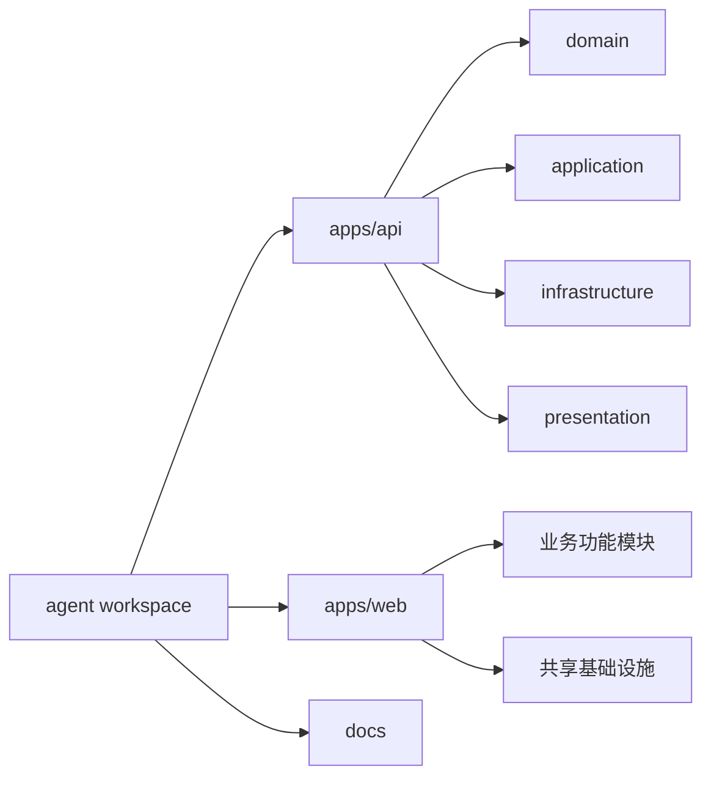

# Agent

基于 NestJS、SQLite、Vue 3 与 Pinia 的全栈单仓库。项目以 DDD 边界组织后端，以业务功能组织前端，优先复用已有能力并保持依赖方向清晰。

## 技术栈

- Node.js 20.18
- pnpm 9
- NestJS 11、TypeORM、SQLite
- Vue 3、Vite、Pinia、Vue Router
- TypeScript、ESLint、Prettier、Husky

## 项目结构



```text
apps/
├── api/                         # NestJS API
└── web/                         # Vue 3 Web
docs/
├── architecture.md             # 架构边界和设计原则
└── modules/                    # 功能模块说明
templates/
└── eyoucms/                    # EyouCMS 展示模板与独立预览页
```

## 本地开发

```bash
cp apps/api/.env.example apps/api/.env
cp apps/web/.env.example apps/web/.env
pnpm install
pnpm dev
```

首次启动前把 `apps/api/.env` 中的 `CREDENTIAL_ENCRYPTION_KEY` 替换为本机生成的 32 字节密钥：

```bash
openssl rand -hex 32
```

- API：`http://localhost:3000/api`
- Swagger：`http://localhost:3000/docs`
- Web：`http://localhost:5173`
- Zvec 向量数据：`zvec-data/`

## 中文管理后台

启动项目后，Web 根路径即为中文管理后台：

- `/`：管理工作台与后端服务状态。
- `/agents`：智能体创建、列表和测试入口。
- `/knowledge-bases`：知识库创建、文档上传和处理状态。
- `/model-providers`：DeepSeek、通义千问、豆包及兼容模型配置。
- `/api-access`：智能体应用与 API 访问凭证管理。
- `/chat/:agentId`：指定智能体的独立真实对话测试页。

管理后台模块结构与后端边界见
[中文智能体管理后台文档](docs/modules/admin-web.md)。

对话默认流式输出，支持 Markdown、数学公式、ECharts/D3 图表、Mermaid
流程图/思维导图，以及图片和音频输入。格式与接口见
[流式富内容与多模态对话文档](docs/modules/rich-streaming-chat.md)。

## 单 JS 服务端构建

```bash
pnpm build:server
node apps/api/dist-single/server.js
```

构建产物只有一个应用文件 `apps/api/dist-single/server.js`。由于 SQLite、Zvec
包含平台原生二进制，PDF 解析器包含运行时资源，部署目录仍需执行生产依赖安装；
其余 NestJS 业务代码和 JavaScript 依赖均已写入该文件。

跨域来源通过 `CORS_ORIGIN` 配置，多个来源使用逗号分隔；设置为 `*` 时允许任意来源。

## 中文智能体对话页

仓库包含纯中文 EyouCMS 智能体对话模板，以及无需 CMS 环境即可进入的 HTML 测试页。API、模型和知识库配置
属于后台能力，不会出现在该用户页面。

```bash
python3 -m http.server 4173 -d templates/eyoucms
```

访问
`http://localhost:4173/preview/agent-platform.html?agentId=<智能体ID>`。
页面后台地址由 `templates/eyoucms/skin/js/agent-platform.js` 顶部常量配置。
EyouCMS 接入方式见
[中文智能体对话页文档](docs/modules/agent-eyoucms-page.md)。

生产环境构建、持久化目录、Nginx、systemd 和 EyouCMS 发布步骤见
[部署文档](docs/deployment.md)。

## 质量检查

```bash
pnpm format:check
pnpm lint
pnpm typecheck
pnpm test
pnpm build
pnpm build:server
```

提交前 Husky 会运行 lint-staged，仅检查暂存文件。

## 开发约束

1. 新增功能前先搜索同类模块、公共组件、领域对象和基础设施适配器。
2. 领域层不得依赖 NestJS、TypeORM、HTTP 或数据库实现。
3. 控制器按业务动作拆分；一个函数只承担一个明确职责。
4. 配置统一从环境变量和配置模块读取，业务代码不得出现环境相关硬编码。
5. 单文件不得超过 500 行；达到上限前按职责拆分。
6. 每个功能模块必须在 `docs/modules` 中说明职责、结构、流程和扩展点。

详细规范见 [架构文档](docs/architecture.md) 与 [贡献指南](CONTRIBUTING.md)。
