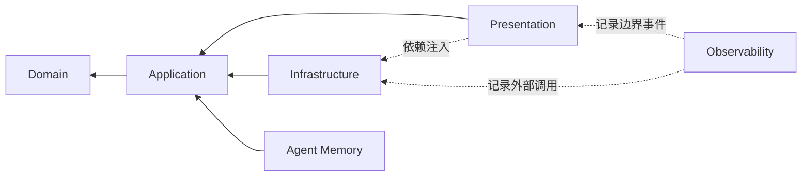
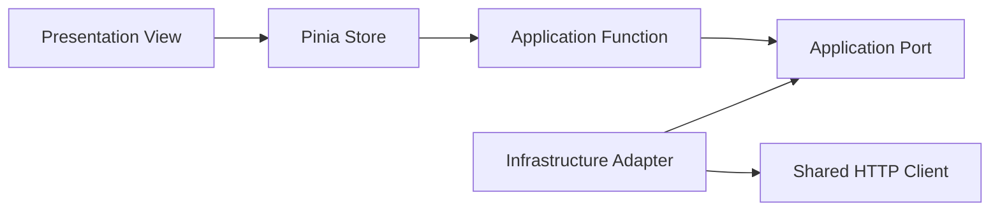

# 架构说明

## 目标

项目使用低耦合、高内聚的模块化设计。抽象只服务于真实的替换点或业务边界，不以层数或设计模式数量作为质量目标。

## 后端依赖规则

- `domain`：业务概念、值对象和不变量，不依赖框架。
- `application`：用例、输入输出与外部能力端口。
- `infrastructure`：数据库、时钟和第三方服务等端口实现。
- `presentation`：HTTP 路由、DTO 和协议转换。

领域层与应用层不得导入 NestJS、TypeORM、Express 或前端代码。

`observability` 是横切基础设施，但仍通过应用服务暴露记录能力。业务模块只提交
操作名称、状态、耗时和用量，不依赖 SQLite 实体，也不记录提示词、回复正文、
密钥或附件内容。

`agent-memory` 是对话应用能力，提供短期线程、稳定事实/偏好和图片情景记忆。
`AgentMemoryService` 管理短期与稳定事实，`AgentEpisodicMemoryService` 通过
SQLite + 独立 Zvec + ModelGateway 管理图片事件、混合召回与低置信度澄清。
`ChatAttachmentModule` 导出 owner 安全的附件端口，聊天和记忆共同复用，避免
把文件路径、TypeORM、Zvec 或多模态供应商细节泄漏到领域层。

## 前端模块规则

每个业务模块拥有自己的页面、组件、状态、应用函数和接口适配器。只有无业务语义且可跨模块复用的能力进入 `shared`。

## 配置管理

- 环境差异由 `.env` 提供。
- 后端通过 Nest Config 暴露类型化配置。
- 前端只通过 `import.meta.env` 的集中配置模块读取变量。
- 示例值只存在于 `.env.example` 和配置边界，不散落于业务代码。

## 设计评审清单

- 是否已有相同能力可以扩展？
- 是否存在跨层反向依赖？
- 是否能删掉一层而不损失边界？
- 类与函数是否只有一个变化原因？
- 错误是否在合适的层转换？
- 模块文档和图是否同步更新？
