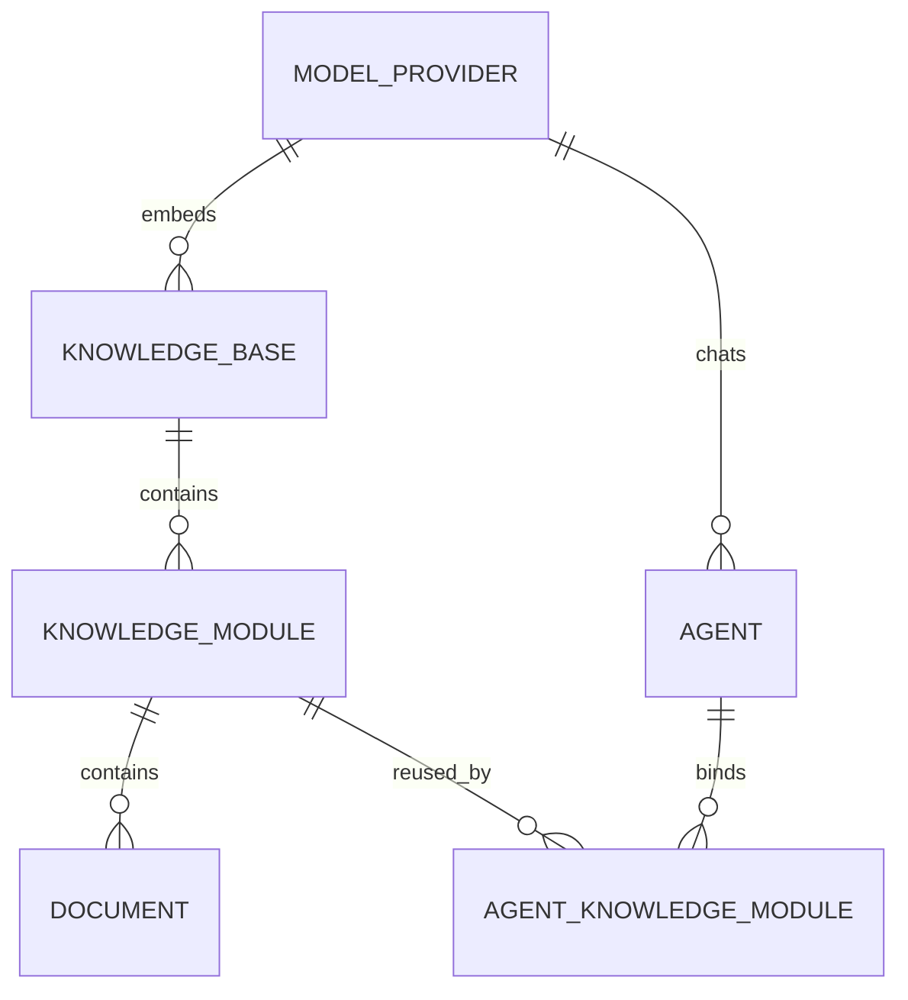
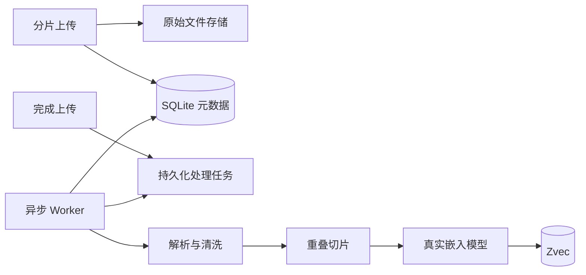

# 大容量共享知识架构

## 状态

已采纳。

## 背景

单个智能体可能引用 5～6GB 企业资料。原始文件、解析文本、向量和管理元数据的读写模式不同，
如果全部写入 SQLite，会放大数据库文件、锁竞争和备份成本，也无法提供可扩展的语义检索。

平台还需要让多个智能体复用相同知识，并允许只复用其中一个业务模块。

## 参考方案

本设计复用业界公开方案的边界，不复制其源码：

- Dify：文件存储和向量存储可替换，文档通过 Extract、Transform、Load 异步索引；应用可关联多个知识库。
- RAGFlow：原始文件、任务队列、元数据和检索引擎分离；文件可被多个数据集引用；数据集锁定嵌入模型。
- FastGPT：知识库、集合、数据条目分层；业务元数据与向量检索分库存储。
- AWS Bedrock Knowledge Bases：原始数据源、解析切片、嵌入生成和向量索引是独立阶段。

## 决策

### 存储职责

| 数据                             | 默认实现         | 责任                                |
| -------------------------------- | ---------------- | ----------------------------------- |
| 智能体、知识库、模块、文档、任务 | SQLite           | 事务元数据和状态                    |
| 原始文件、上传分片               | 本地对象存储目录 | 流式大文件读写，可替换 S3/OSS/MinIO |
| 语义向量和片段正文               | Zvec             | 向量索引、模块过滤和相似度检索      |
| 模型凭证                         | SQLite 密文      | AES-256-GCM 加密，不向前端回传      |

SQLite 不保存文件二进制或向量。

### 共享模型

- 知识库定义统一嵌入空间。
- 知识模块是可复用的最小业务单元，例如“产品资料”“售后政策”。
- 智能体通过多对多绑定选择任意模块，同一模块只解析和索引一次。
- 一个智能体可以绑定多个知识库中的模块。检索时按知识库分组并行召回，再合并结果。

### 大文件上传

浏览器先创建上传会话，再按固定分片上传。服务端逐片流式写盘并记录校验值，完成时按顺序流式合并，
不会把整个文件放入浏览器请求体、Node.js 内存或 SQLite。

5～6GB 指知识库累计容量。默认单文件上限和分片大小由环境变量控制，生产环境可按磁盘、网关和对象
存储能力调整。

### 异步索引

首个版本使用 SQLite 持久化任务和进程内调度器，任务不会因 API 进程重启丢失。应用层的处理用例与
调度器分离，后续可把调度器替换为 Redis Streams、RabbitMQ 或独立 Worker，而不修改领域模型。

### 嵌入空间约束

知识库创建时选择嵌入提供商、模型和维度。写入首批向量后这些参数不可直接修改；切换模型必须重建
整个知识库索引，避免不同维度或不同语义空间的向量混用。

## 结果

- 管理数据仍满足 SQLite 技术栈要求。
- 5～6GB 资料不会造成单请求内存峰值或 SQLite BLOB 膨胀。
- 知识模块可以被多个智能体复用，避免重复上传、解析和向量费用。
- 本地开发和单机生产使用 Zvec 持久目录；向量实现细节见
  [ADR-0002](0002-zvec-embedded-vector-index.md)。
- PDF、DOCX 解析仍受单文件解析器内存限制，因此单文件上限需要独立配置，不能等同于知识库总容量。
