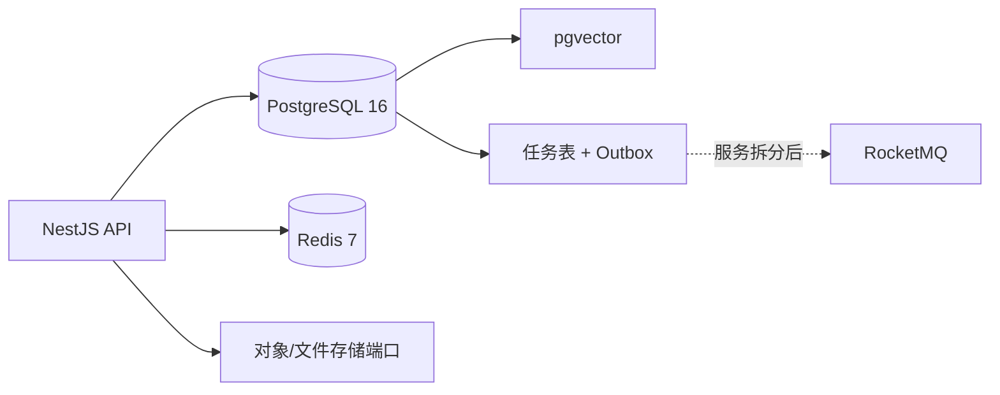
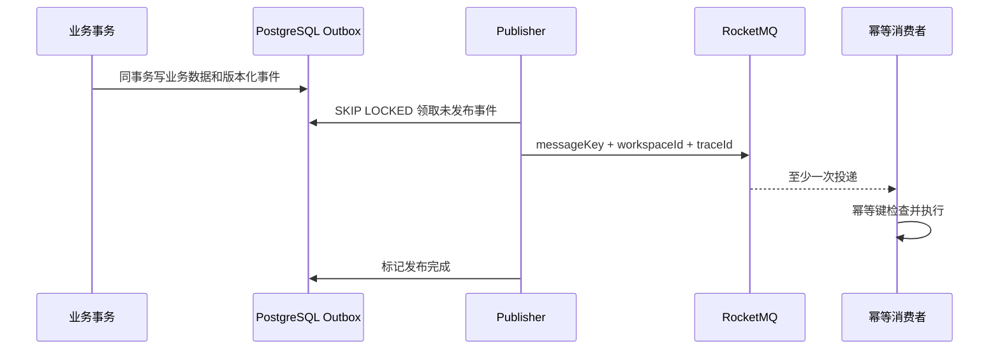

# PostgreSQL、pgvector、Redis 与消息系统边界

- 状态：已接受
- 日期：2026-07-14
- 取代：ADR-0001 的 SQLite 元数据部分、ADR-0002 的默认 Zvec 实现

## 背景

系统目标从单机原型调整为商用智能体 SaaS。业务数据、任务、向量、配额和审计需要支持多实例并发、事务恢复、备份和后续租户隔离。当前仍是单体 NestJS，直接同时引入独立向量数据库和 RocketMQ 会增加运维面，却不能自动解决一致性、幂等或租户越权。

## 决策



### PostgreSQL

PostgreSQL 是业务事实、任务状态、Outbox、观测和后续计费/审计的唯一权威数据库。任务领取使用 `FOR UPDATE SKIP LOCKED`，完成和失败写回继续使用 lease owner 条件更新，避免多 Worker 重复提交。

生产禁止 `synchronize` 和 `dropSchema`，只允许 migration。测试使用独立的 `agent_test` 数据库并在每个串行 E2E suite 启动前清理 schema。

### pgvector

知识库与图片情景继续复用 `VectorIndex`、`AgentMemoryIndex` 应用层端口，Infrastructure 从 Zvec 替换为 pgvector。向量与业务元数据共享 PostgreSQL 备份和故障域，初期减少双写和独立集群运维。

不同 embedding 维度使用共享动态表：

```text
knowledge_vectors_d<dimensions>
agent_memory_vectors_d<dimensions>
```

维度表由 advisory lock 串行创建并记录在 `vector_collections`。业务过滤字段使用 B-tree，向量使用 cosine HNSW：

- `dimensions <= 2000`：`vector(dimensions)`；
- `2000 < dimensions <= 4000`：`halfvec(dimensions)`；
- `dimensions > 4000`：拒绝创建，不能静默降维。

达到下列条件之一再评估 Qdrant、Milvus、OpenSearch 或托管向量服务：

- 向量达到数千万级且 PostgreSQL p95、召回率或维护窗口不满足 SLO；
- 向量写入和检索需要独立水平扩展、多区域副本或独立资源隔离；
- 需要 pgvector 无法满足的混合检索、量化或多向量能力。

### Redis

Redis 只保存可丢失、短 TTL、跨实例共享的协调状态。当前落地：

- API application 固定窗口限流；
- public chat 固定窗口限流；
- readiness 探测。

Redis key 只包含限流类型和标识符 SHA-256，不写 API key、ownerKey 或明文 IP。配置 Redis 后连接或执行失败采用 fail-closed，避免故障时无限放大模型成本；未配置 Redis 仅允许单实例开发使用进程内 fallback。

Redis 不保存业务事实、任务最终状态、账务、长期记忆、租户权限或唯一 Outbox。

### RocketMQ

本阶段不接入 RocketMQ。当前任务生产者和消费者仍在同一单体内，PostgreSQL 队列已提供可靠落盘、重试、dead、恢复和并发领取；此时增加 Broker 不会消除消费者幂等，反而增加 NameServer、Broker、监控和故障处理成本。

当模型/索引 Worker 独立部署，或出现跨服务削峰、多个订阅方、延迟消息等明确需求时，再实现：



事务消息不等于 exactly-once；发布和消费仍必须处理重复、乱序、延迟、死信和 broker 回查。

## 安全边界

这项迁移不等于“商用就绪”。当前 Agent、知识库、模型供应商和 API application 尚未全部绑定 workspace，管理 API 也没有完整租户身份。后续安全阶段必须新增 workspace/member/API key 上下文、资源外键、权限矩阵和 PostgreSQL RLS；在此之前不能把 `ownerKey` 冒充 tenantId，也不能对外宣称已完成 SaaS 租户隔离。

## 迁移与回滚

- SQLite 生产数据不能直接由 PostgreSQL migration 读取，必须在维护窗口执行独立导出、校验、导入。
- 旧 Zvec 向量应从权威文档和记忆摘要重新生成；不能只复制其本地目录。
- 导入前必须先定义旧数据到默认 workspace 的映射，否则会固化新的越权风险。
- 回滚数据库版本时恢复同一时间点的 PostgreSQL、文件存储和加密密钥；Redis 不参与权威恢复。

## 后果

- 获得连接池、多实例任务领取、统一事务备份和可演进的 RLS 基础。
- 初期不需要独立向量集群或消息 Broker。
- PostgreSQL 同时承担 OLTP 和向量负载，必须监控连接池、慢查询、HNSW 构建和表膨胀。
- Redis 成为高成本入口的运行依赖，但不是数据恢复依赖。
