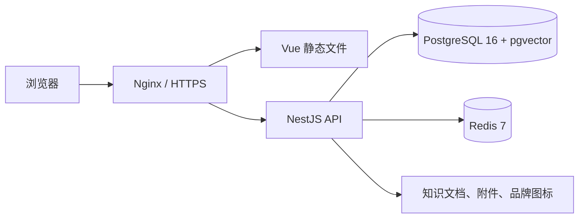

# 部署说明

## 部署结构



PostgreSQL 保存业务事实、任务、Outbox、向量和观测数据。Redis 只保存短 TTL 限流状态，不是备份恢复的权威数据。模型密钥、数据库连接、Redis 连接和上传文件必须保留在服务端。

## 环境要求

- Linux x64；
- Node.js `20.18.x`；
- pnpm `9.15.9`；
- PostgreSQL 16 且安装 pgvector `0.8.x`；
- Redis 7；
- Nginx 或同等反向代理。

## 本地基础设施

仓库 `compose.yaml` 仅用于开发和验证：

```bash
docker compose up -d postgres redis
docker compose ps
```

首次初始化会创建 `agent` 与 `agent_test` 数据库。PostgreSQL 和 Redis 镜像均固定版本并配置健康检查；生产环境应使用受管服务或独立高可用部署，不应直接复用示例密码和端口暴露。

## 安装、迁移与构建

```bash
pnpm install --frozen-lockfile
pnpm format:check
pnpm lint
pnpm typecheck
pnpm test
pnpm build
pnpm build:server
```

生产启动前由单个 migration job 执行 migration，多个 API 副本不要同时抢跑：

```dotenv
NODE_ENV=production
DATABASE_URL=postgresql://agent_service:<password>@postgres.example.com:5432/agent?sslmode=require
DATABASE_POOL_MAX=20
DATABASE_STATEMENT_TIMEOUT_MS=30000
DATABASE_MIGRATIONS_RUN=true
DATABASE_SYNCHRONIZE=false
REDIS_URL=rediss://:<password>@redis.example.com:6379
REDIS_KEY_PREFIX=agent-production
HTTP_TRUST_PROXY_HOPS=1
```

migration job 成功后，长期运行的 API 副本建议设置 `DATABASE_MIGRATIONS_RUN=false`。生产代码不会启用 `dropSchema`；该能力只在 `NODE_ENV=test` 且连接独立 `TEST_DATABASE_URL` 时启用。

完整配置从 `apps/api/.env.example` 复制。还必须生成并稳定保存：

```bash
openssl rand -hex 32
```

```dotenv
CREDENTIAL_ENCRYPTION_KEY=<固定的 64 位十六进制密钥>
BRAND_STORAGE_PATH=/srv/agent-data/brand-storage
CHAT_ATTACHMENT_STORAGE_PATH=/srv/agent-data/chat-attachments
KNOWLEDGE_STORAGE_PATH=/srv/agent-data/knowledge-storage
```

更换 `CREDENTIAL_ENCRYPTION_KEY` 会导致已保存模型密钥无法解密。连接 URL、密码和该密钥不得写入仓库或日志。

## 向量配置

```dotenv
VECTOR_HNSW_M=16
VECTOR_HNSW_EF_CONSTRUCTION=64
VECTOR_HNSW_EF_SEARCH=40
VECTOR_UPSERT_BATCH_SIZE=256
```

知识和情景向量按维度写入共享表。`<= 2000` 维使用 `vector`，`2001～4000` 维使用 `halfvec`，超过 4000 维会拒绝创建。调整 HNSW 参数前必须基于实际召回率、写入耗时和 p95 检索延迟压测。

## Redis 与限流

```dotenv
RATE_LIMIT_WINDOW_MS=60000
API_RATE_LIMIT_MAX=120
PUBLIC_CHAT_RATE_LIMIT_MAX=30
```

API application 按 application ID 限流，public chat 按 agent 与来源 IP 限流。Redis key 只保存标识符哈希。生产配置 Redis 后，Redis 不可用会拒绝高成本入口，避免无限调用模型；不配置 Redis 的进程内 fallback 只适合单实例开发。

`HTTP_TRUST_PROXY_HOPS` 必须等于客户端到 API 之间受信任反向代理的固定跳数；示例 Nginx 与 API 直连时为 `1`。不要在 API 可被公网绕过代理访问时启用，否则攻击者可伪造来源 IP。

## 健康检查

- `GET /api/health`：liveness，不访问外部依赖；
- `GET /api/health/readiness`：检查 PostgreSQL、pgvector extension 和 Redis。

负载均衡器只应向 readiness 返回 200 的实例发送流量。Redis 未配置时 readiness 显示 `disabled`；已配置但连接失败时返回 503。

## systemd 示例

```ini
[Unit]
Description=Agent NestJS API
After=network.target

[Service]
Type=simple
User=agent
Group=agent
WorkingDirectory=/srv/agent/apps/api
ExecStart=/usr/bin/node /srv/agent/apps/api/dist-single/server.js
Restart=always
RestartSec=5
Environment=NODE_ENV=production

[Install]
WantedBy=multi-user.target
```

服务工作目录必须是 `apps/api`，以读取该目录中的 `.env`。

## Nginx 示例

```nginx
server {
    listen 443 ssl http2;
    server_name admin.example.com;
    root /var/www/agent-admin;
    index index.html;

    location /api/ {
        proxy_pass http://127.0.0.1:3000;
        proxy_http_version 1.1;
        proxy_set_header Host $host;
        proxy_set_header X-Forwarded-For $proxy_add_x_forwarded_for;
        proxy_set_header X-Forwarded-Proto $scheme;
        proxy_buffering off;
        proxy_read_timeout 180s;
    }

    location / {
        try_files $uri $uri/ /index.html;
    }
}
```

只开放网关端口；PostgreSQL、Redis 和 API 内部端口不得直接暴露公网。

## 备份、恢复与升级

必须使用同一恢复点保存：

1. PostgreSQL 全量备份与 WAL/PITR；
2. 知识文档、聊天附件和品牌文件；
3. `CREDENTIAL_ENCRYPTION_KEY` 的安全副本；
4. 已审核代码版本和 migration 版本。

Redis 限流状态无需恢复。恢复后先运行 schema 和 pgvector extension 检查，再验证动态向量表、文件引用和 `/api/health/readiness`。

从 SQLite/Zvec 升级不是普通 migration：

- 在维护窗口停止写入；
- 导出并校验 SQLite 业务数据；
- 定义旧数据到 workspace 的映射后再导入 PostgreSQL；
- 从权威文档和情景摘要重新生成 pgvector 索引；
- 对记录数、附件引用和检索抽样做双重校验；
- 保留旧数据只读备份，直到验收完成。

当前仓库尚未提供自动化 SQLite/Zvec 导入工具，不能把旧生产目录直接挂载到新版本。

## RocketMQ 边界

当前单体继续使用 PostgreSQL 任务表与 `FOR UPDATE SKIP LOCKED`。只有模型/索引 Worker 独立部署或出现多个事件订阅方、跨服务削峰、延迟消息需求后，才通过 PostgreSQL Outbox 发布 RocketMQ；消费者仍需实现幂等、重复投递、乱序和死信处理。详见 [ADR-0003](decisions/0003-postgresql-pgvector-redis-and-message-boundary.md)。

## 商用安全前置

数据库迁移不等于完成多租户 SaaS。浏览器 owner 已改为服务端签名匿名 bearer token，
能够阻止客户端直接伪造其他 ownerKey，但 token 被窃取后仍可重放。上线外部租户前还必须
实现 workspace/member/API key 身份上下文、资源 workspace 外键、权限矩阵、审计和
PostgreSQL RLS；匿名 owner token 不能作为 tenantId。

## 发布检查

- migration 在独立任务中成功，API 副本未启用 `synchronize`；
- liveness 与 readiness 均符合预期；
- PostgreSQL 连接池、慢查询、磁盘、WAL 和 HNSW 索引可观测；
- Redis 故障时高成本入口 fail-closed；
- SSE 流式回复无代理缓冲；
- 文件目录或对象存储具备持久化和备份；
- 数据库、Redis、API 内部端口未暴露公网；
- 尚未完成 workspace/RLS 时不得开放多租户商用注册。
