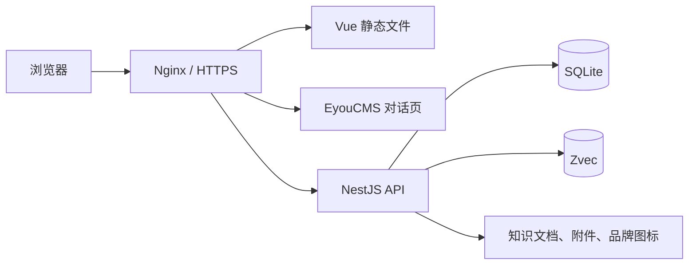

# 部署说明

## 部署结构



Vue 管理后台与 EyouCMS 页面只调用 NestJS API。模型密钥、SQLite、Zvec
和上传文件必须保留在服务端，不得复制到 Web 或 EyouCMS 目录。

## 环境要求

- Linux x64 服务器。
- Node.js `20.18.x`。
- pnpm `9.15.9`。
- Nginx 或具备相同反向代理能力的网关。
- EyouCMS 站点，仅在发布 EyouCMS 对话页时需要。

```bash
corepack enable
corepack prepare pnpm@9.15.9 --activate
node --version
pnpm --version
```

## 安装与构建

```bash
git clone https://github.com/yiting001/agent.git
cd agent
pnpm install --frozen-lockfile
pnpm format:check
pnpm lint
pnpm typecheck
pnpm test
pnpm build
pnpm build:server
```

主要产物：

- Vue 管理后台：`apps/web/dist/`。
- NestJS 单文件入口：`apps/api/dist-single/server.js`。

`better-sqlite3`、Zvec 和 PDF 解析器包含原生模块或运行时资源，因此服务器上仍需保留
生产依赖，不能只复制 `server.js`。

## NestJS 生产配置

复制配置文件：

```bash
cp apps/api/.env.example apps/api/.env
openssl rand -hex 32
```

将生成值写入 `CREDENTIAL_ENCRYPTION_KEY`，并至少调整以下配置：

```dotenv
NODE_ENV=production
API_PORT=3000
CORS_ORIGIN=https://admin.example.com,https://www.example.com
DATABASE_PATH=/srv/agent-data/agent.sqlite
DATABASE_MIGRATIONS_RUN=true
DATABASE_SYNCHRONIZE=false
CREDENTIAL_ENCRYPTION_KEY=<固定的 64 位十六进制密钥>
BRAND_STORAGE_PATH=/srv/agent-data/brand-storage
CHAT_ATTACHMENT_STORAGE_PATH=/srv/agent-data/chat-attachments
KNOWLEDGE_STORAGE_PATH=/srv/agent-data/knowledge-storage
ZVEC_DATA_PATH=/srv/agent-data/zvec-data
OBSERVABILITY_RETENTION_DAYS=30
OBSERVABILITY_SLOW_REQUEST_MS=2000
OBSERVABILITY_SLOW_MODEL_MS=30000
OBSERVABILITY_HIGH_COST_USD=0.1
```

创建并授权持久化目录：

```bash
sudo mkdir -p /srv/agent-data/{brand-storage,chat-attachments,knowledge-storage,zvec-data}
sudo chown -R agent:agent /srv/agent-data
```

`CREDENTIAL_ENCRYPTION_KEY` 用于加密模型密钥。首次投入使用后必须稳定保存；更换该值会使
已保存的模型密钥无法解密。SQLite、Zvec 和三个文件目录必须一起备份。

观测事件保存在同一个 SQLite 数据库中，默认保留 30 天。慢请求、慢模型调用和
单次高成本阈值均从环境变量读取；生产环境应按服务等级目标和模型预算调整。模型
单价在“模型配置”页面按美元/百万 Token 维护，不在代码中硬编码。

## systemd 启动 API

创建 `/etc/systemd/system/agent-api.service`：

```ini
[Unit]
Description=Agent NestJS API
After=network.target

[Service]
Type=simple
User=agent
Group=agent
WorkingDirectory=/srv/agent/apps/api
ExecStart=/usr/bin/node /srv/agent/apps/api/dist-single/server.js
Restart=always
RestartSec=5
Environment=NODE_ENV=production

[Install]
WantedBy=multi-user.target
```

启动并检查：

```bash
sudo systemctl daemon-reload
sudo systemctl enable --now agent-api
sudo systemctl status agent-api
curl http://127.0.0.1:3000/api/health
```

服务的工作目录必须是 `apps/api`，这样 NestJS 才会读取该目录中的 `.env`。

## Nginx 发布 Vue 管理后台

将 `apps/web/dist/` 发布到 `/var/www/agent-admin/`，示例站点配置：

```nginx
server {
    listen 443 ssl http2;
    server_name admin.example.com;

    root /var/www/agent-admin;
    index index.html;

    location /api/ {
        proxy_pass http://127.0.0.1:3000;
        proxy_http_version 1.1;
        proxy_set_header Host $host;
        proxy_set_header X-Forwarded-For $proxy_add_x_forwarded_for;
        proxy_set_header X-Forwarded-Proto $scheme;
        proxy_buffering off;
        proxy_read_timeout 180s;
    }

    location / {
        try_files $uri $uri/ /index.html;
    }
}
```

`proxy_buffering off` 用于保证智能体 SSE 流式回复及时到达浏览器。生产环境应配置有效
TLS 证书，并只开放 Nginx 的 80/443 端口。

## 发布 EyouCMS 对话页

1. 将 `templates/eyoucms/agent-platform.htm` 复制到站点模板目录。
2. 将 `templates/eyoucms/skin/css/agent-*.css` 和
   `templates/eyoucms/skin/js/agent-platform.js` 复制到当前模板的 `skin` 目录。
3. 确认模板已有 `header.htm`、`footer.htm`、`skin/css/style.css` 和
   `skin/css/all.min.css`。
4. 编辑 `agent-platform.js` 顶部配置：

   ```js
   const AGENT_BACKEND_BASE_URL = 'https://api.example.com/api';
   ```

5. 在 EyouCMS 中创建 `agent_id` 自定义字段，并填写已发布智能体 ID。
6. 为目标单页或栏目选择 `agent-platform.htm`，重新生成页面并清理模板缓存。
7. 将 EyouCMS 站点域名加入 API 的 `CORS_ORIGIN`。

`agent-site-layout.js` 会在页面加载和窗口变化时自动测量站点固定/粘性导航的
高度并写入 `--chat-site-navigation-height`，通常无需手动配置。特殊主题下
自动测量不准时，可在 `agent-foundation.css` 中手动覆盖：

```css
.agent-chat-page--eyoucms {
  --chat-site-navigation-height: 72px;
}
```

对话工作区高度会同步扣除该值，桌面端和移动端都不会被公共导航覆盖。

## 更新与回滚

更新前先备份 `/srv/agent-data` 和 `apps/api/.env`：

```bash
git fetch origin
git checkout <已审核的版本>
pnpm install --frozen-lockfile
pnpm build
pnpm build:server
sudo systemctl restart agent-api
```

回滚时检出上一个已验证版本、重新安装锁文件依赖并重新构建。若新版本已经执行不可逆数据
迁移，应同时恢复同一时间点的 SQLite、Zvec 和文件目录备份。

## 发布检查

- `GET /api/health` 返回成功。
- 管理后台刷新任意路由不会出现 404。
- EyouCMS 公共导航不覆盖对话头部。
- EyouCMS 页面能读取品牌并获得流式回复。
- 浏览器控制台没有 CORS、Mixed Content 或资源 404。
- SQLite、Zvec、知识文档、附件和品牌图标均写入持久化目录。
- API 端口不直接暴露到公网。
