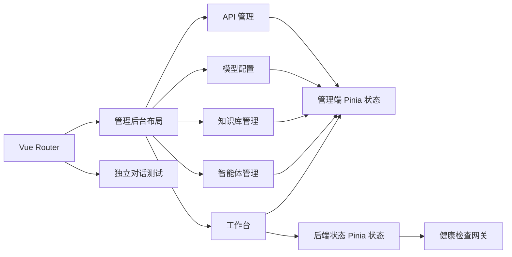
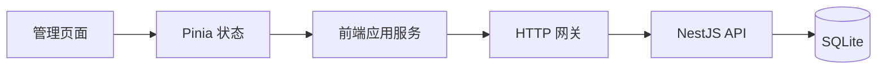

# 中文智能体管理后台

## 目标

实际 Vue 应用根路径提供中文管理后台，而不是英文项目状态页。管理端负责展示和操作：

- 平台工作台。
- 智能体创建、状态查看和测试入口。
- 知识库创建、文件选择和处理状态。
- DeepSeek、通义千问、豆包与兼容模型配置。
- 智能体 API 应用与脱敏凭证管理。
- 后端健康状态检查。

最终用户对话页使用独立路由，不展示模型、知识库、API 或其他后台配置。

## 路由

| 路径               | 页面       | 责任                                 |
| ------------------ | ---------- | ------------------------------------ |
| `/`                | 工作台     | 汇总资源、服务状态和快捷入口         |
| `/agents`          | 智能体管理 | 创建智能体、查看状态、进入测试       |
| `/knowledge-bases` | 知识库管理 | 创建知识库、选择文档、查看处理状态   |
| `/model-providers` | 模型配置   | 管理模型服务地址、模型名称和密钥输入 |
| `/api-access`      | API 管理   | 创建应用、关联智能体和查看调用量     |
| `/chat/:agentId?`  | 对话测试   | 只提供最终用户对话体验               |

## 目录结构

```text
apps/web/src/
├── app/router/
│   ├── admin.route.ts
│   ├── chat.route.ts
│   └── index.ts
├── modules/
│   ├── admin/
│   │   ├── domain/
│   │   │   └── admin-workspace.ts
│   │   ├── stores/
│   │   │   └── admin-workspace.store.ts
│   │   └── presentation/
│   │       ├── components/
│   │       ├── layouts/
│   │       └── views/
│   ├── chat/
│   │   └── presentation/views/
│   │       └── AgentChatView.vue
│   └── system/
│       ├── application/
│       ├── domain/
│       ├── infrastructure/
│       └── stores/
└── styles/
    ├── foundation.css
    ├── admin-layout.css
    ├── admin-components.css
    ├── admin-pages.css
    ├── chat-page.css
    └── responsive.css
```

## 模块关系



## 页面责任

### 管理后台布局

`AdminLayout.vue` 只负责：

- 左侧导航。
- 页面标题和说明。
- 移动端导航状态。
- 嵌套路由出口。

具体业务内容由各功能页面负责，不写入布局组件。

### 工作台

工作台读取管理端状态并展示：

- 已发布智能体数量。
- 知识库文档数量。
- 已启用模型数量。
- API 调用次数。
- 最近智能体。
- NestJS 后端健康状态。

### 智能体管理

- 支持按名称和描述搜索。
- 支持填写名称、描述和默认模型创建草稿。
- 展示模型、知识库数量、对话量和发布状态。
- “测试”按钮只跳转到独立对话页。

### 知识库管理

- 支持创建知识库。
- 文件选择限制为 TXT、Word、PDF 和 Markdown。
- 选择文件后更新文档数量和处理状态。
- 页面明确说明解析、清洗、切片和索引由后台完成。

### 模型配置

- 展示各模型供应商的连接状态。
- 配置服务地址、模型名称和访问密钥。
- 访问密钥使用密码输入，不回显。
- 当前演示状态不会持久化密钥。

### API 管理

- 创建接入应用并关联已发布智能体。
- 展示脱敏访问凭证。
- 复制标准对话接口地址。
- 展示调用次数和应用状态。

### 对话测试

- 页面全部为中文。
- 支持快捷问题、文本输入、发送和重新开始。
- 页面不包含任何后台配置入口。
- 当前回复为本地演示回复。

## 数据边界

当前管理页面使用 `admin-workspace.store.ts` 提供可操作的演示状态，以便先确认信息架构和交互。
正式业务数据必须通过应用服务和基础设施适配器连接 NestJS API。



正式接入时必须遵守以下边界：

- 页面组件不直接拼接 API 地址。
- 页面组件不直接保存模型访问密钥。
- 密钥由 NestJS 接口接收、加密并持久化。
- 文档解析状态由后端返回，前端只负责展示。
- 智能体发布、停用和删除由独立应用用例处理。
- 对话测试页只提交会话标识和用户消息。

## 响应式设计

- 大屏：固定管理侧栏，多列资源卡片。
- 平板：缩小侧栏，资源卡片改为两列。
- 手机：侧栏变为抽屉，资源卡片和数据区改为单列。
- 对话测试页在手机端保留完整输入和消息区域。

## 安全要求

- 不在源码、页面状态或浏览器存储中写入真实密钥。
- API 列表只展示脱敏凭证。
- 正式密钥只在创建时返回一次。
- 公开对话页不得展示管理端模型、知识库和 API 配置。
- 业务系统应从服务端调用智能体接口，不在公开网页中暴露凭证。

## 验证范围

- Vue 根路径显示中文管理后台。
- 五个管理路由可以通过左侧导航访问。
- 管理页面所有主要操作具有可见交互反馈。
- 智能体测试路由与管理端布局隔离。
- 后端健康检查仍通过原有网关和应用服务执行。
- 单个文件不超过 500 行。
- 格式、lint、类型检查、单元测试和构建全部通过。
