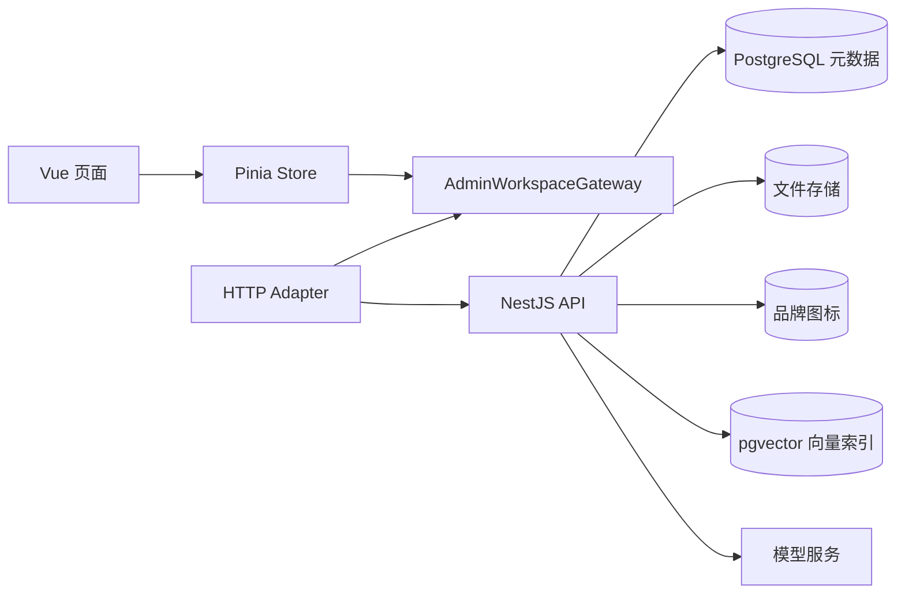

# 中文智能体管理后台

## 目标

Vue 根路径提供全中文管理后台，所有资源来自 NestJS 真实接口：

- OpenAI 兼容模型服务配置和密钥验证。
- 智能体创建、编辑、删除、知识模块绑定、发布和停用，卡片展示智能体 ID 并支持一键复制。
- 大容量知识库、可复用模块和分片文档上传。
- API 应用及一次性访问密钥。
- 软件名称与图标的全局品牌配置。
- 基于真实模型和 pgvector 检索结果的对话测试。
- 对话测试自动携带 `conversationId` 和浏览器级 `memoryOwnerKey`，附件上传同时绑定当前智能体和 owner；服务端可保存隔离的短期会话、长期偏好和图片情景。

最终用户对话页使用独立路由，不展示模型、知识库或 API 配置。

## 路由

| 路径               | 页面       | 责任                                       |
| ------------------ | ---------- | ------------------------------------------ |
| `/`                | 工作台     | 汇总真实资源和服务状态                     |
| `/agents`          | 智能体管理 | 创建、编辑、删除、发布、停用、绑定共享模块 |
| `/knowledge-bases` | 知识库管理 | 创建知识库和模块、分片上传文档             |
| `/model-providers` | 模型配置   | 验证并加密保存模型服务配置                 |
| `/api-access`      | API 管理   | 创建应用、展示一次性密钥和调用量           |
| `/settings`        | 系统设置   | 修改全局软件名称和图标                     |
| `/chat/:agentId`   | 对话测试   | 调用指定智能体的真实检索增强对话           |

## 目录结构

```text
apps/web/src/modules/admin/
├── domain/
│   └── admin-workspace.ts
├── application/
│   └── admin-workspace.gateway.ts
├── infrastructure/
│   └── http-admin-workspace.gateway.ts
├── stores/
│   └── admin-workspace.store.ts
└── presentation/
    ├── components/
    ├── layouts/
    └── views/
```

## 依赖方向



- 页面只处理表单、展示和用户反馈。
- Store 管理资源集合、加载状态、错误和上传进度。
- Gateway 定义前端应用边界，HTTP 细节只存在于基础设施适配器。
- 品牌配置使用独立 `branding` 模块和 Store，避免与智能体资源状态耦合。
- API 基础地址统一来自 `VITE_API_BASE_URL`，本地开发由 Vite 代理 `/api`。

## 真实业务流程

### 模型配置

1. 管理员填写服务标识、地址、模型名称和密钥。
2. NestJS 调用该服务的 `/models` 验证连接。
3. 验证通过后使用 AES-256-GCM 加密密钥并保存。
4. 前端只保留不含密钥的模型摘要。

### 知识文档上传

1. 浏览器为文件创建上传会话。
2. 根据服务端返回的分片大小逐片上传，页面显示实际进度。
3. 服务端逐片流式写盘，完成后合并原文件并创建持久化任务。
4. Worker 解析、切片、调用嵌入模型并写入 pgvector。
5. 页面从 API 重新加载文档数量、容量和处理状态。

浏览器不会一次读取或提交整个文件，知识库累计容量不受单次请求内存限制。

### 智能体与模块共享

创建智能体时可以选择任意知识库下的多个模块。绑定关系为多对多，同一模块可以被多个智能体使用，
文档只需要解析和索引一次。

### 对话

测试页提交当前消息记录、`conversationId`、`memoryOwnerKey` 和智能体标识。后端先恢复该 owner 的会话最近消息，
再召回跨会话长期偏好/事实和相关图片情景，必要时回读 owner 范围内原图，随后按已绑定模块过滤知识向量检索，将记忆与知识片段一起加入系统上下文，
再调用智能体选定的真实对话模型。页面显示回答及引用文件名，不包含本地兜底回答。

### API 应用

- 只有已发布智能体可以创建应用。
- 原始 `ag_live_...` 密钥只返回一次。
- 数据库只保存 SHA-256 哈希和脱敏值。
- 标准接口为 `/api/v1/chat/completions`，使用 Bearer 鉴权。

## 安全要求

- 不在源码、Pinia 或浏览器存储中保存模型密钥和 API 密钥。
- 公开页面不得展示后台配置。
- 生产环境应为管理接口增加账号鉴权，并由服务端代理公开网页的 API 调用。
- `CREDENTIAL_ENCRYPTION_KEY` 必须通过环境变量提供，不能提交仓库。

## 验证范围

- 管理端不存在业务演示数组或本地模拟回复。
- 页面创建、配置、上传、发布和对话操作均调用 NestJS API。
- 5 个管理路由与独立对话路由保持中文。
- 单文件不超过 500 行。
- 格式、lint、类型、单元/E2E 测试和构建全部通过。
