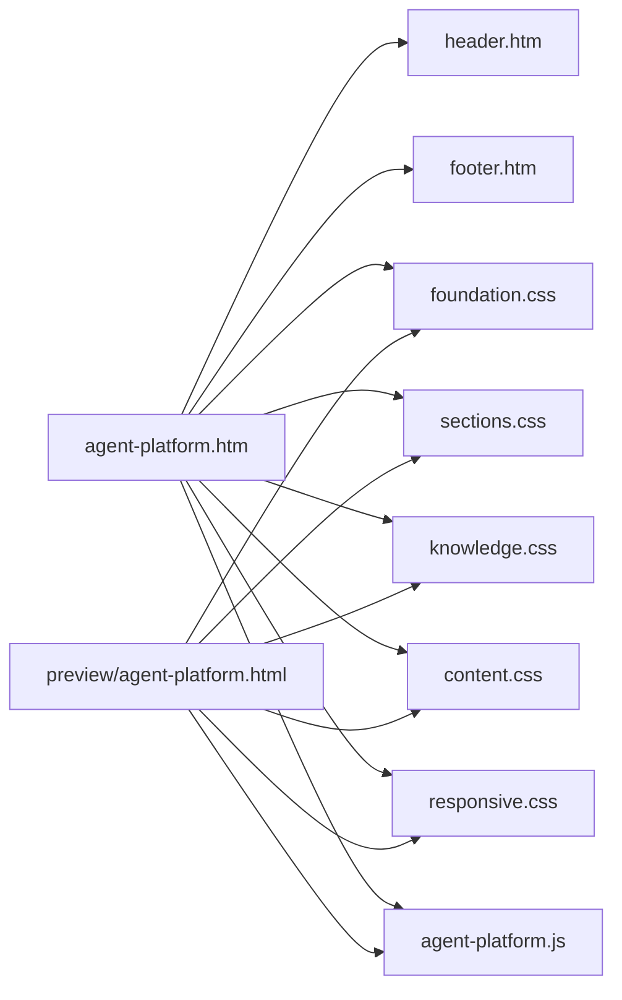
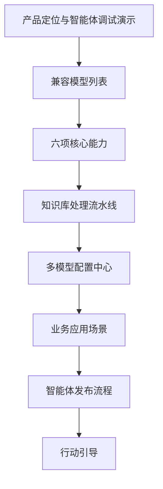

# Agent 平台 EyouCMS 展示页

## 目标

提供可直接接入 EyouCMS 的 Agent 管理平台营销展示页，完整表达以下产品能力：

- 创建、配置、调试和发布智能体。
- 上传 TXT、Word、PDF、Markdown 等资料并完成解析、清洗、切片和索引。
- 统一接入 DeepSeek、通义千问、豆包、本地模型等模型平台。
- 为已发布智能体生成带鉴权和观测能力的 API。
- 通过业务场景与标准流程解释平台的实际使用方式。

该模块只负责产品展示和前端交互演示，不实现真实文件上传、模型调用、智能体管理或 EyouCMS
后台字段配置。这些能力应由后续业务模块与 API 提供。

## 目录结构

```text
templates/eyoucms/
├── agent-platform.htm               # EyouCMS 页面模板
├── preview/
│   └── agent-platform.html          # 无 EyouCMS 依赖的测试页
└── skin/
    ├── css/
    │   ├── agent-foundation.css     # 设计令牌与通用组件
    │   ├── agent-sections.css       # 导航、首屏、能力卡片
    │   ├── agent-knowledge.css      # 知识流水线与模型中心
    │   ├── agent-content.css        # 场景、流程与 CTA
    │   └── agent-responsive.css     # 响应式与无障碍动画
    └── js/
        └── agent-platform.js        # 演示交互与滚动动画
```



## 页面结构



## EyouCMS 接入

1. 将 `agent-platform.htm` 复制到当前站点的模板目录。
2. 将 `skin/css` 与 `skin/js` 下的 Agent 文件复制到该模板对应的 `skin` 目录。
3. 在 EyouCMS 后台将目标栏目或单页模板设置为 `agent-platform.htm`。
4. 确认当前模板目录已存在 `header.htm` 与 `footer.htm`。如站点使用其他名称，修改模板顶部和底部的
   `{eyou:include ...}`。
5. 页面标题、关键词、描述和站点图标读取 EyouCMS 当前栏目的 SEO 字段与全局字段。

模板内部 CTA 使用页面锚点，不依赖固定栏目 ID。接入站点后，可将按钮链接替换为站点已有的产品体验、
注册或联系栏目标签。

## 本地预览

`preview/agent-platform.html` 不包含任何 EyouCMS 标签，可直接用浏览器打开。也可从仓库根目录启动静态服务：

```bash
python3 -m http.server 4173 -d templates/eyoucms
```

然后访问：

```text
http://localhost:4173/preview/agent-platform.html
```

## 演示交互

- 输入问题并发送，页面会追加用户消息和一条本地模拟回答。
- 点击模型卡片会同步更新模型中心和首屏调试窗口的当前模型。
- 点击“重新演示处理”会依次展示上传、解析、清洗、切片和发布状态。
- 滚动进入视口时展示轻量入场动画；系统偏好减少动画时自动关闭。

上述交互不发送网络请求，也不存储输入内容。

## 响应式范围

- 桌面端：双栏首屏、三列能力卡片、四列场景与流程。
- 平板端：首屏和功能展示改为单栏，能力与场景改为两列。
- 移动端：全部卡片单列，隐藏工作台侧栏，知识处理步骤改为纵向。

## 扩展方式

- 新增模型只需增加带 `data-model-name` 的模型按钮，现有脚本会自动接管选择行为。
- 新增页面区块时优先复用设计令牌、容器、标题、卡片、按钮和图标组件。
- 接入真实 API 时，保留展示层结构，将演示事件替换为独立业务模块，不要在模板中直接保存密钥或调用模型。
- EyouCMS 页面与预览页有意保留少量 HTML 重复：前者包含模板标签和公共头尾，后者必须支持离线直接打开；
  CSS 与 JavaScript 已完全共享，视觉与交互规则只维护一份。

## 验证范围

- Prettier 检查 HTML、CSS、JavaScript 和 Markdown 格式。
- 文件行数检查保证单个文件不超过 500 行。
- 浏览器桌面和移动视口验证布局、锚点、模型切换、对话与知识处理演示。
- 项目现有 lint、类型检查、单元测试和生产构建继续作为合并质量门禁。
