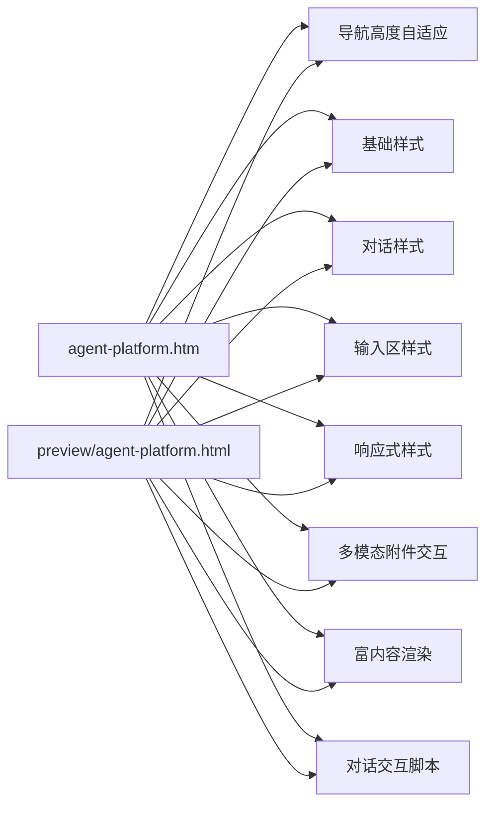
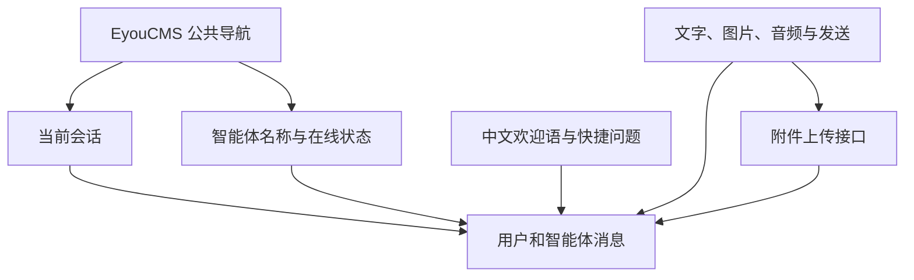
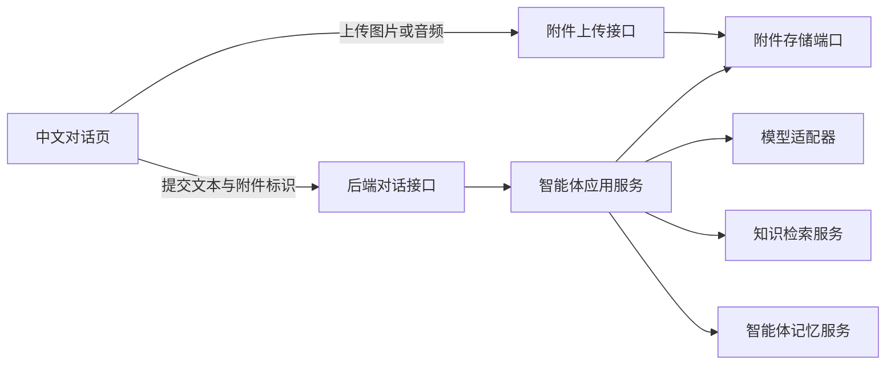

# 中文智能体对话页

## 目标

为最终用户提供一个纯中文、专注对话的智能体页面。页面只允许用户：

- 开始新对话。
- 查看当前浏览器会话。
- 切换浏览器本地保存的最近会话，并通过同一 `conversationId` 恢复服务端短期记忆。
- 输入问题并发送。
- 上传图片或音频，与文本一起发送给当前智能体。
- 查看富内容回答：Markdown、数学公式、表格、ECharts（含仪表盘）与 Mermaid 图表。
- 点击常用问题快速发起对话。
- 未配置智能体 ID 时，从平台全部可用智能体（除已停用外）中选择要对话的智能体；配置后只能使用指定的那一个。
- 清空当前对话。
- 在手机端打开或关闭对话列表。
- 从 `/api/branding` 读取后台配置的软件名称和图标。

API 密钥、模型供应商、知识库文件、文档解析、清洗、切片和发布等配置全部属于后台管理能力，
不得出现在该测试页面。

## 非目标

- 不在浏览器中保存或展示 API 密钥。
- 不在前台配置模型、提示词、知识库或接口。
- 不在测试页上传或管理知识文件。
- 不在浏览器直接调用第三方模型；浏览器只保存最近会话副本和不含密钥的会话标识。

独立 HTML 和 EyouCMS 模板调用 NestJS
`/api/public/agents/:agentId/chat`，除已停用外的智能体均可用。后端根据智能体配置完成知识检索与真实模型调用。
页面同时读取 `/api/branding`；品牌接口失败时保留模板内置的名称和机器人图标，不影响对话。

## 目录结构

```text
templates/eyoucms/
├── agent-platform.htm               # EyouCMS 中文对话模板
├── preview/
│   └── agent-platform.html          # 可直接进入的独立测试页
└── skin/
    ├── css/
    │   ├── agent-foundation.css     # 中文排版、颜色和基础组件
    │   ├── agent-chat.css           # 侧栏、头部、消息和欢迎区
    │   ├── agent-composer.css       # 底部输入框
    │   ├── agent-rich-content.css   # 回答中的 Markdown、公式、表格与图表样式
    │   ├── agent-selector.css       # 智能体选择器样式
    │   └── agent-responsive.css     # 平板与手机适配
    └── js/
        ├── agent-site-layout.js     # 自动测量站点固定导航高度
        ├── agent-branding.js        # 品牌名称与图标加载
        ├── agent-selector.js        # 未指定智能体时的选择器
        ├── agent-attachments.js     # 附件选择、预览、移除和上传
        ├── agent-conversations.js   # 浏览器本地会话历史
        ├── agent-memory-identity.js # 会话 ID 与 owner 隔离标识
        ├── agent-rich-content.js    # Markdown、KaTeX、ECharts 与 Mermaid 渲染
        └── agent-platform.js        # 后台地址、品牌加载、对话和移动侧栏
```



## 页面结构



页面没有后台导航、模型选择、知识库管理或 API 配置入口。
`agent-site-layout.js` 在页面加载和窗口变化时自动测量站点固定/粘性导航的高度，
并写入 CSS 变量 `--chat-site-navigation-height`，工作区据此下移，
避免固定导航覆盖对话头部；特殊主题也可在
`agent-foundation.css` 中手动覆盖该变量。
快捷问题文案包裹在 `chat-suggestion__copy` 中，文案样式不再命中图标容器，
图标与文案垂直居中对齐。
工作区固定在公共导航与视口底部之间，不受站点页脚样式或页面内容高度影响。
主内容网格显式允许对话区收缩和滚动，短窗口恢复初始欢迎内容时输入区仍固定可见。
左侧会话列表拥有独立滚动区域，记录增多时品牌、新建按钮和底部说明保持可见。
内置 SVG 图标同时声明现代 `href` 与兼容 `xlink:href` 引用，
避免部分浏览器出现图标缺失或错位。
页面所有图标均来自内置 SVG 图标集（sprite），不使用 emoji 字符。

## 如何进入测试页面

先启动 API，并在后台创建至少一个智能体。启动 API 前必须准备 PostgreSQL + pgvector 与 Redis；本地可运行 `docker compose up -d postgres redis`。
然后在仓库根目录启动静态服务：

在仓库根目录运行：

```bash
python3 -m http.server 4173 -d templates/eyoucms
```

浏览器访问：

```text
http://localhost:4173/preview/agent-platform.html
```

这种方式更接近网站部署后的资源加载方式。

预览页必须指定智能体：

```text
http://localhost:4173/preview/agent-platform.html?agentId=<智能体ID>
```

页面与 NestJS 后台通信的基础地址统一保存在
`skin/js/agent-platform.js` 顶部的 `AGENT_BACKEND_BASE_URL` 常量中。

智能体 ID 的确定顺序（优先级从高到低）：

1. URL 查询参数 `agentId`。
2. EyouCMS 页面的 `agent_id` 自定义字段。
3. `agent-platform.js` 顶部的 `AGENT_DEFAULT_AGENT_ID` 常量。
4. 以上均未配置时，页面请求公开接口 `GET /api/public/agents`，
   展示平台全部可用智能体（除已停用外）供访问者选择；接口只返回
   `id`、`name`、`description`，不泄露提示词与模型信息。
   同域部署使用 `/api`；前后端分离部署时改为完整地址，例如
   `https://api.example.com/api`。

富内容渲染库（markdown-it、KaTeX、ECharts、Mermaid）按需懒加载，
基础地址统一保存在 `skin/js/agent-rich-content.js` 顶部的
`AGENT_RICH_ASSET_BASE_URL` 常量中，默认使用公共 CDN；内网或离线部署时
改为自托管目录即可，目录内部结构需与 npm 包路径一致。
渲染库加载失败时回退为纯文本显示，不影响对话。

## EyouCMS 接入

1. 将 `agent-platform.htm` 复制到当前 EyouCMS 站点的模板目录。
2. 将 `skin/css` 和 `skin/js` 中以 `agent-` 开头的文件复制到对应模板的 `skin` 目录。
3. 确认站点模板中已有 `skin/css/style.css`、`skin/css/all.min.css`、`header.htm`
   和 `footer.htm`。
4. 在 EyouCMS 后台为需要承载智能体的单页或栏目选择 `agent-platform.htm`。
5. 保存并生成页面后，直接访问该单页或栏目的前台地址。
6. 可选：创建 `agent_id` 自定义字段并填写智能体 ID；
   不填写时访问者可在页面上自行选择平台全部可用智能体；填写后只能使用该智能体。
7. 在 `agent-platform.js` 中设置 `AGENT_BACKEND_BASE_URL`。
8. 标题、关键词、描述和站点图标读取 EyouCMS 当前页面字段。

模板严格加载站点公共样式和头尾：

```text
{eyou:static file="skin/css/style.css" /}
{eyou:static file="skin/css/all.min.css" /}
{eyou:include file="header.htm" /}
<!-- 智能体对话主体 -->
{eyou:include file="footer.htm" /}
```

## 测试页交互

- 点击快捷问题会自动发送对应内容。
- 输入文字后按回车发送，`Shift + Enter` 换行。
- 可选择最多 6 个 PNG、JPG、WebP、GIF、MP3 或 WAV 附件；附件可单独发送。
- 附件先上传到 `/api/chat-attachments`，对话消息只提交后端返回的附件标识。
- 已发送的图片和音频在当前会话中显示预览，重新开始时释放本地预览资源。
- 发送后先展示“正在回复”，再通过 SSE 逐段显示真实模型和知识检索生成的回答。
- 回答按 Markdown 渲染，支持标题、列表、代码块、表格与 `$...$`/`$$...$$` 数学公式；
  `echarts` 代码块渲染图表（含仪表盘 gauge），`mermaid` 代码块渲染流程图，
  图表在回答结束后统一绘制，避免流式半截 JSON 渲染失败。
- Markdown 渲染禁用原始 HTML，避免模型输出脚本进入页面。
- 点击“开始新对话”“重新开始”或清空按钮会恢复初始状态。
- 手机端点击左上角菜单按钮可打开最近对话抽屉。

页面按智能体在 `localStorage` 中最多保存 30 条会话副本，并把同一
`conversationId` 和浏览器级随机 `memoryOwnerKey` 交给平台后端。服务端按 owner 隔离并保存最近短期消息，召回长期偏好/事实，
因此刷新页面或跨会话提问时仍能保持连续性。第三方模型密钥始终留在后端。

## 接入边界



前台只向后端对话接口提交智能体标识和消息。以下内容必须留在服务端：

- 模型平台密钥。
- 模型名称与参数。
- 智能体提示词。
- 知识库标识和检索策略。
- 文档处理状态与管理操作。

不得把第三方模型密钥写入 HTML、JavaScript 或浏览器存储。

## 扩展方式

- 当前页面生成不可预测的 `conversationId`，本地历史与服务端短期记忆使用同一标识；
  接入账号体系后应改由后端签发并校验会话归属。
- 流式回答使用公开 SSE 接口，前端只负责增量渲染文本。
- 公共导航高度变化时只调整 CSS 配置变量，不修改页面结构。
- 后台域名变化时只调整 JavaScript 配置常量，不在模板中散落地址。
- 新增用户可见能力前先确认它属于对话体验；后台管理功能必须放入独立管理端模块。

## 验证范围

- 页面可通过静态服务连接真实 API。
- 所有可见文案均为中文。
- 页面不存在 API、模型和知识库配置控件。
- 输入、快捷问题、回复、清空和移动侧栏交互可用。
- 短窗口和 EyouCMS 公共导航同时存在时输入区保持可见。
- 图片和音频可选择、预览、移除、上传，并通过公开智能体接口发送。
- 回答中的 Markdown、公式、表格、ECharts 仪表盘与 Mermaid 图表可正常渲染。
- 单个源文件不超过 500 行。
- 项目格式、lint、类型检查、测试和构建保持通过。
