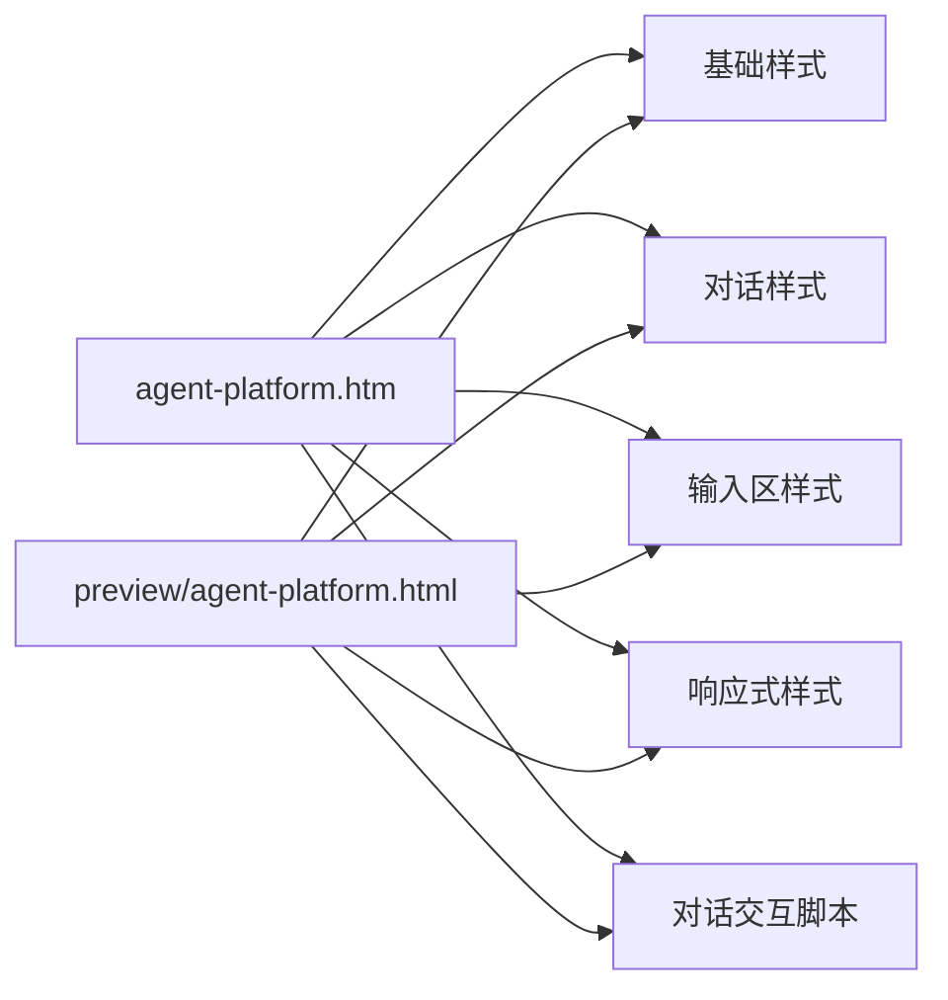
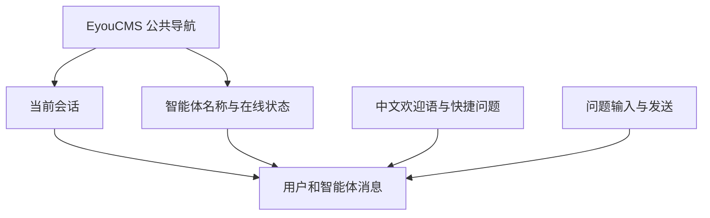
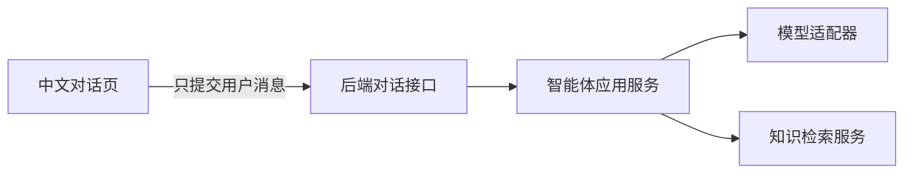

# 中文智能体对话页

## 目标

为最终用户提供一个纯中文、专注对话的智能体页面。页面只允许用户：

- 开始新对话。
- 查看当前浏览器会话。
- 输入问题并发送。
- 点击常用问题快速发起对话。
- 清空当前对话。
- 在手机端打开或关闭对话列表。
- 从 `/api/branding` 读取后台配置的软件名称和图标。

API 密钥、模型供应商、知识库文件、文档解析、清洗、切片和发布等配置全部属于后台管理能力，
不得出现在该测试页面。

## 非目标

- 不在浏览器中保存或展示 API 密钥。
- 不在前台配置模型、提示词、知识库或接口。
- 不在测试页上传或管理知识文件。
- 不在浏览器直接调用第三方模型或持久化会话。

独立 HTML 和 EyouCMS 模板调用 NestJS
`/api/public/agents/:agentId/chat`，只有已发布智能体可用。后端根据智能体配置完成知识检索与真实模型调用。
页面同时读取 `/api/branding`；品牌接口失败时保留模板内置的名称和机器人图标，不影响对话。

## 目录结构

```text
templates/eyoucms/
├── agent-platform.htm               # EyouCMS 中文对话模板
├── preview/
│   └── agent-platform.html          # 可直接进入的独立测试页
└── skin/
    ├── css/
    │   ├── agent-foundation.css     # 中文排版、颜色和基础组件
    │   ├── agent-chat.css           # 侧栏、头部、消息和欢迎区
    │   ├── agent-composer.css       # 底部输入框
    │   └── agent-responsive.css     # 平板与手机适配
    └── js/
        └── agent-platform.js        # 后台地址、品牌加载、发送和移动侧栏
```



## 页面结构



页面没有后台导航、模型选择、知识库管理或 API 配置入口。
EyouCMS 模板通过 `agent-chat-page--eyoucms` 为站点公共导航预留 64px，
避免固定导航覆盖对话头部；站点导航高度不同时只需修改
`agent-foundation.css` 中的 `--chat-site-navigation-height`。

## 如何进入测试页面

先启动 API，并在后台创建至少一个智能体。Zvec 随 NestJS 进程加载，不需要单独启动服务。
然后在仓库根目录启动静态服务：

在仓库根目录运行：

```bash
python3 -m http.server 4173 -d templates/eyoucms
```

浏览器访问：

```text
http://localhost:4173/preview/agent-platform.html
```

这种方式更接近网站部署后的资源加载方式。

预览页必须指定智能体：

```text
http://localhost:4173/preview/agent-platform.html?agentId=<智能体ID>
```

页面与 NestJS 后台通信的基础地址统一保存在
`skin/js/agent-platform.js` 顶部的 `AGENT_BACKEND_BASE_URL` 常量中。
同域部署使用 `/api`；前后端分离部署时改为完整地址，例如
`https://api.example.com/api`。

## EyouCMS 接入

1. 将 `agent-platform.htm` 复制到当前 EyouCMS 站点的模板目录。
2. 将 `skin/css` 和 `skin/js` 中以 `agent-` 开头的文件复制到对应模板的 `skin` 目录。
3. 确认站点模板中已有 `skin/css/style.css`、`skin/css/all.min.css`、`header.htm`
   和 `footer.htm`。
4. 在 EyouCMS 后台为需要承载智能体的单页或栏目选择 `agent-platform.htm`。
5. 保存并生成页面后，直接访问该单页或栏目的前台地址。
6. 创建 `agent_id` 自定义字段并填写智能体 ID。
7. 在 `agent-platform.js` 中设置 `AGENT_BACKEND_BASE_URL`。
8. 标题、关键词、描述和站点图标读取 EyouCMS 当前页面字段。

模板严格加载站点公共样式和头尾：

```text
{eyou:static file="skin/css/style.css" /}
{eyou:static file="skin/css/all.min.css" /}
{eyou:include file="header.htm" /}
<!-- 智能体对话主体 -->
{eyou:include file="footer.htm" /}
```

## 测试页交互

- 点击快捷问题会自动发送对应内容。
- 输入文字后按回车发送，`Shift + Enter` 换行。
- 发送后先展示“正在回复”，再通过 SSE 逐段显示真实模型和知识检索生成的回答。
- 点击“开始新对话”“重新开始”或清空按钮会恢复初始状态。
- 手机端点击左上角菜单按钮可打开最近对话抽屉。

消息会提交到平台后端，但不会在浏览器存储中持久化；第三方模型密钥始终留在后端。

## 接入边界



前台只向后端对话接口提交智能体标识和消息。以下内容必须留在服务端：

- 模型平台密钥。
- 模型名称与参数。
- 智能体提示词。
- 知识库标识和检索策略。
- 文档处理状态与管理操作。

不得把第三方模型密钥写入 HTML、JavaScript 或浏览器存储。

## 扩展方式

- 会话持久化应由后端返回会话标识，左侧历史列表只读取用户有权限查看的会话。
- 流式回答使用公开 SSE 接口，前端只负责增量渲染文本。
- 公共导航高度变化时只调整 CSS 配置变量，不修改页面结构。
- 后台域名变化时只调整 JavaScript 配置常量，不在模板中散落地址。
- 新增用户可见能力前先确认它属于对话体验；后台管理功能必须放入独立管理端模块。

## 验证范围

- 页面可通过静态服务连接真实 API。
- 所有可见文案均为中文。
- 页面不存在 API、模型和知识库配置控件。
- 输入、快捷问题、回复、清空和移动侧栏交互可用。
- 单个源文件不超过 500 行。
- 项目格式、lint、类型检查、测试和构建保持通过。
