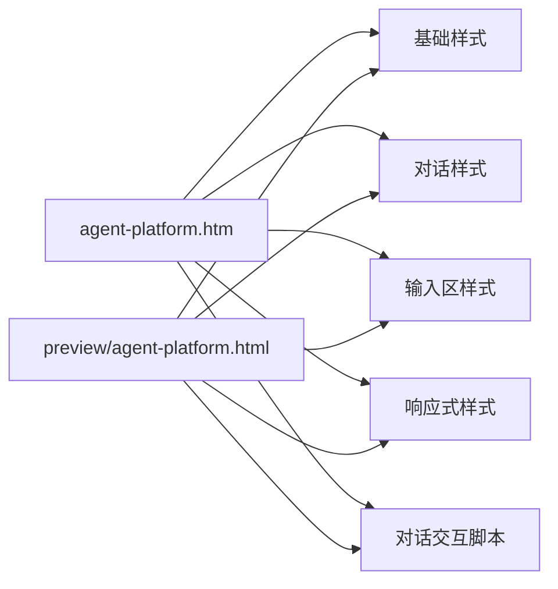
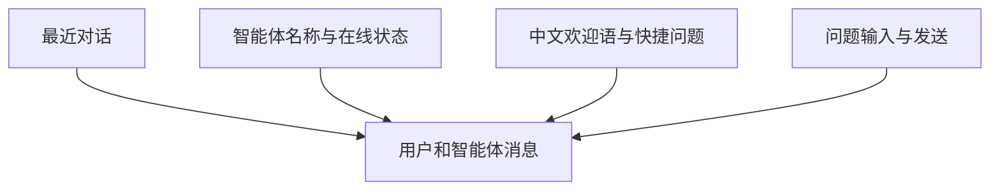
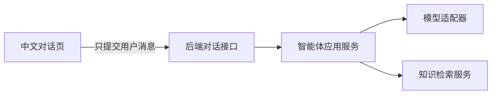

# 中文智能体对话页

## 目标

为最终用户提供一个纯中文、专注对话的智能体页面。页面只允许用户：

- 开始新对话。
- 查看最近对话的界面示例。
- 输入问题并发送。
- 点击常用问题快速发起对话。
- 清空当前对话。
- 在手机端打开或关闭对话列表。

API 密钥、模型供应商、知识库文件、文档解析、清洗、切片和发布等配置全部属于后台管理能力，
不得出现在该测试页面。

## 非目标

- 不在浏览器中保存或展示 API 密钥。
- 不在前台配置模型、提示词、知识库或接口。
- 不在测试页上传或管理知识文件。
- 不在本模块实现真实模型调用和会话持久化。

当前独立 HTML 使用本地模拟回复，目的是确认页面样式和基础交互。正式接入时应由后端根据当前智能体配置
完成模型调用和知识检索。

## 目录结构

```text
templates/eyoucms/
├── agent-platform.htm               # EyouCMS 中文对话模板
├── preview/
│   └── agent-platform.html          # 可直接进入的独立测试页
└── skin/
    ├── css/
    │   ├── agent-foundation.css     # 中文排版、颜色和基础组件
    │   ├── agent-chat.css           # 侧栏、头部、消息和欢迎区
    │   ├── agent-composer.css       # 底部输入框
    │   └── agent-responsive.css     # 平板与手机适配
    └── js/
        └── agent-platform.js        # 发送、清空、快捷问题和移动侧栏
```



## 页面结构



页面没有后台导航、模型选择、知识库管理或 API 配置入口。

## 如何进入测试页面

### 方式一：直接打开

在文件管理器中双击：

```text
templates/eyoucms/preview/agent-platform.html
```

该页面的样式和脚本使用相对路径，不需要安装依赖，也不需要启动后端。

### 方式二：启动本地静态服务

在仓库根目录运行：

```bash
python3 -m http.server 4173 -d templates/eyoucms
```

浏览器访问：

```text
http://localhost:4173/preview/agent-platform.html
```

这种方式更接近网站部署后的资源加载方式。

## EyouCMS 接入

1. 将 `agent-platform.htm` 复制到当前 EyouCMS 站点的模板目录。
2. 将 `skin/css` 和 `skin/js` 中以 `agent-` 开头的文件复制到对应模板的 `skin` 目录。
3. 在 EyouCMS 后台为需要承载智能体的单页或栏目选择 `agent-platform.htm`。
4. 保存并生成页面后，直接访问该单页或栏目的前台地址。
5. 标题、关键词、描述和站点图标读取 EyouCMS 当前页面字段。

模板故意不引入网站公共 `header.htm` 和 `footer.htm`，以保证用户进入后看到的是完整对话界面。
如果站点必须保留公共头尾，可以在模板的 `<body>` 内按现有站点规范添加。

## 测试页交互

- 点击快捷问题会自动发送对应内容。
- 输入文字后按回车发送，`Shift + Enter` 换行。
- 发送后先展示“正在回复”，再返回本地中文演示回答。
- 点击“开始新对话”“重新开始”或清空按钮会恢复初始状态。
- 手机端点击左上角菜单按钮可打开最近对话抽屉。

所有输入只保留在当前浏览器页面，不会上传、保存或调用第三方模型。

## 正式接入边界



正式接入时，前台只向后端对话接口提交消息和会话标识。以下内容必须留在服务端：

- 模型平台密钥。
- 模型名称与参数。
- 智能体提示词。
- 知识库标识和检索策略。
- 文档处理状态与管理操作。

不得把第三方模型密钥写入 HTML、JavaScript 或浏览器存储。

## 扩展方式

- 接入真实对话时，将脚本中的本地回复替换为独立 HTTP 客户端调用，不改变页面结构。
- 会话持久化应由后端返回会话标识，左侧历史列表只读取用户有权限查看的会话。
- 如果需要流式回答，由后端提供流式接口，前端只负责逐段渲染文本。
- 新增用户可见能力前先确认它属于对话体验；后台管理功能必须放入独立管理端模块。

## 验证范围

- 页面可直接打开，也可通过静态服务访问。
- 所有可见文案均为中文。
- 页面不存在 API、模型和知识库配置控件。
- 输入、快捷问题、回复、清空和移动侧栏交互可用。
- 单个源文件不超过 500 行。
- 项目格式、lint、类型检查、测试和构建保持通过。
