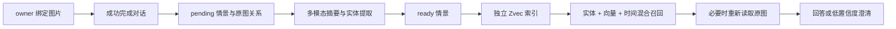
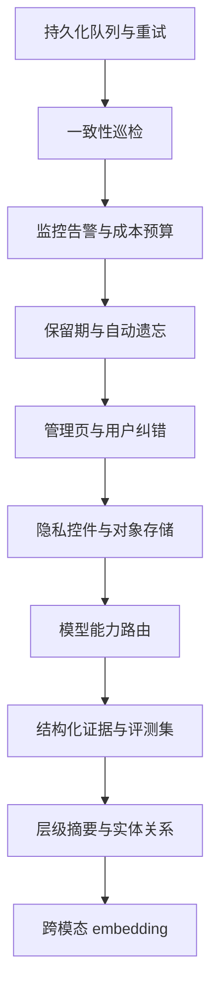

# 图片情景记忆未实现项与后续路线

## 文档目的

第一阶段已经完成图片上传、情景提取、跨会话召回、原图证据回读、隔离和删除闭环。本文件只记录尚未实现或有意延后的能力，避免把第一阶段能力误认为完整的生产级记忆平台。

## 第一阶段已完成边界



当前已具备：

- `agentId + ownerKey` 隔离的图片上传、读取、召回和删除。
- `pending / ready` 情景状态及视觉提取失败降级。
- 图片摘要、可检索实体、重要度和原始附件关系。
- 独立于企业知识库的 Zvec 情景索引。
- “上次”“最近”“那只狗”“前一张”等中文指代召回。
- 颜色、数量、品种、OCR 等视觉问题的原图回读。
- 候选接近或证据不足时的澄清约束。
- SQLite、索引、附件关系和无引用媒体的联动删除。
- 列表、单条删除、清空和原始图片查看接口。

## 尚未实现

### P0：生产稳定性

#### 1. 持久化异步任务与自动重试

当前情景提取在回答结束后通过进程内异步调用执行。服务重启、进程崩溃或模型暂时不可用时，`pending` 记录会保留，但不会自动重试。

后续需要：

- 增加持久化任务表或队列。
- 使用 Outbox 保证“情景已创建”和“任务已投递”的一致性。
- 为视觉提取、embedding 和索引写入分别设置重试次数、退避和死信状态。
- 提供 `pending` 扫描、手动重试和批量恢复入口。
- 使用幂等键避免重复情景和重复索引点。

#### 2. 数据一致性巡检

当前删除路径会同步清理相关资源，但没有后台巡检器处理异常退出或人工改库产生的不一致。

后续需要定期检查：

- SQLite 有情景但 Zvec 无向量。
- Zvec 有向量但 SQLite 已删除。
- artifact 指向不存在的附件。
- 本地媒体无任何 artifact 引用。
- `pending` 超过最大处理时间。

#### 3. 记忆专项监控与告警

当前失败会写结构化日志，尚未提供记忆专项仪表盘和告警规则。

建议增加：

- 情景创建量、成功率、失败率和 `pending` 积压量。
- 视觉提取、embedding、召回和原图读取延迟。
- 每个 provider、agent 和 owner 维度的 Token 与成本聚合。
- 索引不可用、媒体缺失、越权拒绝和一致性异常告警。
- 每日成本预算和异常增长告警。

#### 4. 保留期与自动遗忘

当前情景会一直保存，除非用户或管理端主动删除。

后续需要：

- owner 或 agent 级保留期配置。
- 最近访问时间、重要度和用户固定标记共同决定保留策略。
- 删除前宽限期和可恢复回收站。
- 到期情景、索引点和媒体的统一清理任务。

### P1：用户可控与管理能力

#### 5. 可视化记忆管理页

当前服务端已有列表、查看原图、删除和清空接口，但管理后台没有独立的记忆页面。

建议页面支持：

- 按 owner、agent、状态、时间和实体筛选。
- 查看摘要、原图、来源会话和访问次数。
- 重试 `pending`、编辑摘要、修正实体和调整重要度。
- 合并重复情景、固定重要情景和批量删除。
- 显示“这条回答使用了哪些记忆”的召回解释。

#### 6. 用户纠错与冲突处理

当前模型提取结果可以删除，但不能直接纠正。用户说“那不是柯基”时，也没有结构化地覆盖旧结论。

后续需要：

- 保存用户修正及其来源，不直接静默覆盖历史证据。
- 对摘要、实体和结构化属性进行版本管理。
- 冲突时优先使用用户明确修正，并保留审计记录。
- 支持“不要再记这张图”和“这条记忆不属于我”等自然语言控制。

#### 7. 显式隐私与 Temporary Chat 控件

当前未提供 `memoryOwnerKey` 的调用不会形成长期情景，但前端还没有统一的“临时聊天/关闭记忆”开关。

后续需要：

- 在所有聊天入口提供清晰的记忆开关和状态提示。
- 上传前告知图片是否会形成长期情景。
- 提供 owner 级导出、全部删除和撤回授权。
- 为敏感图片提供更短保留期或完全不落盘模式。

#### 8. 媒体存储增强

当前复用本地附件存储，适合单实例部署，尚未实现：

- S3、OSS 等对象存储适配器。
- 静态加密、密钥轮换和细粒度访问审计。
- 内容哈希去重和病毒扫描。
- 多实例并发、生命周期策略和跨区域备份。
- 缩略图与原图分层，降低管理页面读取成本。

#### 9. 模型能力路由

当前使用智能体配置的对话模型完成视觉提取，没有单独的视觉模型配置和能力探测。

后续需要：

- 区分对话模型、视觉提取模型和 embedding 模型。
- 启动或保存配置时验证模型是否支持图片。
- 按成本、延迟和质量路由不同任务。
- 支持模型降级，并记录不同模型生成结果的置信度。

#### 10. 更多媒体类型

第一阶段只把图片形成长期情景。音频可以用于当前多模态聊天，但不会自动形成可召回的音频情景；视频、文档截图序列和实时摄像头也未支持。

### P2：高级记忆智能

#### 11. 结构化视觉属性与 OCR 证据

当前摘要和实体以文本形式保存，没有独立字段记录：

- OCR 文本及区域。
- 对象数量、颜色、品种等属性。
- 每个结论的置信度。
- 结论对应的图片区域或来源附件。

结构化证据可以让系统在低置信度时更准确地决定回答、回读原图或请求澄清。

#### 12. 情景合并与层级摘要

当前每次图片事件独立保存，尚未实现：

- 相近事件去重。
- 多次出现的同一对象聚合。
- 日、周或主题级情景摘要。
- 稳定事实与情景记忆之间的受控晋升。

任何“情景晋升为事实”都必须要求高置信或用户确认，不能根据一张狗的图片推断用户拥有一只狗。

#### 13. 实体关系与身份连续性

当前通过文本实体检索“狗、柯基、公园”，没有判断两张图片中的狗是否为同一只，也没有图数据库。

后续可评估：

- 受控实体 ID 和别名。
- 用户确认后的“同一对象”关系。
- 时间线、地点和事件关系。
- 关系型表或图索引；数据规模不足时不应提前引入图数据库。

#### 14. 跨模态专用 embedding

当前 Zvec 保存的是情景摘要文本 embedding。尚未使用图片 embedding，因此主要依赖模型摘要质量。

后续可评估 CLIP、SigLIP 或供应商多模态 embedding，并采用：

```text
最终分数 =
  文本查询-摘要向量
  + 文本查询-图片向量
  + 实体词
  + 时间约束
  + 新近性
  + 重要度
```

#### 15. 标准化评测

当前测试覆盖功能正确性和隔离边界，尚未建立记忆质量基准。

建议建立固定评测集：

- 多张相似狗图片下的“上次/前一只”准确率。
- 数天和数十轮对话后的跨会话召回率。
- 错误图片、错误 owner 和错误 agent 的泄漏率必须为零。
- 候选冲突时的澄清率和编造率。
- 视觉回读后的颜色、数量、品种和 OCR 准确率。
- 成本、延迟、索引规模和保留期的长期趋势。

可参考 LoCoMo、LongMemEval 等长程记忆评测方法，但需要补充图片事件和视觉证据测试集。

## 推荐实施顺序



下一阶段建议先实现“持久化任务队列 + `pending` 自动重试 + 记忆专项监控”。这三项直接决定图片情景记忆在生产环境中的可恢复性和可运维性，优先级高于图谱或专用多模态 embedding。
