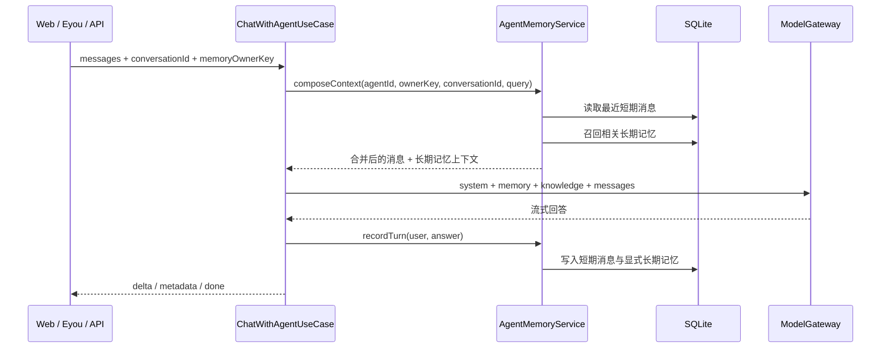
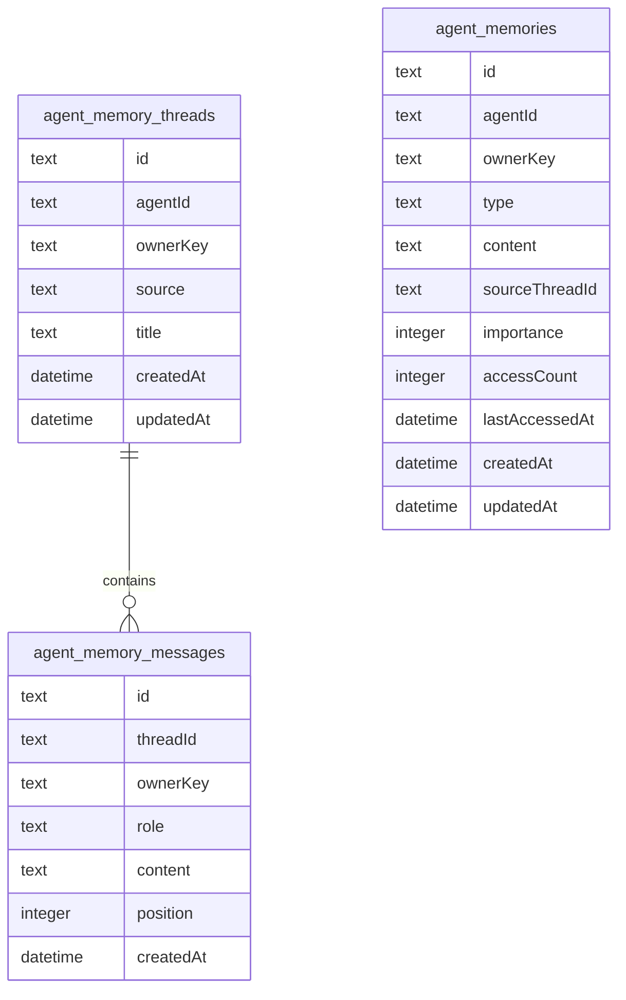

# 智能体记忆系统

## 模块目标

智能体记忆系统让同一个智能体在多轮和跨会话中保持上下文连续性：

- **短期记忆**：按 `memoryOwnerKey + conversationId` 持久化最近对话轮次，下一次请求可以只提交最新问题，服务端会恢复该会话最近消息。
- **长期记忆**：从用户显式要求“记住”的内容、姓名和偏好中提取稳定事实，跨会话召回并注入系统上下文。
- **可观测边界**：记忆只存储用户显式或高置信偏好，不写入密钥、附件二进制或模型完整提示词。
- **兼容现有入口**：后台测试页、公开 EyouCMS 页面和 OpenAI 兼容 API 继续复用 `ChatWithAgentUseCase`。

非目标：

- 不替代知识库 RAG。知识库面向企业文档，记忆面向对话中形成的用户/智能体上下文。
- 不把所有历史消息无限塞入模型上下文，只保留可配置最近轮次并按相关性召回长期记忆。
- 不使用模型二次调用做记忆抽取，避免额外成本和隐私扩大；后续可在应用层端口扩展为异步抽取器。

## 大厂实践参考

- LangGraph 将记忆分为 **thread-scoped short-term memory** 和跨线程的 **long-term store**：短期用 checkpointer 恢复线程状态，长期用 namespace store 检索事实。
- Google ADK 区分 `Session`、`State`、`MemoryService`：会话保存事件和临时状态，MemoryService 负责把完成会话或增量事件写入可搜索长期记忆。
- OpenAI Agents SDK 的 Sessions 在每次运行前读取历史、运行后写回新增项，并支持限制读取条数来控制上下文成本。
- Claude Memory Tool 把持久记忆交给应用侧存储，只在需要时读取，避免把所有历史都常驻上下文。
- Microsoft AutoGen 抽象 `Memory` 协议，核心能力是 `add`、`query`、`update_context`、`clear`。
- Letta 区分 always-visible memory blocks、可检索 archival memory 和外部 RAG；小而关键的偏好适合长期记忆，大文档仍交给知识库。

本项目采用与这些方案一致的两层结构：会话线程负责短期连续性，长期记忆仓库负责跨会话事实和偏好召回。

## 目录结构

```text
apps/api/src/modules/agent-memory/
├── agent-memory.module.ts
├── domain/
│   └── agent-memory.ts
├── application/
│   ├── agent-memory.repository.ts
│   ├── agent-memory.service.ts
│   └── agent-memory.service.spec.ts
├── infrastructure/
│   ├── agent-memory.entity.ts
│   ├── agent-memory-message.entity.ts
│   ├── agent-memory-thread.entity.ts
│   └── typeorm-agent-memory.repository.ts
└── presentation/http/
    ├── clear-agent-memory.controller.ts
    ├── delete-agent-memory.controller.ts
    ├── list-agent-memories.controller.ts
    └── memory-owner-key.ts
```

## 数据流



## 存储模型



`agent_memories.sourceThreadId` 只记录记忆来源，删除会话不会自动删除仍有效的长期记忆；清空 owner 记忆时由应用服务统一删除两类数据。

## 公共接口

### 对话请求

三个对话入口都支持可选 `conversationId`：

- `POST /api/agents/:id/chat`
- `POST /api/public/agents/:agentId/chat`
- `POST /api/v1/chat/completions`

示例：

```json
{
  "conversationId": "9fb4a3f7-91b7-46de-92a2-55d932f7a74f",
  "memoryOwnerKey": "225f42d8-ea54-46fc-a59f-a702ea0f0509",
  "messages": [{ "role": "user", "content": "请记住：我喜欢中文回答" }],
  "stream": true
}
```

### 长期记忆列表

```text
GET /api/agents/:agentId/memories?ownerKey=<memoryOwnerKey>
```

返回该智能体的长期记忆摘要，用于后台诊断和后续管理页扩展。

记忆始终按 `agentId + memoryOwnerKey` 隔离。后台测试页和 EyouCMS 页面在浏览器首次访问时生成随机 owner key；OpenAI 兼容接口使用 API 应用 ID 作为 owner key。未提供 owner key 的旧调用保持无状态，不读取或写入长期记忆。

### 删除和清空

```text
DELETE /api/agents/:agentId/memories/:memoryId?ownerKey=<memoryOwnerKey>
DELETE /api/agents/:agentId/memories?ownerKey=<memoryOwnerKey>
```

第一条只删除指定长期记忆；第二条清空该 owner 在指定智能体下的短期线程、短期消息和长期记忆。

## 记忆写入规则

长期记忆只在高置信场景写入：

- `请记住：...`
- `remember that ...`
- `我叫...`、`我的名字是...`
- `我喜欢...`、`我偏好...`
- `我不喜欢...`、`我希望你...`

疑问句不会按普通偏好规则写入；显式“记住”内容若同时符合姓名或偏好规则，只保存结构化后的单条记忆。相同 `agentId + ownerKey` 下相同内容去重，重复出现只更新重要度和更新时间。短期记忆只写入最新用户消息与成功回答，失败或中断的流不会增加对话计数，也不会写入记忆。

## 配置项

| 环境变量                            | 默认值 | 说明                       |
| ----------------------------------- | ------ | -------------------------- |
| `AGENT_MEMORY_RECENT_MESSAGE_LIMIT` | `12`   | 每个会话恢复的最近消息条数 |
| `AGENT_MEMORY_RECALL_LIMIT`         | `6`    | 每次注入模型的长期记忆条数 |

## 测试范围

- 单元测试覆盖短期历史重叠合并、长期记忆召回、显式记忆抽取、疑问句排除、owner 隔离、跨智能体隔离和成功轮次写入。
- E2E 测试覆盖 SQLite 持久化、跨会话召回、长期记忆列表、单条删除和 owner 级清空。
- 对话入口保持向后兼容；不传 `conversationId` 时仍按原来的请求消息工作。
- 记忆模块不依赖模型服务，不增加额外外部调用成本。

## 扩展方式

- 若需要更强语义召回，可新增 `MemoryIndex` 端口，用已有 embedding provider 写入 Zvec。
- 若需要后台人工维护，可在现有列表、删除和清空接口上增加记忆编辑页。
- 若需要更智能的记忆抽取，可新增异步抽取用例，但必须先做隐私白名单与成本告警。
