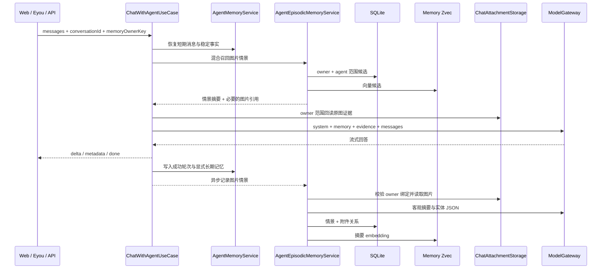
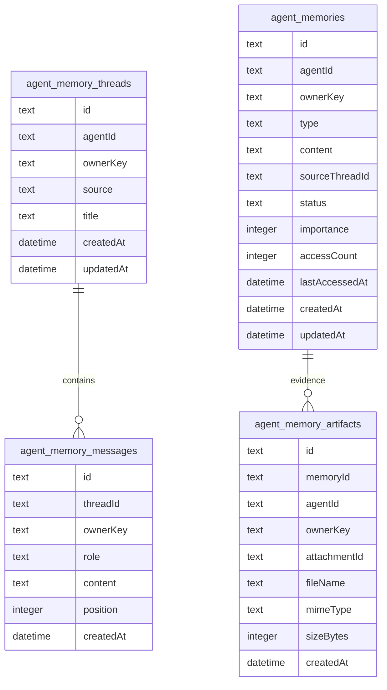

# 智能体记忆系统

## 模块目标

智能体记忆系统让同一个智能体在多轮和跨会话中保持上下文连续性：

- **短期记忆**：按 `memoryOwnerKey + conversationId` 持久化最近对话轮次，下一次请求可以只提交最新问题，服务端会恢复该会话最近消息。
- **长期记忆**：从用户显式要求“记住”的内容、姓名和偏好中提取稳定事实，跨会话召回并注入系统上下文。
- **图片情景记忆**：成功对话中的 owner 绑定图片会异步提取客观摘要和实体，保存原图引用，并支持“上次那只狗”“前一张图片”等跨会话指代。
- **独立混合检索**：情景记忆使用独立 Zvec 集合，并结合向量、实体词、时间顺序、新近性和重要度重排，不与企业知识库索引混用。
- **证据回读**：问题依赖颜色、数量、品种或 OCR 等视觉细节时，重新读取 owner 范围内原始图片交给多模态模型，而不是只依赖 caption。
- **可观测边界**：不写入密钥、base64、模型完整提示词或未经确认的对象归属；视觉提取失败时保留 `pending` 情景，不生成虚假描述。
- **兼容现有入口**：后台测试页、公开 EyouCMS 页面和 OpenAI 兼容 API 继续复用 `ChatWithAgentUseCase`。

非目标：

- 不替代知识库 RAG。知识库面向企业文档，记忆面向对话中形成的用户/智能体上下文。
- 不把所有历史消息无限塞入模型上下文，只保留可配置最近轮次并按相关性召回长期记忆。
- 第一阶段不引入图数据库或训练专用记忆模型；实体关系先通过 SQLite 情景文本、附件关系和检索实体表达。

## 大厂实践参考

- LangGraph 将记忆分为 **thread-scoped short-term memory** 和跨线程的 **long-term store**：短期用 checkpointer 恢复线程状态，长期用 namespace store 检索事实。
- Google ADK 区分 `Session`、`State`、`MemoryService`：会话保存事件和临时状态，MemoryService 负责把完成会话或增量事件写入可搜索长期记忆。
- OpenAI Agents SDK 的 Sessions 在每次运行前读取历史、运行后写回新增项，并支持限制读取条数来控制上下文成本。
- Claude Memory Tool 把持久记忆交给应用侧存储，只在需要时读取，避免把所有历史都常驻上下文。
- Microsoft AutoGen 抽象 `Memory` 协议，核心能力是 `add`、`query`、`update_context`、`clear`。
- Letta 区分 always-visible memory blocks、可检索 archival memory 和外部 RAG；小而关键的偏好适合长期记忆，大文档仍交给知识库。

本项目采用三层结构：会话线程负责短期连续性，稳定事实仓库负责跨会话偏好，图片情景层负责带时间和原始媒体证据的事件回忆。

## 目录结构

```text
apps/api/src/modules/agent-memory/
├── agent-memory.module.ts
├── domain/
│   └── agent-memory.ts
├── application/
│   ├── agent-episodic-memory.service.ts
│   ├── agent-memory-management.service.ts
│   ├── agent-memory.index.ts
│   ├── agent-memory.repository.ts
│   ├── agent-memory.service.ts
│   ├── episode-extraction.ts
│   └── episodic-memory-query.ts
├── infrastructure/
│   ├── agent-memory-artifact.entity.ts
│   ├── agent-memory.entity.ts
│   ├── agent-memory-message.entity.ts
│   ├── agent-memory-thread.entity.ts
│   ├── typeorm-agent-memory.repository.ts
│   └── zvec-agent-memory.index.ts
└── presentation/http/
    ├── clear-agent-memory.controller.ts
    ├── delete-agent-memory.controller.ts
    ├── get-agent-memory-artifact.controller.ts
    ├── list-agent-memories.controller.ts
    └── memory-owner-key.ts
```

## 数据流



## 存储模型



`agent_memories.type=episodic` 表示图片情景，`status=ready` 表示提取和索引成功，`status=pending` 表示原始证据已保存但视觉提取失败。`agent_memory_artifacts` 只保存安全附件引用和元数据，不保存 base64。删除情景后会清理 SQLite 关系、Zvec 点和无引用原始文件。

## 公共接口

### 对话请求

三个对话入口都支持可选 `conversationId`：

- `POST /api/agents/:id/chat`
- `POST /api/public/agents/:agentId/chat`
- `POST /api/v1/chat/completions`

示例：

```json
{
  "conversationId": "9fb4a3f7-91b7-46de-92a2-55d932f7a74f",
  "memoryOwnerKey": "225f42d8-ea54-46fc-a59f-a702ea0f0509",
  "messages": [{ "role": "user", "content": "请记住：我喜欢中文回答" }],
  "stream": true
}
```

### 长期记忆列表

```text
GET /api/agents/:agentId/memories?ownerKey=<memoryOwnerKey>
```

返回稳定记忆和图片情景摘要。图片情景包含 `status` 与 `artifacts` 元数据，可用于诊断、查看和删除。

### 查看情景原始图片

```text
GET /api/agents/:agentId/memories/:memoryId/artifacts/:artifactId?ownerKey=<memoryOwnerKey>
```

接口同时校验 `agentId + ownerKey + memoryId + artifactId`，只返回该 owner 的原始图片。上传时 Vue 和 EyouCMS 会通过 `X-Agent-Id`、`X-Memory-Owner-Key` 将附件绑定到智能体和 owner；旧的无状态附件仍可用于当前对话，但不会形成长期图片情景。

记忆始终按 `agentId + memoryOwnerKey` 隔离。后台测试页和 EyouCMS 页面在浏览器首次访问时生成随机 owner key；OpenAI 兼容接口使用 API 应用 ID 作为 owner key。未提供 owner key 的旧调用保持无状态，不读取或写入长期记忆。

### 删除和清空

```text
DELETE /api/agents/:agentId/memories/:memoryId?ownerKey=<memoryOwnerKey>
DELETE /api/agents/:agentId/memories?ownerKey=<memoryOwnerKey>
```

第一条删除指定记忆及其 Zvec 点和无引用图片；第二条清空该 owner 在指定智能体下的短期线程、短期消息、长期记忆、图片关系、向量和无引用媒体。

## 记忆写入规则

长期记忆只在高置信场景写入：

- `请记住：...`
- `remember that ...`
- `我叫...`、`我的名字是...`
- `我喜欢...`、`我偏好...`
- `我不喜欢...`、`我希望你...`

疑问句不会按普通偏好规则写入；显式“记住”内容若同时符合姓名或偏好规则，只保存结构化后的单条记忆。相同 `agentId + ownerKey` 下相同内容去重，重复出现只更新重要度和更新时间。短期记忆只写入最新用户消息与成功回答，失败或中断的流不会增加对话计数，也不会写入记忆。

图片情景遵循不同规则：

1. 只有成功完成的回答、有效 owner 和 owner 绑定图片才进入记录流程。
2. 回答内容先返回客户端，图片提取在流结束后异步执行，不增加首屏延迟。
3. 多模态模型只输出客观摘要、可检索实体和重要度，不允许推断“图片里的狗属于用户”等归属。
4. 提取成功后保存 `ready` 情景并写入独立 Zvec；失败时保存 `pending` 情景和原始证据，不写入虚假视觉描述。
5. 召回按向量、实体词、时间指代、新近性和重要度重排；低于阈值不注入，多个候选接近时要求模型先澄清。
6. “前一只/前一张”跳过最近候选；“最近/上次”优先最近事件。
7. 视觉细节问题回读原图；只询问事件大意时使用摘要，减少多模态成本。

## 配置项

| 环境变量                              | 默认值         | 说明                       |
| ------------------------------------- | -------------- | -------------------------- |
| `AGENT_MEMORY_RECENT_MESSAGE_LIMIT`   | `12`           | 每个会话恢复的最近消息条数 |
| `AGENT_MEMORY_RECALL_LIMIT`           | `6`            | 每次注入模型的稳定记忆条数 |
| `AGENT_MEMORY_EPISODE_RECALL_LIMIT`   | `3`            | 每次最多注入的图片情景数   |
| `AGENT_MEMORY_EPISODE_MIN_SCORE`      | `0.25`         | 情景召回最低混合分数       |
| `AGENT_MEMORY_ZVEC_COLLECTION_PREFIX` | `agent_memory` | 独立情景向量集合前缀       |

## 测试范围

- 单元测试覆盖短期历史重叠、稳定记忆抽取、中文实体词、最近/前一情景排序和候选歧义判断。
- E2E 测试覆盖图片上传、自动情景提取、跨会话“上次那只狗”、原图证据回读、owner 越权拒绝、删除清理和视觉模型失败后的 `pending` 降级。
- 对话入口保持向后兼容；不传 `conversationId` 时仍按原来的请求消息工作。
- 未提供 `memoryOwnerKey` 的调用保持无状态，不自动记录图片情景。

## 扩展方式

- 若需要后台人工维护，可在现有列表、删除和清空接口上增加记忆编辑页。
- 第二阶段可增加任务队列、失败重试、人工纠正和保留期清理；第三阶段再评估实体图谱和跨模态专用 embedding。
