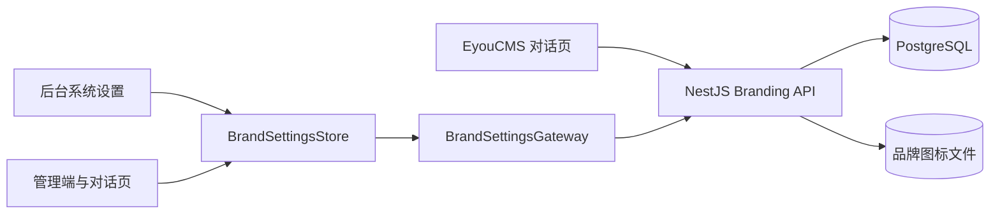

# 软件品牌配置

## 目标

管理员在后台统一修改软件名称和图标，配置由 NestJS 与 PostgreSQL 真实持久化，并应用到：

- Vue 管理后台侧栏、工作台和浏览器标题。
- Vue 智能体对话测试页。
- EyouCMS 智能体对话模板及独立 HTML 预览页。

未上传自定义图标时，各页面使用内置机器人图标，不依赖第三方图片服务。

## 结构

```text
apps/api/src/modules/branding/
├── domain/                    # 品牌配置与公开摘要
├── application/               # 查询、改名、上传和移除图标用例
├── infrastructure/
│   ├── brand-settings.entity.ts
│   ├── typeorm-brand-settings.repository.ts
│   └── storage/local-brand-icon.storage.ts
└── presentation/http/         # 品牌配置和图标 HTTP 接口

apps/web/src/modules/branding/
├── domain/brand-settings.ts
├── application/brand-settings.gateway.ts
├── infrastructure/http-brand-settings.gateway.ts
└── stores/brand-settings.store.ts
```



## 接口

| 方法     | 路径                 | 作用                         |
| -------- | -------------------- | ---------------------------- |
| `GET`    | `/api/branding`      | 获取软件名称及自定义图标状态 |
| `PUT`    | `/api/branding`      | 保存软件名称                 |
| `PUT`    | `/api/branding/icon` | 以原始二进制上传软件图标     |
| `GET`    | `/api/branding/icon` | 读取当前软件图标             |
| `DELETE` | `/api/branding/icon` | 恢复内置默认图标             |

图标上传请求必须携带正确的 `Content-Type` 与 `Content-Length`。后端同时校验文件大小和文件签名，
只接受 PNG、JPG、WebP、ICO。

## 持久化

- PostgreSQL 的 `brand_settings` 单例记录只保存名称、图标 MIME 类型和存储键。
- 图标二进制写入 `BRAND_STORAGE_PATH`，不写入 PostgreSQL。
- 新图标成功保存数据库后才删除旧图标；数据库保存失败时清理新文件。
- 图标响应使用带更新时间版本参数的 URL，允许浏览器安全缓存。

## 配置

- `DEFAULT_SOFTWARE_NAME`：数据库尚无配置时的软件名称。
- `BRAND_STORAGE_PATH`：图标文件目录，默认 `brand-storage`。
- `BRAND_ICON_MAX_BYTES`：图标大小上限，默认 `1048576`（1MB）。

## 后台使用

进入 `/settings`：

1. 输入 2～40 个字符的软件名称。
2. 可选择 PNG、JPG、WebP 或 ICO 图片。
3. 保存后配置立即更新；“恢复默认图标”会删除当前自定义图标。

## 测试范围

- API 端到端测试覆盖默认配置、名称持久化、图标上传、图标读取和恢复默认图标。
- Pinia 单元测试覆盖配置加载及名称与图标的保存顺序。
- 数据库迁移测试验证关闭同步模式时品牌表仍能正常创建和读取。
