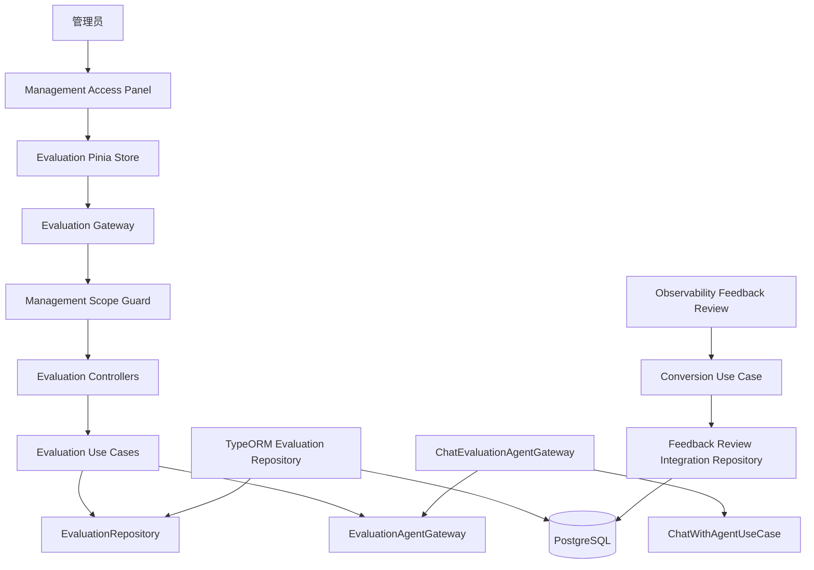
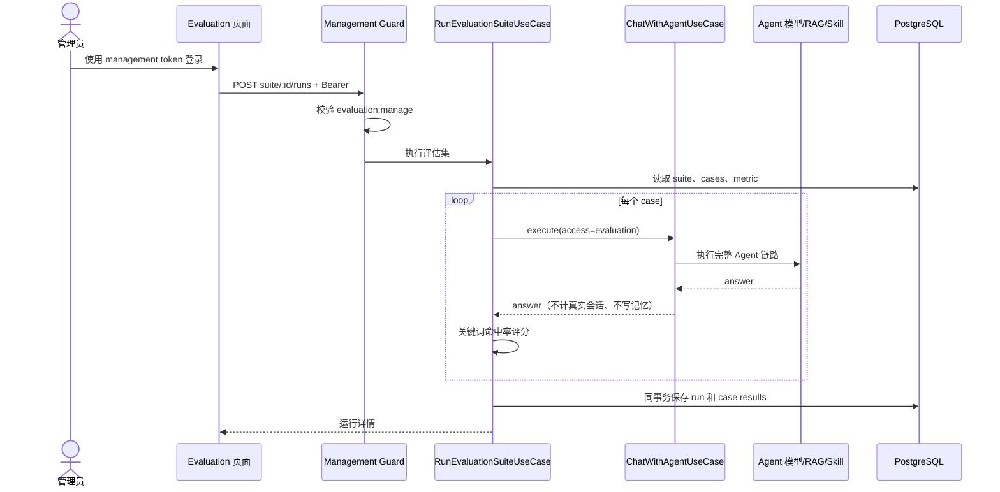
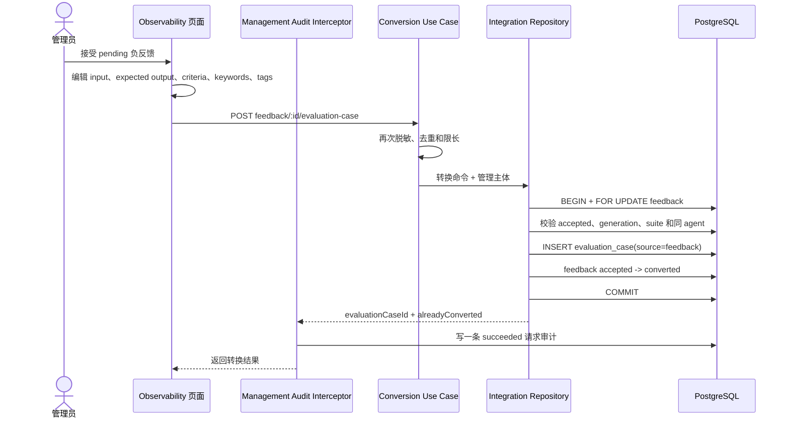
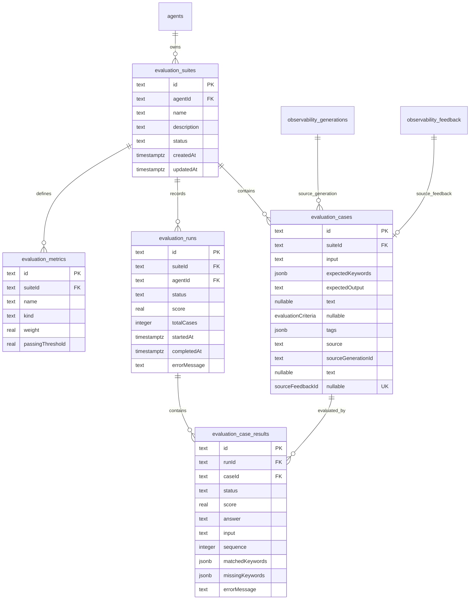
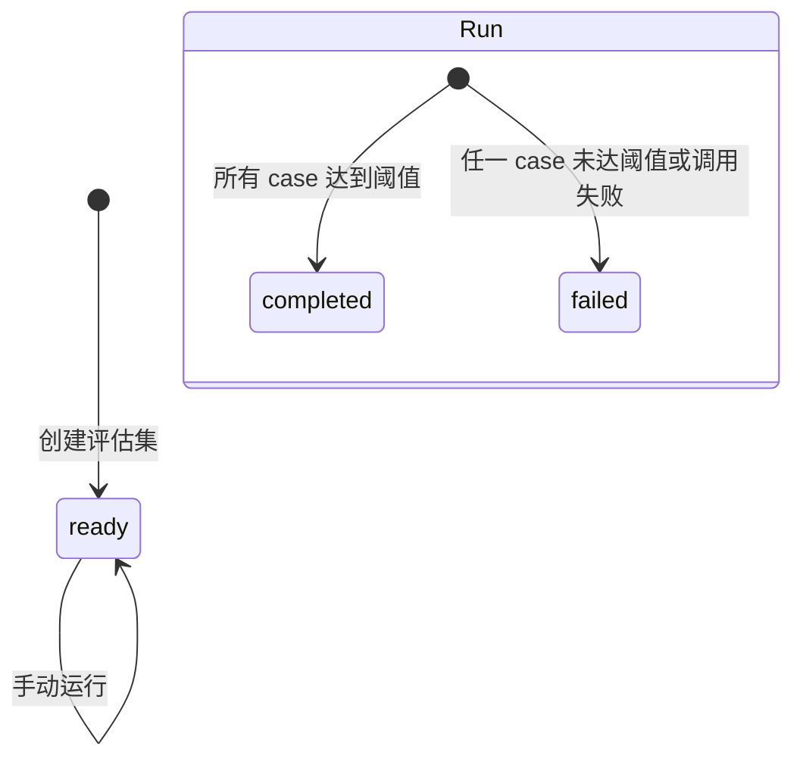

# Evaluation 评估与测试

## 功能目标、已实现能力和非目标

Evaluation 模块为智能体维护可重复执行的评估集、用例、确定性指标和基准运行记录。
P0 在既有离线评估能力上增加了管理权限边界，以及从人工接受的线上负反馈转换用例的
可追溯入口。

已实现能力：

- 管理员创建绑定现有智能体的评估集。
- 每个评估集包含多个输入、期望关键词和一个关键词命中率指标。
- 手动触发运行，按智能体当前模型、知识、Prompt Policy 和 Skill 配置执行真实链路。
- 将运行、回答、得分、命中/缺失关键词和安全错误摘要写入 PostgreSQL。
- Evaluation case 区分 `manual | feedback` 来源。
- Feedback 来源 case 保存 generation/feedback ID、期望输出、评价标准和标签。
- 同一 feedback 最多关联一个 case；重复转换幂等返回原 case。
- 全部 Evaluation HTTP API 要求 `evaluation:manage`。
- 前端提供当前标签页管理登录、评估集列表、创建、运行、详情和权限/重试状态。

P0 非目标：

- 不实现定时调度、异步运行队列、分布式领取、失败重试或运行幂等键。
- 不实现 LLM-as-a-Judge、人工评分、语义相似度、引用或富内容协议评分。
- 不实现在线抽样、趋势回归告警、A/B、发布门禁或外部 benchmark 导入导出。
- 不实现评估集编辑、复制、归档或删除 API。
- 不伪造 Workspace、多租户、成员角色或 RLS。

## 与线上用户反馈的边界

Observability generation feedback 负责真实线上信号，Evaluation 负责可重复的离线基准：

- 正反馈不进入人工审核队列。
- 负反馈先进入 `pending`，不会自动污染评估集。
- 管理员接受反馈后，前端打开转换表单；管理员可编辑脱敏输入、期望输出、评价标准、
  关键词和标签。
- Observability 应用服务在转换前再次执行确定性脱敏和长度限制。
- `TypeOrmFeedbackReviewRepository` 在同一事务内校验来源、写入 Evaluation case 并更新
  feedback 状态；管理访问边界记录处置结果审计。
- Evaluation case 不复制原始 owner token、actor hash 或未脱敏正文。

转换是 Observability 到 Evaluation 的显式集成用例，不是 Evaluation 运行时自动摄取。
Evaluation 模块本身仍只通过 `EvaluationRepository` 管理评估集和运行。

## 目录结构和分层职责

```text
apps/api/src/modules/evaluation/
├── domain/
│   ├── evaluation.ts                 # suite、case、metric、run 和来源类型
│   └── evaluation-scoring.ts         # 关键词命中率与加权得分规则
├── application/
│   ├── create-evaluation-suite.use-case.ts
│   ├── run-evaluation-suite.use-case.ts
│   ├── list-evaluation-suites.use-case.ts
│   ├── list-evaluation-runs.use-case.ts
│   ├── get-evaluation-run.use-case.ts
│   ├── evaluation-agent.gateway.ts   # Agent 执行端口
│   └── evaluation.repository.ts      # suite/run 持久化端口
├── infrastructure/
│   ├── evaluation-*.entity.ts
│   ├── chat-evaluation-agent.gateway.ts
│   └── typeorm-evaluation.repository.ts
├── presentation/http/                # 每个路由独立 Controller
└── evaluation.module.ts

apps/api/src/modules/observability/
├── application/convert-feedback-to-evaluation-case.use-case.ts
└── infrastructure/typeorm-feedback-review.repository.ts

apps/web/src/modules/evaluation/
├── domain/evaluation.ts
├── application/evaluation.gateway.ts
├── infrastructure/http-evaluation.gateway.ts
├── stores/evaluation.store.ts
└── presentation/views/EvaluationView.vue
```

- Domain 不依赖 NestJS、TypeORM、HTTP 或模型 SDK。
- Application 只依赖领域类型和端口。
- Infrastructure 负责 PostgreSQL 事务和 Chat 适配。
- Presentation 负责 DTO、scope 声明和协议转换。
- Feedback 转换的跨表细节只存在于 Observability 基础设施适配器中，不进入
  Evaluation Controller 或评分规则。

## 模块结构图



## 评估运行流程



## Feedback 转换流程



## 数据模型和 ER 图



Case 来源约束：

- 手工创建固定为 `source=manual`、`tags=[]`，两个来源 ID 必须为空。
- 反馈转换固定为 `source=feedback`，generation 和 feedback ID 必须同时存在。
- `sourceFeedbackId` 唯一，确保一个 feedback 最多创建一个 case。
- 来源 generation/feedback 外键使用 `ON DELETE RESTRICT`，避免静默失去追溯关系。
- suite 外键继续 `ON DELETE CASCADE`；删除 suite 时其 case 和历史运行按既有关系清理。

## 状态机和运行语义



- `evaluation_suites.status` 当前只写 `ready`。
- `evaluation_runs.status` 是同步运行最终状态，不持久化 queued/running 中间态。
- 一个 case 未达到阈值或 Agent 调用失败时，run 为 `failed`。
- 当前只有 `contains_keywords`；expected output 和 criteria 作为人工基准信息保存，尚未
  进入自动评分公式。

## API 和权限

所有接口都要求严格 Bearer 管理凭证和 `evaluation:manage`：

| 方法   | 路径                                   | 说明                           |
| ------ | -------------------------------------- | ------------------------------ |
| `GET`  | `/api/evaluation-suites`               | 列出 suite 和最新 run 摘要     |
| `POST` | `/api/evaluation-suites`               | 创建 suite、metric 和手工 case |
| `GET`  | `/api/evaluation-suites/:suiteId/runs` | 查看 suite 运行历史            |
| `POST` | `/api/evaluation-suites/:suiteId/runs` | 同步执行 suite                 |
| `GET`  | `/api/evaluation-runs/:runId`          | 查看 run 和 case results       |

Feedback 转换接口位于 Observability：

| 方法   | 路径                                                              | Scope                                          |
| ------ | ----------------------------------------------------------------- | ---------------------------------------------- |
| `POST` | `/api/observability/feedback-reviews/:feedbackId/evaluation-case` | `observability:feedback` + `evaluation:manage` |

转换响应：

```json
{
  "feedbackId": "feedback-id",
  "evaluationCaseId": "case-id",
  "reviewStatus": "converted",
  "alreadyConverted": false
}
```

## 转换输入和校验

| 字段                 | 规则                                             |
| -------------------- | ------------------------------------------------ |
| `suiteId`            | UUID，必须存在并与 generation 属于同一 agent     |
| `input`              | 必填，最多 4000 字符                             |
| `expectedOutput`     | 后端可选，最多 20000 字符；当前 Web 表单要求填写 |
| `evaluationCriteria` | 后端可选，最多 4000 字符；当前 Web 表单要求填写  |
| `expectedKeywords`   | 1 到 20 个，每个最多 80 字符                     |
| `tags`               | 0 到 20 个，每个最多 40 字符                     |

Use Case 对 input、expected output、criteria、keywords 和 tags 再次执行与观测正文一致的
确定性脱敏。关键词和标签去空白、去空值、去重；DTO 和应用层共同限制数量与长度。

## 管理端、安全和审计边界

- Evaluation 页面使用共享 `ManagementAccessPanel`，token 只保存在当前标签页的
  `sessionStorage`。
- Evaluation Gateway 使用管理专用 HTTP Client 自动添加 Authorization；Pinia 只保存
  subject、scopes、加载状态和业务数据，不保存 token。
- 页面启动时验证 `/api/management-access/session`；缺少 `evaluation:manage` 时显示明确
  权限错误，不加载 suite/run。
- `401` 清除 token 和已加载 Evaluation 状态；`403` 保留登录会话并显示缺权。
- 登出或失效会递增 Store version，过期的并发响应不能重新填充敏感状态。
- 所有受保护 Evaluation 请求由统一 Guard/ManagementAuditInterceptor 写一条低敏感结果
  审计；业务仓储不直接插入审计，审计不与 case/status 事务共享，也不保存请求正文或
  token。
- 模型 API Key 只由 Model Provider runtime 在进程内解密，Evaluation 不返回或记录。
- 手工 case、转换 case、run input 和模型 answer 当前以明文保存在 Evaluation 表中；
  管理员必须只录入脱敏基准，访问控制不能替代数据分类和保留策略。
- P0 管理主体来自环境配置，不代表 Workspace 或租户身份。

## 事务、并发和失败恢复

- 创建 suite 时，suite、metric 和 cases 在一个 PostgreSQL 事务中保存。
- 保存 run 时，run 和全部 case results 在一个事务中保存。
- 转换时对 feedback 获取 `pessimistic_write` 行锁，再校验其为 `accepted`。
- generation 不存在、suite 不存在或跨 agent 时事务失败，不写 case 或 converted 状态。
- 插入 case 和更新 feedback 任一步失败都会回滚，不会留下半转换状态。
- 业务事务提交或抛错后，统一 ManagementAuditInterceptor 分别记录 `succeeded` 或
  `failed`；无效凭证和 scope 越权由 Guard 记录 `denied`。
- `sourceFeedbackId` 唯一约束处理跨进程重复转换；重复请求返回原 case ID。
- 单个 Agent case 调用失败时保存通用错误摘要，不泄露上游错误或密钥；其他 case 继续。
- 当前同步运行不会自动重试，管理员可重新运行整个 suite。
- `evaluation` 来源调用不会增加真实会话次数，也不会写短期、长期或情景记忆。

## Migration 和回滚

- 初始 Evaluation 五表由 `1752159000000-add-evaluation.ts` 创建。
- P0 的 `1752162000000-add-observability-quality-p0.ts` 扩展 case 来源、expected output、
  criteria 和 tags，并添加来源唯一约束、CHECK 与 `RESTRICT` 外键。
- 现有 case 自动使用数据库默认 `source=manual` 和空 tags。
- P0 down 会先删除来源 CHECK/FK/唯一约束，再移除新增列；回滚会丢失 P0 case 的来源、
  expected output、criteria 和 tags，因此必须先备份并确认业务可接受。
- 已转换 case 引用 Observability 来源；删除或回滚前必须一并检查 feedback/generation
  关系，不能只处理 Evaluation 单表。

## 测试范围

- Domain 单测：关键词命中、失败状态和加权平均。
- Application 单测：创建手工 case 时写 `source=manual/tags=[]`、禁用 agent 和安全失败。
- Evaluation E2E：带管理凭证创建 suite、运行、查询结果和模型密钥不泄露。
- 质量闭环 E2E：负反馈接受、跨 agent 拒绝、转换字段、owner token 不复制、重复转换、
  用户更新已转换 feedback 后来源保持。
- 并发 E2E：竞争审核只有一个决定成功，未转换 feedback 更新后回到 pending。
- Migration E2E：case 新列、唯一约束、来源 CHECK/FK、up/down 和旧 case 默认回填。
- Web 单测：Evaluation 权限错误、401 清理、登出竞态、Gateway 路径，以及 Observability
  转换表单所依赖的 suite 列表与失败重试。
- UI 黄金路径：管理登录、创建/运行 suite、接受负反馈、编辑转换表单、转换成功和重复
  转换提示。

## 后续扩展

- 增加统一 Evaluator 端口、规则评分、LLM-as-a-Judge 和人工评分。
- 增加异步运行队列、稳定抽样键、重试、成本统计和质量趋势切片。
- 增加评估集编辑、版本、归档、导入导出和数据保留策略。
- 引入 Workspace/member/RLS 后，把 suite、case、run、来源和审计绑定真实租户边界。
- 在发布治理阶段增加 A/B、回归阈值、告警和发布门禁。
