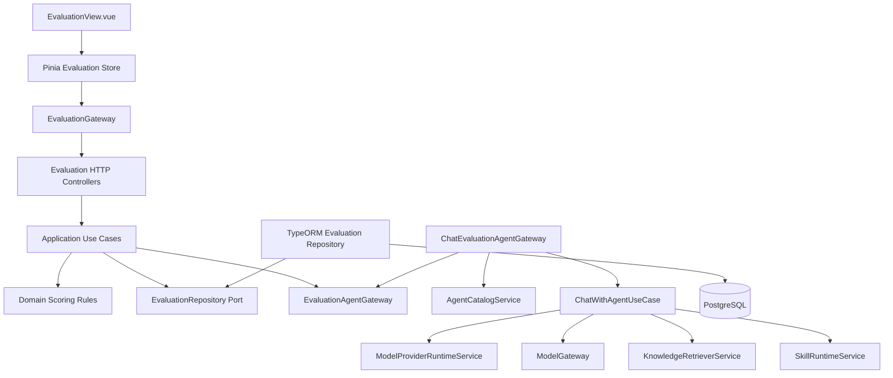
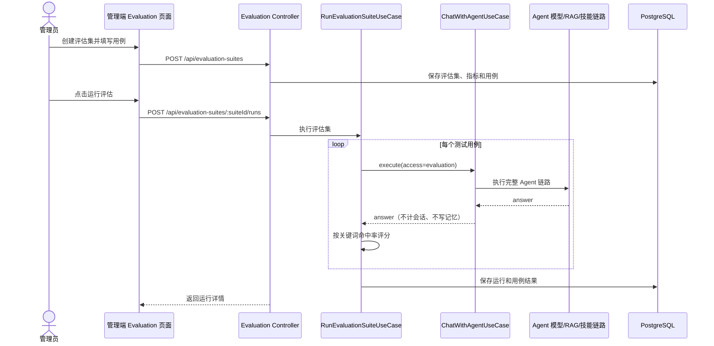
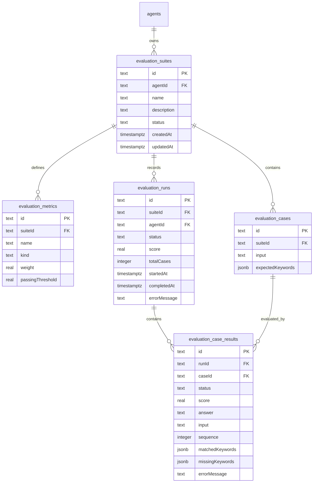
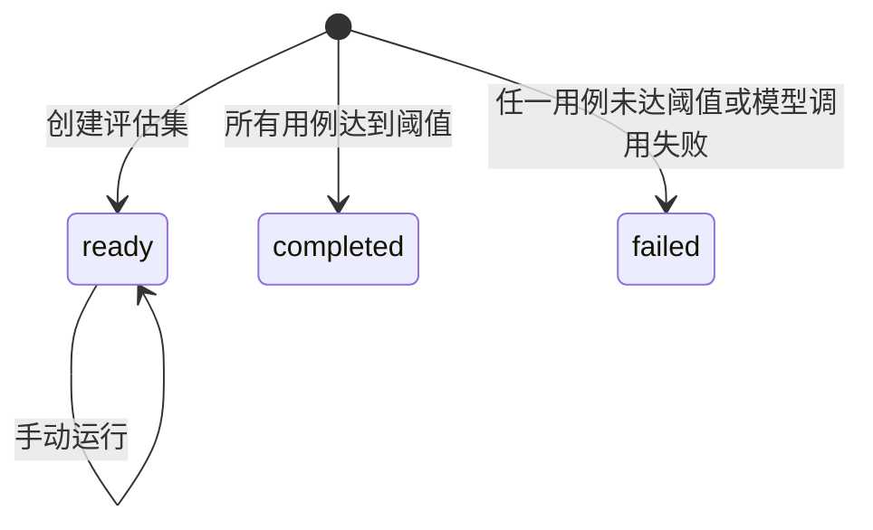

# Evaluation 评估与测试

## 功能目标、已实现能力和非目标

Evaluation 模块用于为智能体建立可重复执行的评估集，定义测试用例、自动评分指标和基准运行记录，持续观察 Agent 回答质量。

已实现能力：

- 管理端创建评估集，绑定现有智能体。
- 每个评估集包含多个测试用例，每个用例包含用户输入和期望关键词。
- 当前自动指标为“关键词命中率”，按命中比例计算 0-1 得分，并用阈值判断用例是否通过。
- 手动触发评估运行，按智能体当前模型配置调用真实模型。
- 将运行、用例结果、回答、命中关键词、缺失关键词和错误写入 PostgreSQL。
- 前端提供评估集列表、核心统计、运行记录和运行详情。

非目标：

- 不实现定时调度、异步队列、分布式并发领取和重试。
- 不实现人工评分、LLM-as-a-judge 或外部 benchmark 导入。
- 不改变当前项目尚未具备的统一认证、多租户和 RBAC 边界。
- 不记录模型密钥、提示词密钥或二进制附件内容。

## 目录结构及每层职责

```text
apps/api/src/modules/evaluation/
├── domain/
│   ├── evaluation.ts                 # 评估集、指标、运行和结果领域类型
│   └── evaluation-scoring.ts         # 关键词命中率与加权得分规则
├── application/
│   ├── create-evaluation-suite.use-case.ts
│   ├── run-evaluation-suite.use-case.ts
│   ├── list-evaluation-suites.use-case.ts
│   ├── list-evaluation-runs.use-case.ts
│   ├── get-evaluation-run.use-case.ts
│   ├── evaluation-agent.gateway.ts   # Agent 执行端口
│   └── evaluation.repository.ts      # 持久化端口
├── infrastructure/
│   ├── *.entity.ts                   # TypeORM PostgreSQL 实体
│   ├── chat-evaluation-agent.gateway.ts
│   └── typeorm-evaluation.repository.ts
├── presentation/http/
│   ├── create-evaluation-suite.controller.ts
│   ├── run-evaluation-suite.controller.ts
│   ├── list-evaluation-suites.controller.ts
│   ├── list-evaluation-runs.controller.ts
│   ├── get-evaluation-run.controller.ts
│   └── create-evaluation-suite.dto.ts
└── evaluation.module.ts

apps/web/src/modules/evaluation/
├── domain/evaluation.ts              # 前端展示模型
├── application/evaluation.gateway.ts  # HTTP 网关端口
├── infrastructure/http-evaluation.gateway.ts
├── stores/evaluation.store.ts        # Pinia 状态与操作编排
└── presentation/views/EvaluationView.vue
```

## Mermaid 模块结构图



## Mermaid 业务流程图



## 数据模型、ER 图和状态机



状态定义：



- `evaluation_suites.status` 当前只写入 `ready`，表示可运行。
- `evaluation_runs.status` 为最终状态：`completed` 表示所有用例通过，`failed` 表示至少一个用例失败。
- 当前同步运行不持久化中间态，因此没有并发领取、重试和租约字段。

## API、配置项、权限与安全边界

API：

| 方法   | 路径                                   | 说明                       |
| ------ | -------------------------------------- | -------------------------- |
| `GET`  | `/api/evaluation-suites`               | 列出评估集和最新运行摘要   |
| `POST` | `/api/evaluation-suites`               | 创建评估集、指标和测试用例 |
| `GET`  | `/api/evaluation-suites/:suiteId/runs` | 查看某评估集的运行历史     |
| `POST` | `/api/evaluation-suites/:suiteId/runs` | 同步执行评估集             |
| `GET`  | `/api/evaluation-runs/:runId`          | 查看单次运行详情           |

配置项：

- 本模块不新增环境变量。
- 模型调用复用 `ChatWithAgentUseCase` 的智能体提示词、知识检索、技能、模型供应商、温度、降级和观测链路。
- 数据库变更通过 `1752159000000-add-evaluation.ts` migration 管理。

权限与安全边界：

- 当前仓库没有统一认证与 RBAC，本模块沿用管理端现有边界。
- 模型 API Key 只由 `ModelProviderRuntimeService` 解密到进程内，Evaluation 不返回、不持久化、不记录密钥。
- 评估结果会保存模型回答正文，因此不得把真实用户隐私或密钥写入评估用例。
- 观测链路只记录低基数元数据和调用状态，不记录提示词、密钥或完整敏感输入。

## 异常处理、降级和清理策略

- 创建评估集时校验智能体存在、用例非空、每个用例至少一个关键词、当前仅允许一个关键词命中率指标。
- 运行时如果评估集不存在、状态不可运行、智能体不存在、模型未配置对话模型，会返回应用错误。
- 单个用例 Agent 调用失败时写入失败结果和错误摘要，不暴露密钥。
- `evaluation` 调用来源不会增加真实对话次数，也不会写入短期、长期或情景记忆。
- 当前同步运行不会部分重试；失败用例可通过再次手动运行评估集恢复。
- 删除智能体或评估集时，数据库外键 `ON DELETE CASCADE` 清理关联指标、用例、运行和结果。

## 测试范围

- `evaluation-scoring.spec.ts` 覆盖关键词命中、失败路径和加权平均规则。
- `evaluation.e2e-spec.ts` 覆盖模型供应商、智能体、评估集创建、运行保存、结果查询和密钥不泄露。
- 前端通过 Pinia Store 和真实 HTTP 网关分层接入，后续可继续补充组件交互测试。

## 尚未实现项和后续扩展路线

- 定时评估、运行队列、并发领取、幂等键和失败重试。
- LLM 评审、人工复核、语义相似度、工具调用正确性和 RAG 引用准确性指标。
- 评估集编辑、复制、归档和导入导出。
- 多租户权限、评估运行预算限制和结果保留策略。
- 与观测页面联动的质量趋势、回归告警和发布门禁。
