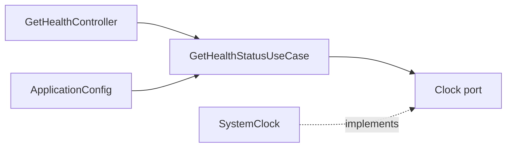

# 健康检查模块

## 目标

提供无副作用的 API 存活检查，验证 NestJS 应用、配置注入和 HTTP 路由可用。该模块不检查具体业务数据，也不承担监控聚合职责。

## 结构



```text
health/
├── domain/health-status.ts
├── application/
│   ├── ports/clock.port.ts
│   └── use-cases/get-health-status.use-case.ts
├── infrastructure/system-clock.ts
├── presentation/http/get-health.controller.ts
└── health.module.ts
```

## 公共接口

`GET /api/health`

```json
{
  "service": "agent-api",
  "status": "ok",
  "timestamp": "2026-01-01T00:00:00.000Z"
}
```

## 配置

- `API_SERVICE_NAME`：响应中的服务名称。

## 测试范围

- 用例单元测试固定时钟与输出。
- 端到端测试验证 HTTP 状态码和响应结构。

## 扩展方式

需要数据库或第三方依赖检查时，为每种检查定义独立端口并由基础设施层实现；不要让控制器直接访问外部资源。
