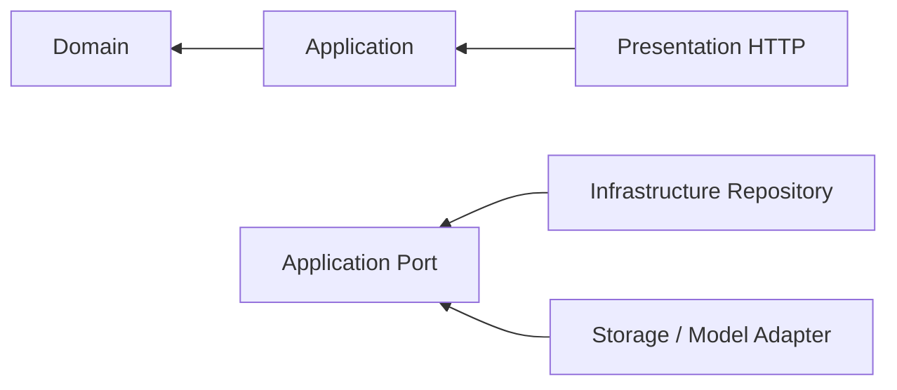

# 真实知识库与智能体服务

## 目标

提供真实持久化的智能体、模型、知识模块、分片上传、异步索引、API 凭证和对话接口，替换前端演示数据。

## 非目标

- 不把原始文件或向量存入 SQLite。
- 不在浏览器保存第三方模型密钥。
- 不用同步 HTTP 请求解析整个大文件。
- 不伪造模型回复、索引成功状态或调用量。

## 模块结构

```text
apps/api/src/modules/
├── agents/             # 智能体与共享知识模块绑定
├── knowledge/          # 知识库、模块、文档、上传和索引
├── model-providers/    # OpenAI 兼容模型配置与加密凭证
├── api-access/         # 应用访问密钥
└── chat/               # 检索增强对话
```

各模块内部遵循：



## 主要流程

### 创建和共享知识

1. 配置一个支持嵌入接口的 OpenAI 兼容模型服务。
2. 创建知识库并锁定嵌入模型与维度。
3. 在知识库中创建业务知识模块。
4. 将文档分片上传到模块。
5. Worker 完成解析、清洗、切片、嵌入和 Qdrant 写入。
6. 创建智能体时选择一个或多个模块；模块可以同时绑定多个智能体。

### 对话

1. 对话接口加载智能体和已绑定模块。
2. 按知识库分组，为问题生成对应嵌入。
3. 在每个 Qdrant 集合中按模块标识过滤召回。
4. 合并最相关片段并附带来源。
5. 使用智能体配置的真实模型生成回答。

## 安全边界

- `CREDENTIAL_ENCRYPTION_KEY` 必须是 32 字节密钥的 64 位十六进制表示。
- 模型密钥使用 AES-256-GCM 保存。
- API 应用密钥只返回一次，数据库只保存 SHA-256 哈希和脱敏前缀。
- 文件名不参与磁盘路径拼接；服务端只使用生成的存储键。
- 上传完成前校验分片连续性、总大小和可选 SHA-256。

## 容量边界

- `KNOWLEDGE_MAX_DOCUMENT_BYTES`：单文件上限。
- `KNOWLEDGE_UPLOAD_CHUNK_BYTES`：推荐客户端分片大小。
- `KNOWLEDGE_STORAGE_PATH`：原始文件和临时分片目录。
- 知识库累计容量通过流式对象存储扩展，不受单次请求内存限制。
- PDF 和 DOCX 解析器需要读取单个文件，因此生产环境应限制超大单文件，并优先拆分资料。

## 数据库初始化

- 本地开发使用 `DATABASE_SYNCHRONIZE=true` 快速同步实体。
- 生产环境使用 `DATABASE_SYNCHRONIZE=false` 和 `DATABASE_MIGRATIONS_RUN=true`。
- 初始迁移位于 `apps/api/src/database/migrations`，只创建元数据表和索引，不创建文件或向量数据表。

## 可替换点

- `KnowledgeObjectStorage`：本地目录可替换 S3、OSS 或 MinIO。
- `VectorIndex`：Qdrant 可替换其他支持过滤的向量数据库。
- `ModelGateway`：当前支持 OpenAI 兼容嵌入与对话协议。
- `IngestionScheduler`：进程内轮询可替换独立队列消费者。

## 验证范围

- SQLite CRUD 和多对多模块绑定端到端测试。
- 分片乱序上传、重复上传和完整合并测试。
- 模型凭证加密后不以明文出现在数据库或响应。
- API 应用密钥只返回一次且可校验。
- 基础文本解析、重叠切片和任务状态测试。
- 前端所有管理数据来自 NestJS API，不再包含业务演示数组或本地模拟回复。
