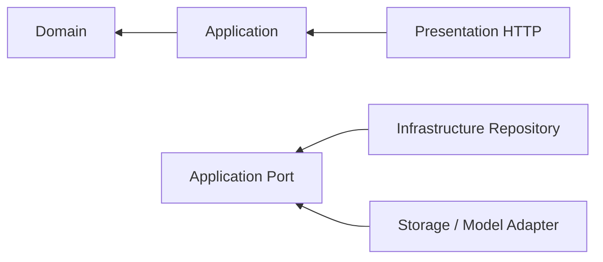
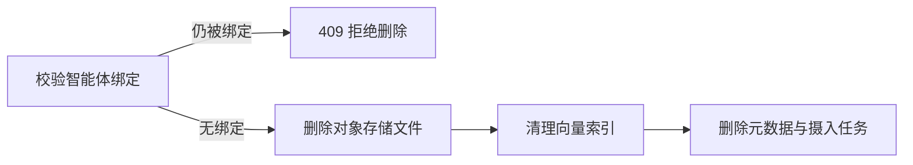

# 真实知识库与智能体服务

## 目标

提供真实持久化的智能体、模型、知识模块、分片上传、异步索引、API 凭证和对话接口，替换前端演示数据。

## 非目标

- 不把原始文件存入 PostgreSQL；向量由 pgvector 列保存。
- 不在浏览器保存第三方模型密钥。
- 不用同步 HTTP 请求解析整个大文件。
- 不伪造模型回复、索引成功状态或调用量。

## 模块结构

```text
apps/api/src/modules/
├── agents/             # 智能体与共享知识模块绑定
├── knowledge/          # 知识库、模块、文档、上传和索引
├── model-providers/    # OpenAI 兼容模型配置与加密凭证
├── api-access/         # 应用访问密钥
└── chat/               # 检索增强对话
```

各模块内部遵循：



## 主要流程

### 创建和共享知识

1. 配置一个支持嵌入接口的 OpenAI 兼容模型服务。
2. 创建知识库并锁定嵌入模型与维度。
3. 在知识库中创建业务知识模块。
4. 将文档分片上传到模块。
5. Worker 完成解析、清洗、切片、嵌入和 pgvector 写入。
6. 创建智能体时选择一个或多个模块；模块可以同时绑定多个智能体。

### 知识库管理（编辑 / 删除 / 内容查看）

管理接口一路由一控制器，全部复用既有的仓储、对象存储、解析器和向量索引端口：

| 路由                                   | 说明                                                      |
| -------------------------------------- | --------------------------------------------------------- |
| `PUT /knowledge-bases/:id`             | 修改知识库名称与描述（嵌入配置不可变）                    |
| `DELETE /knowledge-bases/:id`          | 删除知识库及其模块、文档、任务、文件和整个向量 Collection |
| `PUT /knowledge-modules/:id`           | 修改模块名称与描述                                        |
| `DELETE /knowledge-modules/:id`        | 删除模块及其文档、任务、文件和对应文档向量                |
| `GET /knowledge-modules/:id/documents` | 查看模块内文档元数据（不暴露存储键与哈希）                |
| `GET /knowledge-documents/:id/content` | 预览已就绪文档的提取文本，超长时截断                      |
| `DELETE /knowledge-documents/:id`      | 删除单个文档及其文件、任务和向量                          |

删除清理顺序与保护：



- 知识库 / 模块若仍被智能体绑定（`KnowledgeModuleUsage` 端口校验），返回 409，需先解绑。
- 删除知识库、模块或文档时按业务 ID 删除共享维度表中的向量行，不删除其他知识库数据。
- 内容预览复用 `KnowledgeObjectStorage.readBuffer` 与 `DocumentTextExtractor`，
  预览长度由 `KNOWLEDGE_PREVIEW_MAX_CHARS` 控制。
- 前端在知识库管理页提供编辑 / 删除 / 文档列表 / 内容预览交互，
  经 `AdminWorkspaceGateway` → Pinia store → 视图分层调用。

### 对话

1. 对话接口加载智能体和已绑定模块。
2. 按知识库分组，为问题生成对应嵌入。
3. 在 pgvector 维度表中按知识库和模块标识过滤召回。
4. 合并最相关片段并附带来源。
5. 使用智能体配置的真实模型生成回答。

## 安全边界

- `CREDENTIAL_ENCRYPTION_KEY` 必须是 32 字节密钥的 64 位十六进制表示。
- 模型密钥使用 AES-256-GCM 保存。
- API 应用密钥只返回一次，数据库只保存 SHA-256 哈希和脱敏前缀。
- 文件名不参与磁盘路径拼接；服务端只使用生成的存储键。
- 上传完成前校验分片连续性、总大小和可选 SHA-256。

## 容量边界

- `KNOWLEDGE_MAX_DOCUMENT_BYTES`：单文件上限。
- `KNOWLEDGE_PREVIEW_MAX_CHARS`：文档内容预览的最大字符数。
- `KNOWLEDGE_UPLOAD_CHUNK_BYTES`：推荐客户端分片大小。
- `KNOWLEDGE_STORAGE_PATH`：原始文件和临时分片目录。
- `VECTOR_HNSW_M`：pgvector HNSW 每个节点的最大连接数。
- `VECTOR_HNSW_EF_CONSTRUCTION`：HNSW 构建候选集大小。
- `VECTOR_HNSW_EF_SEARCH`：单连接检索候选集大小。
- `VECTOR_UPSERT_BATCH_SIZE`：单次向量 upsert 的切片数量。
- 知识库累计容量通过流式对象存储扩展，不受单次请求内存限制。
- PDF 和 DOCX 解析器需要读取单个文件，因此生产环境应限制超大单文件，并优先拆分资料。

pgvector 与业务元数据位于 PostgreSQL，可由多个 API/Worker 实例并发访问。不同 embedding
维度使用共享动态表，知识库和模块 ID 作为强制过滤字段；达到数千万向量、需要独立多区域
扩展或 PostgreSQL 检索 SLO 不满足时，保留 `VectorIndex` 端口并替换为专业向量数据库适配器。

## 数据库初始化

- 本地开发使用 `DATABASE_MIGRATIONS_RUN=true` 执行 PostgreSQL migration。
- 生产环境使用 `DATABASE_SYNCHRONIZE=false` 和 `DATABASE_MIGRATIONS_RUN=true`。
- 初始迁移位于 `apps/api/src/database/migrations`；pgvector 动态维度表由 Infrastructure adapter 在首次使用时通过 advisory lock 创建。

## 可替换点

- `KnowledgeObjectStorage`：本地目录可替换 S3、OSS 或 MinIO。
- `VectorIndex`：pgvector 可替换为其他支持强标量过滤的向量数据库。
- `ModelGateway`：当前支持 OpenAI 兼容嵌入与对话协议。
- `IngestionScheduler`：进程内轮询可替换独立队列消费者。

## 验证范围

- PostgreSQL CRUD 和多对多模块绑定端到端测试。
- 分片乱序上传、重复上传和完整合并测试。
- 模型凭证加密后不以明文出现在数据库或响应。
- API 应用密钥只返回一次且可校验。
- 基础文本解析、重叠切片和任务状态测试。
- pgvector 真实 upsert、cosine search、删除和模块过滤测试。
- 前端所有管理数据来自 NestJS API，不再包含业务演示数组或本地模拟回复。
- 知识库 / 模块 / 文档的更新、删除、绑定冲突与清理行为端到端测试。
