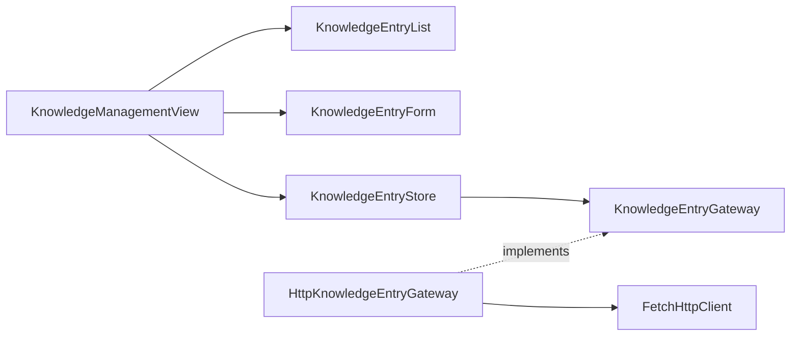

# 知识库模块（Web）

## 目标

提供知识库管理界面：列出条目、查看完整内容、创建、编辑和删除。非目标：搜索、分页与离线缓存（可作为后续扩展）。

## 结构



```text
knowledge/
├── domain/knowledge-entry.ts                       # 与 API 对齐的条目契约
├── application/knowledge-entry.gateway.ts          # 数据访问端口
├── infrastructure/http-knowledge-entry.gateway.ts  # HTTP 适配器与响应校验
├── stores/knowledge-entry.store.ts                 # Pinia 状态与变更动作
└── presentation/
    ├── components/
    │   ├── KnowledgeEntryForm.vue                  # 新建/编辑共用表单
    │   └── KnowledgeEntryList.vue                  # 条目列表与操作按钮
    └── views/KnowledgeManagementView.vue           # 管理页组合视图
```

路由在 `app/router/knowledge.route.ts` 注册为 `/knowledge`，网关实例在 `app/dependencies.ts` 组装。

## 功能

- 进入页面时加载全部条目，按更新时间倒序展示。
- 点击标题在右侧面板查看完整内容与标签。
- 表单支持新建与编辑复用，标签用逗号分隔输入。
- 删除后自动清理选中与编辑状态。
- 加载、保存与错误状态由 Pinia 统一管理并在界面提示。

## 配置

- `VITE_API_BASE_URL`：API 全局前缀地址（复用共享 HTTP 客户端）。

## 测试范围

- 网关单元测试验证响应契约校验与创建、列表行为。
- 类型检查验证组件属性、Store 状态和路由定义。
- 构建检查验证模块可被 Vite 正确打包。

## 扩展方式

- 新增字段：先同步领域契约与网关校验，再扩展表单与展示组件。
- 新增查询（搜索、分页）：在网关端口新增方法，Store 增加对应动作。
- 其他模块不得直接复用该 Store；应通过自己的应用边界访问数据。
