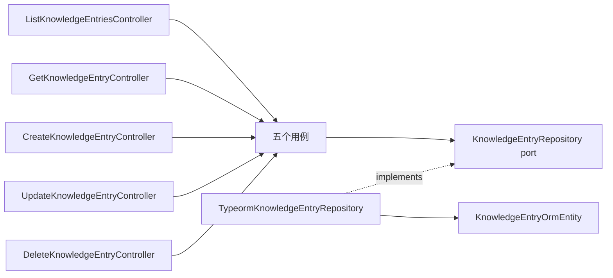

# 知识库模块（API）

## 目标

提供知识条目的创建、查询、编辑和删除能力，支撑前端知识库管理界面。非目标：全文检索、版本历史、权限控制（可作为后续扩展）。

## 结构



```text
knowledge/
├── domain/
│   ├── knowledge-entry.ts                  # 领域契约与长度约束常量
│   └── knowledge-entry-not-found.error.ts  # 领域未找到错误
├── application/
│   ├── ports/knowledge-entry.repository.ts # 持久化端口与注入令牌
│   └── use-cases/                          # 每个业务动作一个用例
│       ├── create-knowledge-entry.use-case.ts
│       ├── list-knowledge-entries.use-case.ts
│       ├── get-knowledge-entry.use-case.ts
│       ├── update-knowledge-entry.use-case.ts
│       └── delete-knowledge-entry.use-case.ts
├── infrastructure/persistence/
│   ├── knowledge-entry.orm-entity.ts       # SQLite 行结构
│   └── typeorm-knowledge-entry.repository.ts
├── presentation/http/
│   ├── dto/                                # class-validator 输入校验
│   ├── knowledge-entry-not-found.filter.ts # 领域错误映射为 404
│   └── *.controller.ts                     # 每个路由动作一个控制器文件
└── knowledge.module.ts
```

## 调用流程

控制器接收并校验 DTO → 调用对应用例 → 用例通过仓储端口读写 → TypeORM 适配器映射 SQLite 行到领域契约 → 未找到时用例抛出领域错误，由异常过滤器转换为 HTTP 404。

## 公共接口

| 方法   | 路径                         | 说明               |
| ------ | ---------------------------- | ------------------ |
| GET    | `/api/knowledge-entries`     | 按更新时间倒序列出 |
| GET    | `/api/knowledge-entries/:id` | 查看单条内容       |
| POST   | `/api/knowledge-entries`     | 创建（201）        |
| PUT    | `/api/knowledge-entries/:id` | 部分字段编辑       |
| DELETE | `/api/knowledge-entries/:id` | 删除（204）        |

条目结构：

```json
{
  "id": "uuid",
  "title": "DDD 分层约定",
  "content": "领域层不得依赖框架。",
  "tags": ["架构"],
  "createdAt": "2026-01-01T00:00:00.000Z",
  "updatedAt": "2026-01-01T00:00:00.000Z"
}
```

## 配置

复用应用级配置：`DATABASE_PATH`、`DATABASE_SYNCHRONIZE`。字段长度上限集中定义在 `domain/knowledge-entry.ts`。

## 测试范围

- 用例单元测试使用内存仓储验证创建、读取、编辑、删除及未找到分支。
- 端到端测试验证完整 CRUD 流程、输入校验（400）和未知条目（404）。

## 扩展方式

- 新增查询（如按标签过滤、分页）：在仓储端口增加方法，新增独立用例与控制器文件。
- 新增字段：先扩展领域契约与约束常量，再同步 ORM 实体、DTO 和前端契约。
- 需要全文检索时为其定义独立端口，由基础设施层选择实现，不修改用例逻辑。
