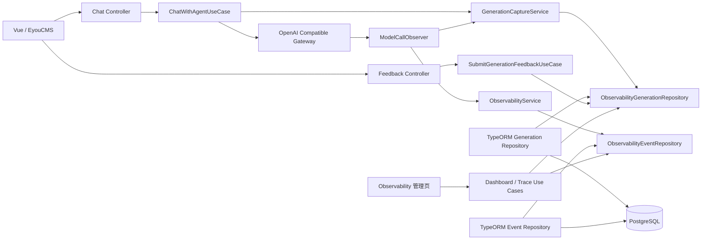
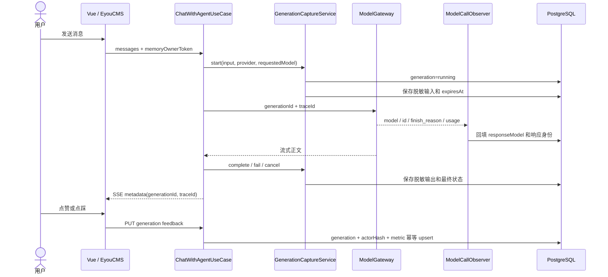
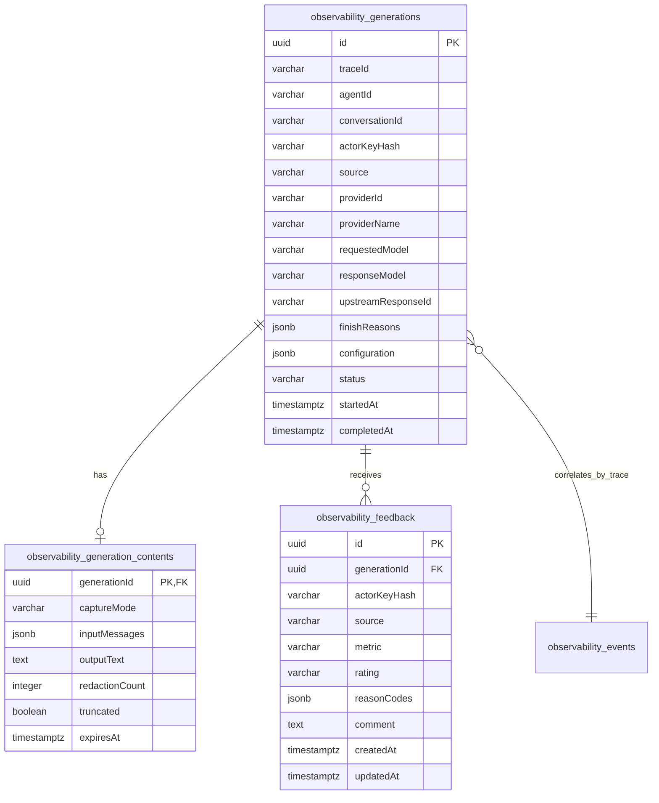
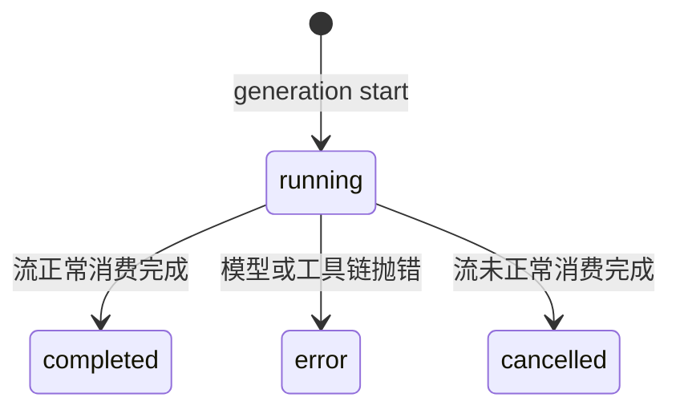

# 观测、生成追踪与用户反馈

## 功能目标、已实现能力和非目标

该模块同时覆盖传统运行观测和一期大模型质量闭环：

- 使用 Trace / Span 关联 HTTP、模型、嵌入和 MCP 工具执行。
- 展示流量、延迟、错误率、运行时、Token、估算成本和告警。
- 为每个 Assistant 回答创建服务端 `generationId`，并关联 `traceId`。
- 分开保存请求模型 `requestedModel` 和上游实际响应模型 `responseModel`。
- 保存供应商名称、供应商 ID、上游响应 ID 和 `finishReasons`。
- 在独立短期内容表中保存脱敏、限长的结构化输入和输出。
- 在管理端 Trace 详情查看生成身份、脱敏正文、状态和用户反馈。
- 聊天页和 EyouCMS 页面支持点赞、点踩、原因与可选评论。
- 反馈按 generation、匿名主体和指标幂等更新。
- Dashboard 展示反馈总数、负反馈数、正反馈率和模型不一致数。

普通 `observability_events` 和结构化日志仍不保存提示词、回复正文、附件内容、
API Key 或请求体。正文仅进入独立的 `observability_generation_contents` 表，
并执行脱敏、字符上限和短期保留。

本期非目标：

- `full` 原文采集和正文加密。
- LLM-as-a-Judge、规则评分、人工标注队列和负反馈自动回流评估集。
- Prompt / Model / Skill A/B 和发布门禁。
- Langfuse、Phoenix、Datadog 或 OTLP 导出。
- 完整 RBAC、多租户隔离和审计。

## 业界实践与设计取舍

设计参考：

1. [Google SRE Monitoring Distributed Systems](https://sre.google/sre-book/monitoring-distributed-systems/)：
   运行层优先观察延迟、流量、错误和饱和度。
2. [OpenTelemetry GenAI Semantic Conventions](https://opentelemetry.io/docs/specs/semconv/gen-ai/)：
   区分请求模型、响应模型、响应 ID、结束原因、输入消息、输出消息和 Evaluation。
3. [Datadog LLM Observability](https://docs.datadoghq.com/llm_observability/)：
   使用 Trace 关联模型、工具、输入输出、质量和成本。
4. Langfuse、LangSmith 和 Arize Phoenix 的公开设计：
   使用 generation 作为单次模型回答的质量归因单元，把最终用户反馈关联到
   generation / trace，而不是关联浏览器随机消息 ID。

GenAI 输入、输出、工具参数和工具结果可能包含个人信息、密钥和企业数据。因此本项目
默认只开放 `off | redacted`，不提供 `full`。模型生成正文与普通 APM 事件物理分表，
避免日志采集器、告警平台和普通事件查询意外扩散正文。

## 目录结构与职责

```text
apps/api/src/modules/observability/
├── domain/
│   ├── observability-event.ts
│   └── observability-generation.ts
├── application/
│   ├── generation-capture.service.ts
│   ├── submit-generation-feedback.use-case.ts
│   ├── get-observability-dashboard.use-case.ts
│   ├── get-observability-trace.use-case.ts
│   ├── observability-event.repository.ts
│   ├── observability-generation.repository.ts
│   ├── observability-trace.context.ts
│   └── observability.service.ts
├── infrastructure/
│   ├── observability-context.ts
│   ├── request-observability.interceptor.ts
│   ├── observability-*.entity.ts
│   ├── typeorm-observability-event.repository.ts
│   └── typeorm-observability-generation.repository.ts
├── presentation/http/
│   ├── get-observability-dashboard.controller.ts
│   ├── get-observability-trace.controller.ts
│   └── submit-generation-feedback.controller.ts
└── observability.module.ts

apps/web/src/modules/observability/
├── domain/observability-dashboard.ts
├── application/observability.gateway.ts
├── infrastructure/http-observability.gateway.ts
├── stores/observability.store.ts
└── presentation/
    ├── components/ObservabilityGenerationDetail.vue
    ├── components/ObservabilityTraceDetailModal.vue
    └── views/ObservabilityView.vue
```

DDD 边界：

- Domain：generation、feedback、状态、原因枚举和确定性脱敏规则。
- Application：生成生命周期、反馈授权与幂等编排、Trace 上下文端口和查询。
- Infrastructure：TypeORM/PostgreSQL、AsyncLocalStorage Trace 上下文和模型响应适配。
- Presentation：HTTP DTO 校验、匿名 token 解析、SSE metadata 和 Vue 展示。

Chat 只依赖 `GenerationCaptureService`；模型网关通过 `ModelCallObserver` 回填真实模型
身份。业务模块不直接访问观测实体。

## 模块结构图



## 聊天、追踪和反馈流程



## 数据模型和 ER 图



反馈唯一约束：

```text
generationId + actorKeyHash + metric
```

重复提交不会新增记录，而是更新评分、原因、评论和 `updatedAt`。删除 generation 时，
内容和反馈通过 `ON DELETE CASCADE` 清理。

低敏感 generation 配置快照包含智能体更新时间、引用文档 ID、Prompt Policy
revision 和 Skill ID，用于定位回答对应的运行配置；不包含提示词正文或密钥。

## 状态机、失败和恢复



generation 只由 `running` 进入一个最终状态。观测持久化失败会记录不含正文的安全错误，
但不会中断真实聊天请求。真实模型调用失败时，generation 进入 `error`；客户端取消或
流未完整消费时进入 `cancelled`。

过期正文清理按小时惰性触发，删除 `expiresAt` 已过期的内容记录，但保留 generation
元数据、Trace、用量、模型身份和反馈，便于长期质量统计。

## API

### `GET /api/observability/dashboard?hours=24`

`hours` 支持 `1` 到 `168`。返回：

- `goldenSignals`：请求量、平均 / P95 延迟、错误率和模型调用量。
- `runtime`：RSS、堆内存、堆饱和度和运行时间。
- `usage`：Token、已定价调用数和估算成本。
- `series`、`recentTraces` 和 `alerts`。
- `quality`：反馈总数、负反馈数、正反馈率和请求/响应模型不一致数。

### `GET /api/observability/traces/:traceId`

返回 HTTP、模型、工具 Span，以及同一 Trace 下的 generation：

- provider name / ID；
- requested model / response model；
- upstream response ID / finish reasons；
- generation status / ID；
- capture mode / truncated；
- 脱敏结构化输入 / 输出；
- 用户反馈、原因和评论。

### `PUT /api/agents/:agentId/generations/:generationId/feedback`

```json
{
  "memoryOwnerToken": "由 /api/memory-owner-tokens 签发",
  "rating": "negative",
  "reasonCodes": ["incorrect", "citation"],
  "comment": "引用与原文不一致"
}
```

`rating` 为 `positive | negative`；原因支持 `incorrect`、`irrelevant`、`citation`、
`format`、`model`、`other`。评论最多 1000 字符并在持久化前再次脱敏。

服务端校验：

1. generation 存在并属于 URL 中的 agent；
2. owner token 签名有效；
3. token 解析出的匿名主体与 generation 主体匹配；
4. rating、reasonCodes 和 comment 合法；
5. 重复反馈执行幂等更新；
6. 跨主体、跨 agent 和伪造 token 被拒绝。

SSE `metadata` 同时返回 `generationId` 和 `traceId`。反馈必须使用服务端
`generationId`，不能使用前端随机消息 ID。

## 模型真实身份与 Token

模型请求和响应身份分开记录：

- `requestedModel`：本地供应商配置实际发送的模型。
- `responseModel`：兼容服务在响应 `model` 字段中声明的真实模型。
- `upstreamResponseId`：响应 `id`。
- `finishReasons`：所有 choice 的 `finish_reason`。
- `system_fingerprint`：只进入低敏感技术 metadata。

兼容服务未返回响应模型时，展示“上游未返回”，技术事件的兼容 `model` 字段回退到
`requestedModel`。两者不一致时 Dashboard 的 `modelMismatchCount` 增加。

模型服务返回 `usage` 时使用实际 Token；流式请求启用
`stream_options.include_usage`。缺失 usage 时使用本地文本估算器，并标记
`tokenCountSource=estimated`。

## 脱敏、安全和权限边界

持久化前处理：

- data URI 和 base64；
- Bearer Token；
- `sk-` 风格密钥；
- `api_key=...`；
- 邮箱、手机号和身份证号；
- Linux/macOS/Windows 本地路径；
- 图片和音频正文替换为省略标记；
- 输入消息集合与输出正文分别执行字符上限。

匿名 token 通过 `MemoryOwnerIdentity.resolve()` 验签并转换为 owner key。
generation 和 feedback 只保存带固定上下文的 SHA-256 hash，不保存原始 token。
主体比较使用定时安全比较。

当前管理端 API 仍缺少完整账号认证和 RBAC。因此生产环境开放 Trace 正文前，应增加
管理员鉴权、正文查看权限和审计。本期脱敏不能保证覆盖所有企业自定义敏感格式，
不能替代数据分类、DLP、加密和合规审批。

## 配置项

| 配置                                   |     默认值 | 说明                       |
| -------------------------------------- | ---------: | -------------------------- |
| `OBSERVABILITY_RETENTION_DAYS`         |       `30` | 普通事件保留天数           |
| `OBSERVABILITY_CONTENT_CAPTURE_MODE`   | `redacted` | `off` 或 `redacted`        |
| `OBSERVABILITY_CONTENT_RETENTION_DAYS` |        `7` | 脱敏正文保留天数           |
| `OBSERVABILITY_CONTENT_MAX_CHARACTERS` |    `50000` | 输入集合和输出各自字符上限 |
| `OBSERVABILITY_SLOW_REQUEST_MS`        |     `2000` | HTTP 慢请求阈值            |
| `OBSERVABILITY_SLOW_MODEL_MS`          |    `30000` | 模型慢调用阈值             |
| `OBSERVABILITY_HIGH_COST_USD`          |      `0.1` | 单次高成本阈值             |

设置 `OBSERVABILITY_CONTENT_CAPTURE_MODE=off` 后仍创建 generation 元数据并支持模型
身份、状态、反馈和质量统计，但不创建正文内容记录。

## 测试范围

- Domain：Bearer、API Key、邮箱、手机号、身份证、路径、data URI、字符截断。
- Configuration：默认 `redacted`、允许 `off`、拒绝未开放的 `full`。
- Generation：创建、actor hash、Trace 关联、`completed/error/cancelled`、off 模式。
- Model Gateway：响应 model、ID、finish reason、system fingerprint、usage 和缺失降级。
- Application：真实模型回填、反馈脱敏、原因去重、主体隔离和跨 agent 拒绝。
- HTTP E2E：SSE metadata、反馈创建与幂等更新、非法 token、越权、非法 DTO、
  missing generation 和 Trace 正文/反馈查询。
- Migration E2E：三张表、事件新增列、唯一约束，以及完整 up/down。
- Web：SSE metadata 解析和 feedback Gateway。
- 全仓格式、lint、类型检查、单元测试、E2E、Web/API 构建和主入口启动。

## 后续扩展

- 为管理端正文查看增加账号认证、RBAC、审计和按租户隔离。
- 对正文表增加应用层加密和密钥轮换后再评估 `full` 模式。
- 把线上负反馈人工确认后转换为 Evaluation case。
- 增加规则评分、LLM-as-a-Judge、人工标注和质量趋势告警。
- 按 Prompt Policy revision、Skill、requested/response model 做质量切片和 A/B。
- 通过独立导出端口接入 OTLP、Langfuse、Phoenix 或 Datadog，不让业务用例依赖
  第三方 SDK。
