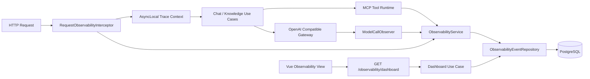
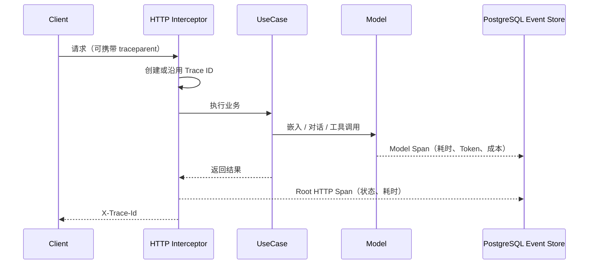

# 观测与监控模块

## 模块目标

为 NestJS API、模型调用和 MCP 工具执行提供统一的运行可见性：

- 输出不包含业务正文的结构化 JSON 日志。
- 使用 Trace / Span 关联一次请求中的 HTTP、嵌入、对话模型和工具步骤。
- 展示 Google SRE 黄金信号：流量、延迟、错误和运行时饱和度。
- 统计模型输入 / 输出 Token，并根据模型配置的单价估算美元成本。
- 对失败、慢请求、慢模型和单次高成本自动生成告警。
- 将事件保存在 PostgreSQL，并按保留天数自动清理。

非目标：

- 不保存提示词、回复正文、附件内容、API Key 或请求体。
- 不替代外部 APM、日志平台和 Pager 系统。
- 不在代码内维护供应商价格；账单单价由管理员配置。

## 业界实践研究

设计选择参考以下公开实践：

1. [Google SRE：Monitoring Distributed Systems](https://sre.google/sre-book/monitoring-distributed-systems/)
   建议优先监控延迟、流量、错误和饱和度，并让告警对应需要人工处理的症状。
2. [OpenTelemetry Semantic Conventions](https://opentelemetry.io/docs/concepts/semantic-conventions)
   使用稳定的资源、Trace、Span、日志和指标语义关联不同信号。
3. [OpenTelemetry GenAI conventions](https://opentelemetry.io/docs/specs/semconv/gen-ai/)
   将模型、操作类型、Token 用量和错误作为生成式 AI 调用的核心属性。
4. [AWS Bedrock cost management](https://docs.aws.amazon.com/bedrock/latest/userguide/cost-management.html)
   按请求元数据归因模型、应用和调用来源，并结合 Token 用量核对成本。
5. [Datadog Agent Observability](https://docs.datadoghq.com/llm_observability/monitoring/)
   将一次智能体执行表示为 Trace，将模型和工具步骤表示为 Span，同时观察延迟、
   错误、Token 与成本。

本项目采用 PostgreSQL 事件存储，保留 OpenTelemetry 风格的 Trace / Span 边界，
后续可新增 OTLP 导出适配器，而无需修改业务用例。

## 目录结构

```text
apps/api/src/modules/observability/
├── domain/
│   └── observability-event.ts
├── application/
│   ├── get-observability-dashboard.use-case.ts
│   ├── observability-event.repository.ts
│   └── observability.service.ts
├── infrastructure/
│   ├── observability-context.ts
│   ├── observability-event.entity.ts
│   ├── request-observability.interceptor.ts
│   └── typeorm-observability-event.repository.ts
├── presentation/http/
│   ├── get-observability-dashboard.controller.ts
│   └── get-observability-dashboard.dto.ts
└── observability.module.ts

apps/web/src/modules/observability/
├── domain/observability-dashboard.ts
├── application/observability.gateway.ts
├── infrastructure/http-observability.gateway.ts
├── stores/observability.store.ts
└── presentation/
    ├── components/
    ├── observability-display.ts
    └── views/ObservabilityView.vue
```

## 结构图



## 执行数据流



## 公共接口

### `GET /api/observability/dashboard?hours=24`

`hours` 支持 `1` 到 `168`。响应包含：

- `goldenSignals`：请求量、平均 / P95 延迟、错误率、模型调用量。
- `runtime`：进程 RSS、堆内存占用、堆饱和度和运行时间。
- `usage`：输入 Token、输出 Token、已配置价格的调用数和估算成本。
- `series`：最多 24 个时间桶的请求、错误、模型调用和成本趋势。
- `recentTraces`：最近 20 条执行链路。
- `alerts`：最近 20 条异常或阈值告警。

每个 HTTP 响应带 `X-Trace-Id`。若上游传入合法 W3C `traceparent`，服务沿用其中的
Trace ID。

## 日志与隐私

结构化日志只包含：

- Trace ID、Span ID、操作名和分类。
- 状态、HTTP 状态码和耗时。
- 模型 / 服务商 ID、Token 与成本。
- 智能体 ID、来源和无敏感信息的扩展标签。

日志和数据库事件都不保存请求体、用户问题、模型回复、知识片段、附件、密钥和
模型服务鉴权头。

## Token 与成本

模型服务返回 `usage` 时使用实际 Token；流式响应请求
`stream_options.include_usage`。兼容服务未返回用量时，使用本地文本估算器，并把
`tokenCountSource` 标记为 `estimated`。

成本使用整数微美元保存：

```text
costUsdMicros =
  inputTokens × inputUsdPerMillionTokens +
  outputTokens × outputUsdPerMillionTokens
```

该公式避免小额成本累计时的浮点精度丢失。模型单价由管理员在模型配置页维护。

## 告警规则

按优先级只为单个事件生成一条告警：

1. 执行失败：`critical`。
2. 模型调用超过 `OBSERVABILITY_SLOW_MODEL_MS`：`warning`。
3. HTTP 请求超过 `OBSERVABILITY_SLOW_REQUEST_MS`：`warning`。
4. 单次模型成本超过 `OBSERVABILITY_HIGH_COST_USD`：`warning`。

当前告警在管理端展示；若需要邮件、Webhook、PagerDuty 或企业微信，可新增
`AlertNotifier` 端口，不改变事件记录逻辑。

## 配置项

| 配置                            |  默认值 | 说明                    |
| ------------------------------- | ------: | ----------------------- |
| `OBSERVABILITY_RETENTION_DAYS`  |    `30` | PostgreSQL 事件保留天数 |
| `OBSERVABILITY_SLOW_REQUEST_MS` |  `2000` | HTTP 慢请求阈值         |
| `OBSERVABILITY_SLOW_MODEL_MS`   | `30000` | 模型慢调用阈值          |
| `OBSERVABILITY_HIGH_COST_USD`   |   `0.1` | 单次高成本阈值          |

## 测试范围

- 仪表盘用例测试黄金指标、成本、告警和 Trace 聚合。
- Token 估算测试中英文与多模态输入边界。
- 迁移端到端测试验证观测表和仪表盘接口可用。
- 全仓 lint、类型检查、单元测试、端到端测试和构建。

## 扩展方式

- 新增 OTLP 导出时实现事件导出端口，不让业务模块依赖 OpenTelemetry SDK。
- 新增工具、队列或定时任务时通过 `ObservabilityService.track` 记录 Span。
- 新增告警渠道时实现通知端口，并保持阈值计算在应用层。
- 新增供应商账单核对时按 `providerId + model + traceId` 关联本地估算与账单明细。
