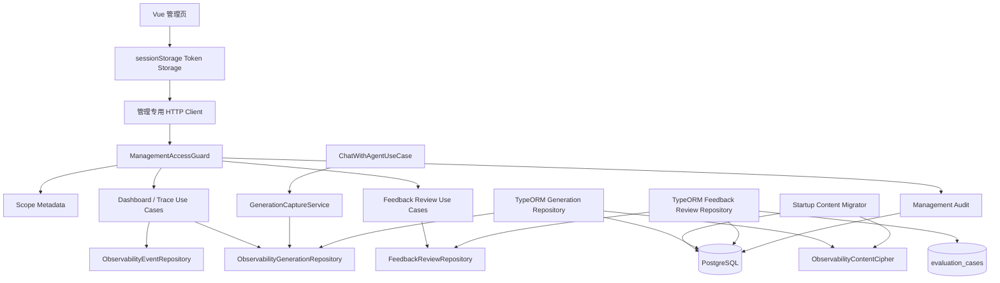
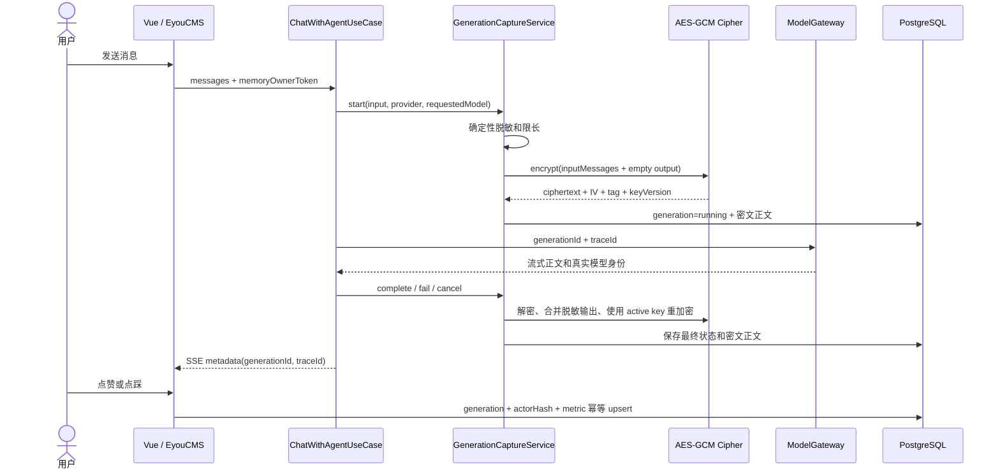
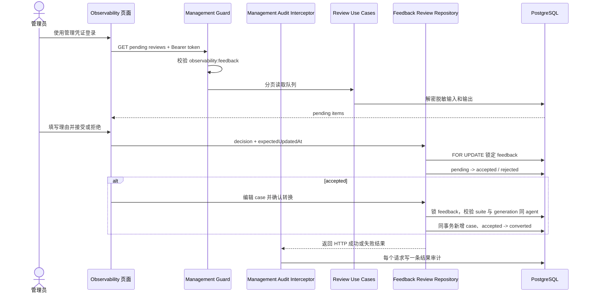
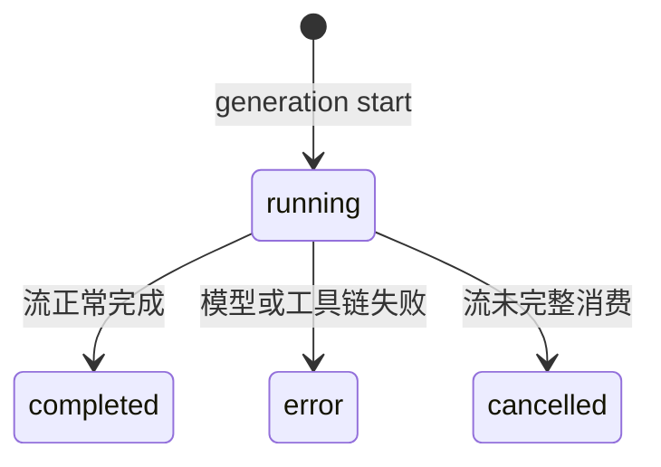
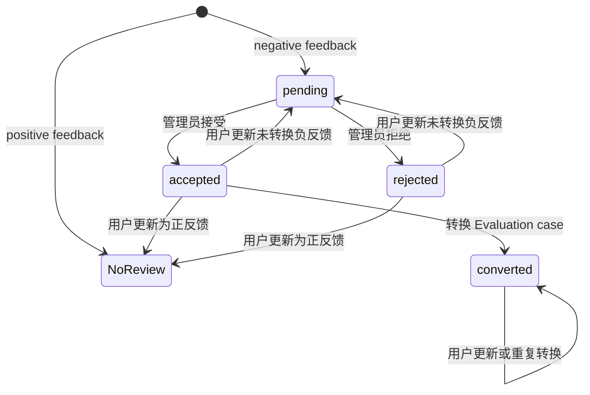

# 观测、生成追踪与人工质量闭环

## 功能目标、已实现能力和非目标

Observability 模块以一次 Assistant 回答对应的 generation 为质量归因单元，同时覆盖运行
观测、脱敏正文保护、最终用户反馈和人工审核闭环。

已实现能力：

- 使用 Trace / Span 关联 HTTP、模型、嵌入和 MCP 工具执行。
- 展示流量、延迟、错误率、运行时、Token、估算成本、告警和反馈质量摘要。
- 为每个 Assistant 回答生成服务端 `generationId`，并关联 `traceId`。
- 分开保存请求模型 `requestedModel` 和上游实际响应模型 `responseModel`。
- 以 `off | redacted` 模式采集脱敏、限长且具有 7 天默认保留期的正文。
- 使用 AES-256-GCM 加密结构化输入和输出，保存 key version 并支持启动轮换。
- 使用配置型高熵 Bearer 凭证、细分 scope 和 PostgreSQL 审计保护管理 API。
- 负反馈进入人工审核队列，支持接受、拒绝和转换为 Evaluation case。
- 转换前允许管理员编辑并再次脱敏输入、期望输出、评价标准、关键词和标签。
- Vue 管理页提供当前标签页登录、权限错误、待审核/已接受队列切换、加载、空状态、
  失败重试和可恢复的转换表单。

普通 `observability_events` 和结构化日志不保存提示词、回复正文、附件、API Key 或
请求体。正文只进入 `observability_generation_contents`，并执行脱敏、字符上限、认证
加密和短期保留。

P0 非目标：

- 不开放 `full` 原文采集，也不增加页面采集策略修改入口。
- 不实现规则 Evaluator、LLM-as-a-Judge、在线抽样、趋势回归告警或人工评分。
- 不实现 Prompt / Model / Skill A/B、发布门禁或外部数据导出。
- 不伪造账号、Workspace、多租户、成员关系或 PostgreSQL RLS。
- 不把负反馈自动写入 Evaluation；必须先由管理员明确接受。

`observability:capture` scope 已作为稳定权限词汇声明，但 P0 的采集模式仍由环境变量
管理，没有对应 HTTP API。

## 设计取舍

设计参考：

1. [Google SRE Monitoring Distributed Systems](https://sre.google/sre-book/monitoring-distributed-systems/)：
   运行层优先观察延迟、流量、错误和饱和度。
2. [OpenTelemetry GenAI Semantic Conventions](https://opentelemetry.io/docs/specs/semconv/gen-ai/)：
   区分请求模型、响应模型、响应 ID、结束原因、输入输出和 Evaluation。
3. Langfuse、LangSmith 和 Arize Phoenix 的公开设计：使用 generation 关联真实回答、
   Trace、反馈和评估来源，而不是使用浏览器随机消息 ID。

GenAI 正文可能包含个人信息、密钥和企业数据。P0 采用“先确定性脱敏，再认证加密，
最后按 scope 解密返回”的顺序；脱敏和加密是互补控制，不能互相替代。管理访问采用
环境配置凭证而非临时伪造完整租户体系，并在文档中明确其生产边界。

## 目录结构与职责

```text
apps/api/src/modules/management-access/
├── domain/management-access.ts              # scope、管理主体和审计类型
├── application/                             # 鉴权与审计端口/服务
├── infrastructure/                          # 配置鉴权和 TypeORM 审计仓储
└── presentation/http/                       # Guard、审计 Interceptor、会话接口

apps/api/src/modules/observability/
├── domain/
│   ├── observability-event.ts
│   ├── observability-generation.ts
│   └── feedback-review.ts
├── application/
│   ├── generation-capture.service.ts
│   ├── submit-generation-feedback.use-case.ts
│   ├── list-feedback-reviews.use-case.ts
│   ├── decide-feedback-review.use-case.ts
│   ├── convert-feedback-to-evaluation-case.use-case.ts
│   ├── observability-content-cipher.ts       # 正文加密端口
│   └── *repository.ts                        # 观测和审核持久化端口
├── infrastructure/
│   ├── observability-content-crypto.ts       # AES-256-GCM 纯实现
│   ├── observability-content-migrator.ts     # 启动明文迁移与 key 轮换
│   ├── observability-content-persistence.ts  # 明/密文兼容读取
│   ├── typeorm-feedback-review.repository.ts # 审核和转换事务
│   └── observability-*.entity.ts
├── presentation/http/                       # 每个管理路由独立 Controller
└── observability.module.ts

apps/web/src/modules/management-access/
├── infrastructure/session-management-token.storage.ts
├── infrastructure/http-management-access.gateway.ts
├── stores/management-access.store.ts
└── presentation/components/ManagementAccessPanel.vue

apps/web/src/modules/observability/
├── domain/feedback-review.ts
├── application/observability.gateway.ts
├── infrastructure/http-observability.gateway.ts
├── stores/observability.store.ts
└── presentation/components/
    ├── ObservabilityFeedbackReviewQueue.vue
    ├── ObservabilityFeedbackConversionModal.vue
    └── ObservabilityTraceDetailModal.vue
```

DDD 边界：

- Domain 定义 generation、feedback、审核状态、输入限制和确定性脱敏规则。
- Application 编排生成生命周期、反馈授权、审核决策、转换和加密端口。
- Infrastructure 实现 TypeORM/PostgreSQL、AES-GCM、启动迁移和跨模块转换事务。
- Presentation 只负责 Guard/DTO/协议转换和 Vue 展示，不直接写业务状态。
- `TypeOrmFeedbackReviewRepository` 是 Observability 到 Evaluation 的集成适配器；
  它在基础设施层访问两个模块的实体，并独占跨表事务边界。

## 模块结构图



## 生成、加密和用户反馈流程



## 负反馈审核与转换流程



## 数据模型和约束

```mermaid
erDiagram
  observability_generations ||--o| observability_generation_contents : has
  observability_generations ||--o{ observability_feedback : receives
  observability_generations ||--o{ evaluation_cases : source_generation
  observability_feedback ||--o| evaluation_cases : source_feedback

  observability_generation_contents {
    text generationId PK,FK
    text captureMode
    jsonb inputMessages nullable
    text outputText nullable
    text ciphertext nullable
    text initializationVector nullable
    text authTag nullable
    text keyVersion nullable
    integer redactionCount
    boolean truncated
    timestamptz expiresAt
  }

  observability_feedback {
    text id PK
    text generationId FK
    text actorKeyHash
    text rating
    jsonb reasonCodes
    text comment
    text reviewStatus nullable
    text reviewerSubject nullable
    text reviewReason nullable
    timestamptz reviewedAt nullable
    timestamptz convertedAt nullable
    timestamptz createdAt
    timestamptz updatedAt
  }

  management_audit_logs {
    text id PK
    text subject
    text action
    text resourceType
    text resourceId nullable
    text result
    jsonb metadata
    timestamptz createdAt
  }
```

关键约束：

- Feedback 唯一键仍为 `generationId + actorKeyHash + metric`。
- 正文 CHECK 只允许“完整 legacy 明文”或“完整密文”之一；新写入只使用密文形态。
- 审核 CHECK 要求未审核状态只能是 positive、所有未转换 negative 必须处于审核状态，并
  约束 reviewer、reason、reviewedAt、convertedAt 的组合；converted 可保留来源后更新
  positive/negative。
- 审核队列按 `reviewStatus + updatedAt` 建索引。
- Evaluation case 对 `sourceFeedbackId` 建唯一约束，并以 `RESTRICT` 外键保留来源。
- 审计结果只能是 `succeeded | failed | denied`。

## 状态机、并发和幂等

Generation 状态机：



反馈审核状态机：



- 审核请求携带 `expectedUpdatedAt`；行锁后发现内容已更新时返回 `409`。
- 两个并发决定由 `pessimistic_write` 串行化，只有第一个成功，冲突请求返回 `409`。
- 同一主体以相同决定和相同理由重复提交时幂等返回当前结果。
- 转换在一个 PostgreSQL 事务内锁定 feedback、校验 generation/suite、插入 case 并更新
  状态；统一 ManagementAuditInterceptor 在事务外按 HTTP 结果写一条请求审计。
- 重复转换返回原 `evaluationCaseId` 和 `alreadyConverted=true`；数据库唯一约束是最终兜底。
- 已转换反馈后续允许用户更新评分或评论，但不会重写已经固化的 Evaluation case。

## 管理认证、权限与审计

### 配置型管理主体

P0 没有账号或 Workspace。`MANAGEMENT_ACCESS_CREDENTIALS` 是 JSON 数组，每项包含稳定
`subject`、高熵 `mgmt_` Bearer token 和 scopes：

```dotenv
MANAGEMENT_ACCESS_CREDENTIALS='[{"subject":"quality-admin","token":"mgmt_<43-or-more-url-safe-characters>","scopes":["observability:metrics","observability:content","observability:feedback","evaluation:manage"]}]'
```

- 生产环境至少需要一项凭证，否则配置阶段启动失败。
- 原始 token 只来自环境变量；运行配置仅保留 SHA-256 digest。
- 认证使用固定长度 digest 和定时安全比较。
- Bearer 格式必须严格为 `Authorization: Bearer <token>`，不接受 URL 或其他 header。
- 该主体不是租户身份，不提供资源级租户隔离，也不保护尚未标注 scope 的其他管理 API。

### Scope 矩阵

| API                                                                    | Scope                                          |
| ---------------------------------------------------------------------- | ---------------------------------------------- |
| `GET /api/management-access/session`                                   | 任意有效管理凭证                               |
| `GET /api/observability/dashboard`                                     | `observability:metrics`                        |
| `GET /api/observability/traces`                                        | `observability:metrics`                        |
| `GET /api/observability/traces/:traceId`                               | `observability:content`                        |
| `GET /api/observability/feedback-reviews`                              | `observability:feedback`                       |
| `PUT /api/observability/feedback-reviews/:feedbackId`                  | `observability:feedback`                       |
| `POST /api/observability/feedback-reviews/:feedbackId/evaluation-case` | `observability:feedback` + `evaluation:manage` |

审核队列会返回审核所需的脱敏输入和输出，因此 `observability:feedback` 本身包含这部分
审核上下文的查看能力；任意 Trace 正文查看仍单独要求 `observability:content`。

### 审计

所有受保护请求记录主体、动作、资源类型/ID、结果、时间和显式低敏感 metadata。业务
仓储不直接插入审计；统一 Guard/Interceptor 保证每个请求最多写一条结果记录。

- Guard 为无效凭证记录 `subject=unknown` 和 `denied`。
- Guard 为已认证但缺 scope 的请求记录真实 subject 和 `denied`。
- ManagementAuditInterceptor 为业务异常记录 `failed` 和安全 HTTP 状态。
- ManagementAuditInterceptor 为正文查看、审核决定和转换成功各记录一条
  `succeeded` 审计。
- 审计资源 ID 只接受规范的 Trace ID 或 Feedback UUID；异常路径参数不会落库。
- metadata 只允许 method、required scopes 和 status code；不读取 header、请求体、
  响应正文、原始 token 或未脱敏正文。
- 普通 HTTP 观测事件只保存 Nest/Express 匹配后的路由模板；无法匹配时固定记录
  `/unmatched`，不从原始请求路径推断动态参数。
- 审计不与审核/转换业务事务共享；每次请求只由统一边界生成一条结果审计。
- P0 不自动清理审计表；生产环境需按合规保留期备份和归档，后续再引入分区或受控清理
  作业。

## 管理端会话和错误恢复

- 管理 token 只保存在当前标签页的 `sessionStorage`，不进入 Pinia 持久化、URL 或日志。
- 普通 HTTP Client 不携带管理凭证；Observability 和 Evaluation 使用管理专用 Client。
- 审核队列可在 `pending` 与 `accepted` 间切换；页面刷新或转换准备失败后，已接受反馈
  仍可重新进入转换表单。
- 共享 Client 在每次请求时读取当前 token，自动添加 Authorization。
- 错误响应即使回显 token，也会在构造 `HttpError` 前替换为 `[REDACTED]`。
- `401` 会清空 token、管理会话和已加载敏感状态；`403` 保留会话并展示具体缺权信息。
- 网络失败保留 sessionStorage token，页面提供重新验证和操作重试。
- 审核决定失败会保留最后一次决定用于重试；`409` 要求刷新队列。
- 转换失败保留已编辑表单和目标评估集，可直接重试。
- Trace 正文失败不会清除低敏感指标，并支持对同一 Trace 重试。

## API

### 观测查询

- `GET /api/observability/dashboard?hours=24`：`hours` 支持 1 到 168，返回 golden
  signals、runtime、usage、时间序列、最近 Trace、alerts 和反馈质量摘要。
- `GET /api/observability/traces`：按时间窗口和 cursor 分页返回低敏感 Trace 摘要，不含
  generation 输入或输出正文。
- `GET /api/observability/traces/:traceId`：返回完整 Span 链、generation 身份、真实模型、
  finish reasons、脱敏输入输出和反馈；每次读取都写正文查看审计。

### 最终用户反馈

`PUT /api/agents/:agentId/generations/:generationId/feedback` 仍使用匿名 owner token，
不使用管理凭证。`rating` 为 `positive | negative`；评论最多 1000 字符并再次脱敏。
原因支持 `incorrect | irrelevant | citation | format | model | other`。服务端校验 generation
与 agent、匿名主体和 DTO，并按既有唯一键幂等更新。

### 审核列表

`GET /api/observability/feedback-reviews?status=pending&page=1&pageSize=20`

- `status` 支持 `pending | accepted | rejected | converted`，默认 `pending`。
- `pageSize` 为 1 到 100。
- 返回 generation/agent ID、反馈原因和评论、审核状态、脱敏最新用户输入、脱敏输出、
  `truncated`、审核人和时间。
- 正文已过期时 input/expectedOutput 为空，管理员仍可在转换表单手工填写。

### 审核决定

`PUT /api/observability/feedback-reviews/:feedbackId`

```json
{
  "decision": "accepted",
  "expectedUpdatedAt": "2026-07-16T12:00:00.000Z",
  "reason": "回答事实错误"
}
```

### 转换 Evaluation case

`POST /api/observability/feedback-reviews/:feedbackId/evaluation-case`

```json
{
  "suiteId": "uuid",
  "input": "脱敏后的问题",
  "expectedOutput": "正确答案",
  "evaluationCriteria": "回答必须与事实一致",
  "expectedKeywords": ["正确", "事实"],
  "tags": ["线上反馈", "事实性"]
}
```

输入和至少一个关键词必填；后端允许 expected output 和 criteria 为空，但当前管理表单要求
填写二者。转换前所有字符串再次执行脱敏、去空白、去重和长度限制。目标 suite 必须存在
并与 generation 属于同一 agent。

## 正文加密、keyring 和轮换

正文使用 AES-256-GCM，输入消息和输出正文组成一个带 `schemaVersion=1` 的 JSON payload。
每次写入生成随机 12 字节 IV 和固定 16 字节认证标签；解密会拒绝其他长度。ciphertext、
IV 和 auth tag 使用 base64 保存。AAD 绑定 payload 版本、`generationId` 和 key version，
因而不能在 generation 之间交换密文。

配置方式：

```dotenv
OBSERVABILITY_CONTENT_ENCRYPTION_KEYS='{"v1":"<64-hex>","v2":"<64-hex>"}'
OBSERVABILITY_CONTENT_ENCRYPTION_ACTIVE_KEY_VERSION=v2
```

- 独立 keyring 的每个 key 都必须是 32 字节的 64 位十六进制字符串。
- active version 必须存在于独立 keyring；新写入只使用 active version。
- `credential-derived-v1` 是派生 fallback 的保留版本名，独立 keyring 使用该名称会导致
  配置阶段启动失败，避免显式 key 被静默覆盖。
- 未配置独立 keyring 时，使用 HKDF-SHA256 从 `CREDENTIAL_ENCRYPTION_KEY` 按固定 salt 和
  `observability-generation-content:aes-256-gcm:v1` 上下文派生，版本为
  `credential-derived-v1`。
- 配置独立 keyring 且仍保留 credential 根密钥时，派生版本继续作为 legacy 读取 key，
  便于从一期数据平滑轮换。
- 即使采集模式为 `off`，进程启动仍要求可用 key，因为可能需要验证和迁移历史正文。

安全轮换步骤：

1. 在 keyring 中同时注入旧 key 和新 key。
2. 把 active version 切换到新版本并启动单个迁移实例。
3. 启动迁移器获取 PostgreSQL session advisory lock，以 100 条为一批读取正文。
4. legacy 明文和旧 key version 数据经认证读取后使用 active key 重写。
5. 任一旧 key 缺失、认证标签失败或 payload 无效都会抛错并阻止应用完成启动。
6. 验证所有实例正常启动和旧版本记录清零后，才能在后续发布移除旧 key。

迁移器不降级写明文。每批独立事务可安全重试；已轮换批次保持新密文，下一次启动从头
验证并跳过 active version。

## Migration、回滚和保留

`1752162000000-add-observability-quality-p0.ts`：

- 为正文增加密文字段和明/密文互斥 CHECK。
- 为 feedback 增加审核字段、状态 CHECK 和队列索引。
- 为 Evaluation case 增加来源字段、唯一约束和来源外键。
- 创建 `management_audit_logs`。

上线时先执行 schema migration，再让新版本应用完成启动正文迁移；旧版本写入者必须在
切换前排空或停止，避免启动扫描结束后继续产生 legacy 明文。

`down` 会先用当前 keyring 逐条认证解密，回填旧 `inputMessages/outputText`，再恢复旧
NOT NULL/default 并删除 P0 字段。缺少任一 key 或认证失败时 down 抛错，migration 事务
回滚，不会删除仍无法恢复的密文列。回滚前必须：

1. 停止正文写入和所有 API 副本。
2. 保留所有历史 key 和 credential 根密钥。
3. 使用包含 P0 down 兼容逻辑的版本执行回填和 rollback。
4. 校验明文行数与密文行数、备份和审计后再启动旧版本。

过期正文仍按小时惰性删除 `expiresAt <= now` 的 content 行；generation 元数据、Trace、
用量和 feedback 保留。Evaluation case 来源外键使用 `RESTRICT`，删除来源前必须先处理已
转换 case，不能静默失去追溯关系。

## 模型身份、脱敏和残余边界

- `requestedModel` 是实际发送的配置模型，`responseModel` 是上游响应声明的模型。
- `upstreamResponseId`、`finishReasons` 和 `system_fingerprint` 只保存技术身份信息。
- 缺失 usage 时使用本地估算器并标记 `tokenCountSource=estimated`。
- 持久化前处理 data URI/base64、Bearer、裸 `mgmt_` 管理凭证、`sk-` 密钥、API Key、
  邮箱、手机号、身份证号和本地路径；图片、音频正文替换为省略标记。
- generation 和 feedback 只保存带上下文的匿名主体 hash，不保存 owner token。
- 确定性脱敏不能覆盖所有企业自定义敏感格式，不能替代数据分类、DLP 和合规审批。
- 转换后的 Evaluation case 和运行结果是再次脱敏后的管理数据，目前仍以明文保存在
  Evaluation 表中，访问边界是 `evaluation:manage`。

## 配置项

| 配置                                                  |     默认值 | 说明                                                  |
| ----------------------------------------------------- | ---------: | ----------------------------------------------------- |
| `MANAGEMENT_ACCESS_CREDENTIALS`                       |   开发为空 | 管理主体、原始 token 和 scopes 的 JSON 数组；生产必填 |
| `OBSERVABILITY_CONTENT_ENCRYPTION_KEYS`               |         无 | 版本到 64 位 hex key 的 JSON object                   |
| `OBSERVABILITY_CONTENT_ENCRYPTION_ACTIVE_KEY_VERSION` |         无 | 独立 keyring 的 active version                        |
| `CREDENTIAL_ENCRYPTION_KEY`                           |         无 | 无独立 keyring时的领域隔离派生根密钥                  |
| `OBSERVABILITY_RETENTION_DAYS`                        |       `30` | 普通事件保留天数                                      |
| `OBSERVABILITY_CONTENT_CAPTURE_MODE`                  | `redacted` | `off` 或 `redacted`                                   |
| `OBSERVABILITY_CONTENT_RETENTION_DAYS`                |        `7` | 脱敏加密正文保留天数                                  |
| `OBSERVABILITY_CONTENT_MAX_CHARACTERS`                |    `50000` | 输入集合和输出各自字符上限                            |
| `OBSERVABILITY_SLOW_REQUEST_MS`                       |     `2000` | HTTP 慢请求阈值                                       |
| `OBSERVABILITY_SLOW_MODEL_MS`                         |    `30000` | 模型慢调用阈值                                        |
| `OBSERVABILITY_HIGH_COST_USD`                         |      `0.1` | 单次高成本阈值                                        |

## 测试范围

- 配置单测：管理 token 格式、重复主体/token、生产必填、keyring、active version 和
  credential 领域派生。
- 鉴权/审计单测：严格 Bearer、定时安全比较、无效凭证、scope 越权、成功/失败/拒绝
  审计和低敏感 metadata。
- 加密单测：AES-GCM 读写、篡改、generation 间换密文、旧 key 读取、active key 写入和
  缺少旧 key。
- API E2E：management session、Dashboard/Trace scope、正文密文落库、正文查看审计、
  审核状态机、并发决定、跨 agent、重复转换和用户更新重置。
- Migration E2E：P0 up/down、明文恢复、CHECK、唯一约束、来源外键和审计表。
- Web 单测：sessionStorage、Authorization header、token 错误脱敏、Gateway、Store 权限
  错误、退出竞态、审核重试、转换重试和 Trace 正文重试。
- UI 黄金路径：登录、指标和 Trace 列表、正文缺权、负反馈接受/拒绝、转换表单和退出。

## 后续扩展

- 引入真实 Workspace/member 身份、资源归属、成员角色、RLS 和凭证吊销后台。
- 在完成数据分类和审批后再评估 `full` 采集与 `observability:capture` 管理 API。
- 增加规则 Evaluator、LLM-as-a-Judge、人工评分、异步在线抽样和质量趋势告警。
- 增加 A/B、发布门禁和 OTLP/Langfuse/Phoenix 等独立导出端口。
