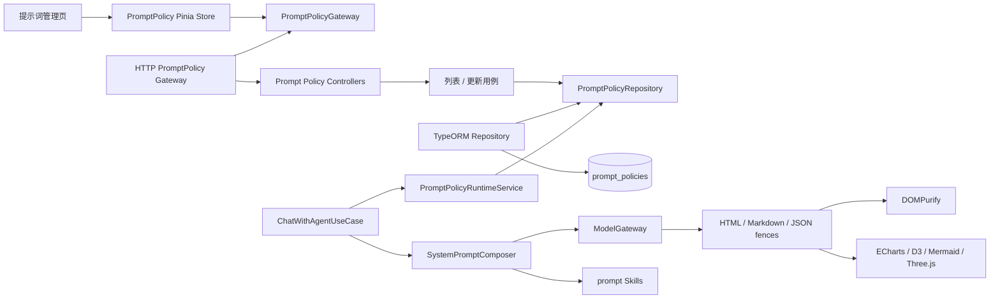
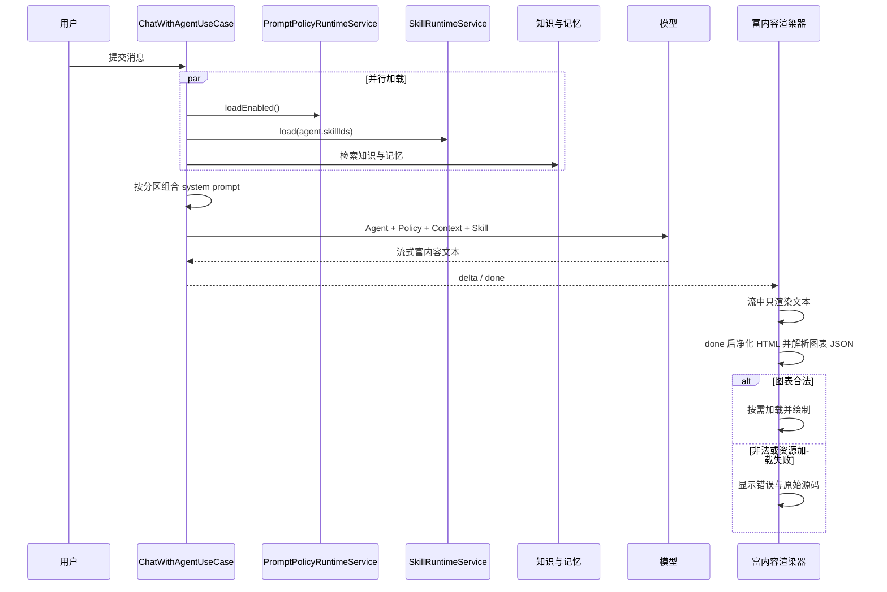
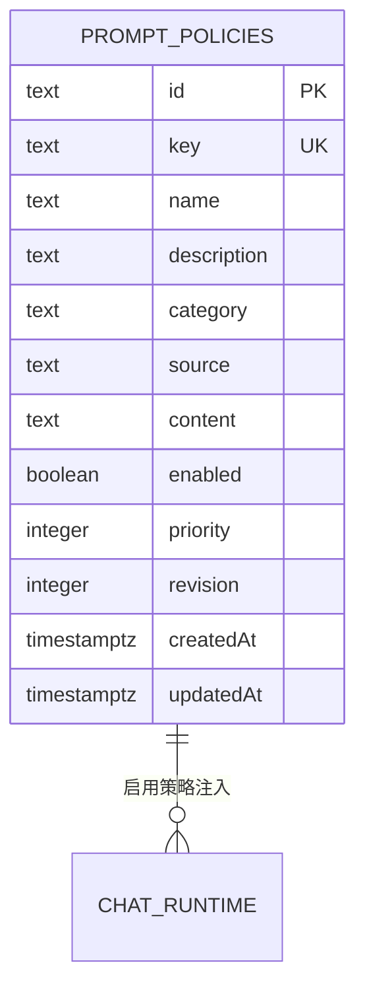
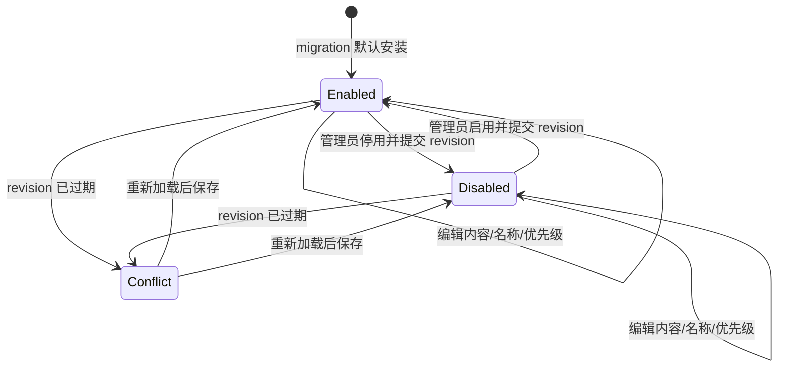
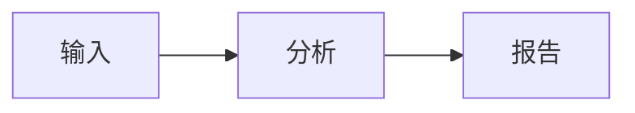

# 富内容输出与内置提示词管理

## 功能目标

本模块让智能体以安全、可降级的富内容协议回答，并允许管理员统一维护控制输出格式的内置系统提示词：

- 使用语义化 HTML 片段表达财务报表、摘要、对比结果和结构化数据；
- 兼容 Markdown、LaTeX 和 Mermaid；
- 使用声明式 JSON 渲染 ECharts、D3 和 Three.js；
- 在“提示词管理”页面查看、编辑、启停和排序内置提示词；
- 复用现有 Chat、知识、记忆和 Skill 链路，不创建第二套模型调用流程；
- 为以后安装 `prompt` Skill 扩展特定行业输出规范保留清晰边界。

## 已实现能力

1. PostgreSQL migration 创建 `prompt_policies`，并预置 `rich-content-output`。
2. 管理 API 提供列表和带 revision 乐观锁的更新。
3. Chat 只加载启用的策略，并按稳定优先级注入系统消息。
4. Vue 管理端新增 `/prompt-policies`，覆盖加载、空、失败、重试、保存、启停和冲突提示。
5. Vue 对话页和 EyouCMS 用户页均支持：
   - 受 DOMPurify 白名单净化的 HTML/Markdown；
   - `echarts` JSON；
   - `d3` 结构化柱状图和折线图；
   - `three` 受限基础几何体场景；
   - `mermaid` 严格安全模式。
6. Three.js、D3、ECharts 和 Mermaid 按需加载；图表失败时展示错误和原始源码。
7. Three.js 卸载时释放动画、观察器、几何体、材质、渲染器和 WebGL 上下文。

## 非目标

- 不执行模型输出的 JavaScript、函数、表达式或事件处理器。
- 不支持外链脚本、图片、纹理、iframe、glTF/OBJ 等外部三维模型。
- 不实现提示词市场、历史版本回滚、审批流和定时发布。
- 不把内置提示词复制到每个 Agent；它是全局策略。
- 不替代现有 `prompt` Skill。内置策略负责平台级规则，Skill 负责可安装的场景能力。
- 当前项目尚无账号和角色模块，因此管理 API 沿用其他后台接口的访问边界；生产部署仍须在网关或后续权限模块中保护管理路由。

## 目录结构

```text
apps/api/src/modules/prompt-policies/
├── domain/
│   └── prompt-policy.ts
├── application/
│   ├── list-prompt-policies.use-case.ts
│   ├── prompt-policy-runtime.service.ts
│   ├── prompt-policy.repository.ts
│   └── update-prompt-policy.use-case.ts
├── infrastructure/
│   ├── prompt-policy.entity.ts
│   └── typeorm-prompt-policy.repository.ts
├── presentation/http/
│   ├── list-prompt-policies.controller.ts
│   ├── update-prompt-policy.controller.ts
│   └── update-prompt-policy.dto.ts
└── prompt-policies.module.ts

apps/web/src/modules/prompt-policies/
├── domain/prompt-policy.ts
├── application/prompt-policy.gateway.ts
├── infrastructure/http-prompt-policy.gateway.ts
├── stores/prompt-policy.store.ts
└── presentation/views/PromptPoliciesView.vue

apps/web/src/modules/chat/presentation/rich-content/
├── rich-message-markdown.ts
├── rich-visualization.renderer.ts
├── visualization-specification.ts
└── three-visualization.renderer.ts

templates/eyoucms/skin/js/
├── agent-rich-content.js
└── agent-rich-visualizations.js
```

## 分层职责

- **Domain**：定义 Prompt Policy 的业务语义、稳定 key、分类、来源和 revision。
- **Application**：列表、更新、启用策略读取和乐观锁冲突转换，只依赖仓储端口。
- **Infrastructure**：TypeORM Entity、PostgreSQL 查询和条件更新。
- **Presentation**：Controller、DTO、Vue 页面、Pinia Store 和 HTTP Gateway。
- **Chat Composer**：组合 Agent Prompt、内置策略、知识、记忆和 Skill，不持久化策略。
- **Rich Content Renderer**：只处理声明式内容，绝不执行模型代码。

## 模块结构



## 对话业务时序



## 系统提示词组合顺序

`SystemPromptComposer` 使用以下稳定分区：

1. Agent 自身 `systemPrompt`；
2. 已启用的内置 Prompt Policy，按 `priority ASC, key ASC` 排序；
3. 企业知识；
4. 跨会话长期记忆；
5. 不可信图片情景证据；
6. Agent 已安装并启用的 `prompt` Skill。

内置策略在知识和外部证据之前注入，避免后续上下文覆盖平台级输出和安全要求。Skill 保持独立分区，后续增加财务、数据分析或三维展示 Skill 时无需修改 Prompt Policy 数据模型。

## 数据模型与 ER 图



字段说明：

- `key`：migration 管理的稳定标识，页面不可修改。
- `category`：`behavior | output | safety`。
- `source`：当前固定为 `builtin`。
- `priority`：0 至 1000，数值越小越先注入。
- `revision`：从 1 开始，每次成功更新加 1。
- `enabled`：只影响后续新对话，不中断已经开始的流式请求。

## 状态流转与并发



更新使用单条条件 SQL：

```sql
UPDATE prompt_policies
SET ..., revision = revision + 1
WHERE id = :id AND revision = :expectedRevision;
```

受影响行数不是 1 时返回 HTTP 409。该事务边界足以防止两个管理员基于同一版本相互覆盖；本模块没有任务领取、重试队列或幂等创建操作。

## API

### `GET /api/prompt-policies`

返回所有内置提示词，包含完整内容和 revision，按优先级和 key 排序。

### `PUT /api/prompt-policies/:id`

请求体：

```json
{
  "name": "富内容 HTML 输出",
  "description": "控制智能体输出安全富内容。",
  "content": "系统提示词正文",
  "enabled": true,
  "priority": 100,
  "expectedRevision": 1
}
```

校验：

- `id` 必须是 UUID；
- 名称 1 至 80 字符；
- 描述最多 240 字符；
- 内容 1 至 20000 字符；
- 优先级是 0 至 1000 的整数；
- revision 是大于等于 1 的整数。

响应为更新后的策略，revision 已加 1。不存在返回 404，过期 revision 返回 409，校验失败返回 400。

## 富内容协议

### HTML 与 Markdown

- 模型输出正文可以使用语义化 HTML 片段，不输出 `html/head/body`。
- Markdown、LaTeX 和安全内联 HTML 可以混用。
- HTML 经 DOMPurify 处理后才写入 DOM。
- 禁止 `script/style/iframe/object/embed/form/img/audio/video/input` 等标签。
- 禁止事件属性、内联 style、`javascript:`、`data:` 和外部资源。

财务报表应优先使用 `table/thead/tbody/th/td`，并明确单位、币种、期间和数据口径。

### ECharts

````text
```echarts
{"xAxis":{"type":"category","data":["收入","成本"]},"yAxis":{"type":"value"},"series":[{"type":"bar","data":[120,-30]}]}
```
````

只接受 JSON 对象。通用安全遍历限制源码长度、深度、节点数、数组长度、危险 key 和外部资源 URL。

### D3

````text
```d3
{"type":"line","data":[{"name":"一月","value":12},{"name":"二月","value":18}]}
```
````

当前只支持 `bar | line`，每项必须是 `{name, value}`。Vue 和 EyouCMS 都支持正数和负数。

### Mermaid

````text

````

使用 `securityLevel: strict`，渲染前先做语法校验。

### Three.js

````text
```three
{
  "background": "#f7f8fc",
  "autoRotate": true,
  "camera": {
    "position": [5, 4, 7],
    "target": [0, 0, 0]
  },
  "objects": [
    {
      "type": "box",
      "size": [2, 1, 3],
      "position": [0, 0, 0],
      "rotation": [0, 0.4, 0],
      "color": "#7765e8"
    },
    {
      "type": "sphere",
      "radius": 0.7,
      "position": [2, 0, 0],
      "color": "#42bbd2"
    }
  ]
}
```
````

场景字段：

| 字段         | 类型      | 限制                           |
| ------------ | --------- | ------------------------------ |
| `background` | `#RRGGBB` | 可选                           |
| `autoRotate` | boolean   | 可选，默认 true                |
| `camera`     | object    | 只允许 `position`、`target`    |
| `objects`    | array     | 必填，1 至 40 个               |
| `position`   | `[x,y,z]` | 每项 -100 至 100               |
| `rotation`   | `[x,y,z]` | 每项 -12.57 至 12.57，单位弧度 |
| `color`      | `#RRGGBB` | 可选                           |

几何体字段：

| type       | 专属字段                                      |
| ---------- | --------------------------------------------- |
| `box`      | `size: [宽, 高, 深]`，每项 0.01 至 100        |
| `plane`    | `size: [宽, 高]`，每项 0.01 至 100            |
| `sphere`   | `radius`，0.01 至 50                          |
| `cylinder` | `radius` 0.01 至 50，`height` 0.01 至 100     |
| `cone`     | `radius` 0.01 至 50，`height` 0.01 至 100     |
| `torus`    | `radius` 0.01 至 50，`tube` 0.01 至 25 且更小 |

未知字段、纹理、模型 URL 和任意脚本都会被拒绝。Vue 端提供 OrbitControls；EyouCMS 端提供自动旋转和自适应尺寸，不加载外部模型。

## 安全与资源限制

- JSON 源码最多 100000 字符。
- Vue 通用 JSON 最深 12 层、最多 2000 个节点、数组最多 500 项。
- EyouCMS 使用同类限制：最深 12 层、最多 5000 个节点、数组最多 1000 项。
- 禁止 `__proto__`、`constructor`、`prototype`。
- 禁止 HTTP(S)、协议相对 URL、`data:` 和 `javascript:`。
- Three.js 最多 40 个对象，WebGL 像素比最多 2。
- 模型输出永不进入 `eval`、`Function`、动态脚本标签或事件属性。
- Prompt 内容属于内部管理配置，不应在公开接口或日志中回显。

## 生命周期、异常与降级

- 流式阶段仅更新文本，`done` 后才解析图表，避免半截 JSON 反复失败。
- ECharts 监听容器尺寸并在卸载时 `dispose()`。
- Three.js 清理 `requestAnimationFrame`、`ResizeObserver`、OrbitControls（Vue）、几何体、材质、Scene、Renderer、WebGL context 和 canvas。
- 单个图表失败不会破坏整条消息；页面展示中文错误与原始配置。
- DOMPurify 在 EyouCMS CDN 加载失败时，Markdown 渲染器自动禁用原始 HTML。
- Prompt 保存失败保留编辑表单；409 提示管理员重新加载最新 revision。

## Migration

`1752160000000-add-prompt-policies.ts`：

- `up()` 创建表和唯一 key，并插入固定 UUID 的 `rich-content-output`；
- `down()` 删除 `prompt_policies`；
- migration E2E 验证建表、默认数据、回滚顺序和重新执行。

数据库继续使用 PostgreSQL、pgvector 和 Redis，不引入 SQLite 或 `synchronize` 生产依赖。

## 配置与依赖

- 本模块没有新增环境变量。
- Vue 增加 `three@0.185.1` 与 `@types/three@0.185.0`。
- EyouCMS 按需加载 D3 7.9.0 和 Three.js 0.185.1，CDN 列表沿用现有富内容配置。
- 依赖升级时必须同步检查 Vue package 与 EyouCMS `AGENT_RICH_LIBRARIES` / `AGENT_RICH_MODULES`。

## 测试范围

- Prompt Policy 列表、启用过滤、更新、revision 增长、非法优先级和并发冲突单元测试。
- System Prompt 分区、顺序和空上下文降级测试。
- HTTP 列表、更新、409、启用注入和停用移除 E2E。
- migration 建表、seed、down 和全量重跑 E2E。
- DOMPurify 移除脚本、事件、style 和图片测试。
- ECharts/D3/Three.js JSON 正常、负值、危险 key、外链、未知几何体和 JavaScript 不执行测试。
- Three.js 动画、观察器、GPU 资源和 canvas 清理测试。
- Prompt Policy Gateway 和 Pinia Store 加载、保存、版本替换与冲突错误测试。
- EyouCMS 脚本执行 `node --check`，并由浏览器主流程验证真实渲染。

## 后续扩展路线

1. 通过现有 `prompt` Skill 安装“财务报表”“经营分析”“三维产品展示”等场景指令。
2. 为 Prompt Policy 增加版本历史、审计人和回滚，但不改变当前稳定 key。
3. 引入账号、角色和管理接口权限后，将 Prompt Policy 更新权限限制为平台管理员。
4. 需要外部三维资产时，新增受信资产服务、签名 URL 和独立沙箱，不放开模型任意 URL。
5. 若增加新的声明式可视化协议，应扩展 parser/renderer 注册边界，而不是允许模型输出 JavaScript。
