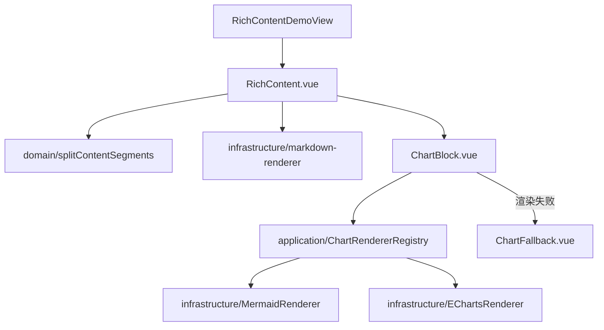

# rich-content 富文本渲染模块

## 职责

将智能体输出的 Markdown 文本渲染为富文本：普通 Markdown（表格、标题、列表等）经消毒后渲染为 HTML；`mermaid` 与 `echarts` 围栏代码块交给对应图表渲染器绘制。任一图表渲染失败时降级为原文兜底展示，绝不中断整体内容渲染，也不向用户抛出裸报错。

## 已实现功能

1. Markdown 渲染（markdown-it）+ XSS 消毒（DOMPurify）。
2. Mermaid 图渲染，渲染前先语法校验（flowchart、sequence 等官方支持的图类型）。
3. ECharts 图渲染（折线图、柱状图、饼图、仪表盘等全部类型），代码块内容为 JSON option，容器尺寸变化自动 resize。
4. 兜底降级：图表语法错误、类型不支持（如 Mermaid 不存在的 `gauge`）或运行时异常时，展示友好提示与原始代码块。
5. 演示页 `/rich-content`：左侧编辑源文本、右侧实时预览。

## 结构导图



```text
modules/rich-content/
├── domain/                  # 纯逻辑：片段切分、渲染器契约
│   ├── content-segment.ts
│   └── chart-renderer.ts
├── application/             # 渲染器注册表（策略模式）
│   └── chart-renderer-registry.ts
├── infrastructure/          # 具体渲染实现（懒加载第三方库）
│   ├── markdown/markdown-renderer.ts
│   └── renderers/{mermaid,echarts}-renderer.ts
└── presentation/            # Vue 组件与演示页
    ├── components/{RichContent,ChartBlock,ChartFallback}.vue
    └── views/RichContentDemoView.vue
```

## 渲染流程

1. `RichContent` 用注册表中的语言列表调用 `splitContentSegments`，把源文本切成 Markdown 片段与图表片段。
2. Markdown 片段经 markdown-it 渲染并由 DOMPurify 消毒后以 `v-html` 输出。
3. 图表片段由 `ChartBlock` 从注册表解析渲染器并异步渲染；渲染器按需动态 import 第三方库，降低首屏体积。
4. 渲染器抛错或语言未注册时，`ChartBlock` 切换为 `ChartFallback`，展示可读错误信息与原始代码。

## 扩展点

- 新增图表类型（如 D3 自定义图）：实现 `ChartRenderer` 接口并在 `app/dependencies.ts` 注册即可，无需修改任何渲染流程代码。
- 更换 Markdown 引擎或消毒策略：只需替换 `infrastructure/markdown/markdown-renderer.ts`。
