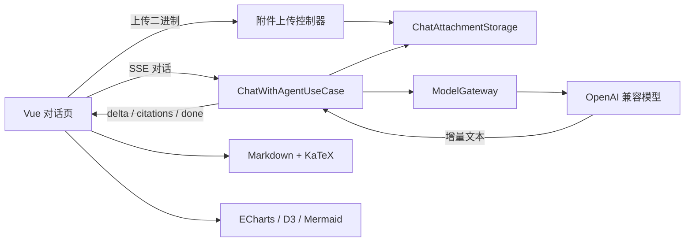
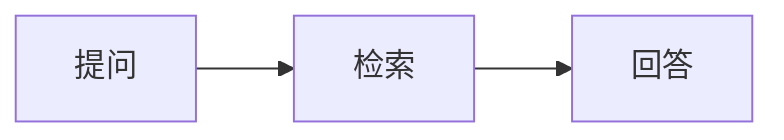

# 流式富内容与多模态对话

## 功能范围

- 智能体后台与公开接口默认使用 SSE 流式输出。
- 回答支持 Markdown、LaTeX、ECharts、D3 和 Mermaid。
- 用户可在单条消息中上传图片或音频，并与文本一并提交模型。
- 附件存储、模型协议和界面渲染通过端口分离，便于替换对象存储或模型厂商。

## 模块结构



## 输出格式

普通 Markdown 与 LaTeX 直接使用标准语法：

```text
行内公式：$E=mc^2$

块级公式：
$$
\int_0^1 x^2 dx = \frac{1}{3}
$$
```

图表和图形使用带语言标识的代码块：

````text
```echarts
{"xAxis":{"type":"category","data":["一月","二月"]},"yAxis":{"type":"value"},"series":[{"type":"bar","data":[12,18]}]}
```

```d3
{"type":"bar","data":[{"name":"一月","value":12},{"name":"二月","value":18}]}
```


````

ECharts 配置必须是 JSON；D3 当前提供 `bar` 和 `line` 两种结构化图表。
Markdown 渲染禁止原始 HTML，避免模型输出脚本进入页面。

## 流式协议

`POST /api/agents/:id/chat` 默认返回 `text/event-stream`，也可显式传入
`"stream": false` 获取完整 JSON。SSE 事件依次为：

- `delta`：回答增量，数据结构为 `{"content":"..."}`。
- `metadata`：智能体 ID 与知识库来源列表。
- `done`：回答完成。
- `error`：流处理失败。

OpenAI 兼容接口 `POST /api/v1/chat/completions` 同样默认流式；显式传入
`"stream": false` 可关闭。

## 多模态附件

`POST /api/chat-attachments` 接收原始二进制请求体：

- `Content-Type`：`image/png`、`image/jpeg`、`image/webp`、`image/gif`、
  `audio/mpeg` 或 `audio/wav`。
- `X-File-Name`：经过 URI 编码的文件名。
- 返回值：附件 ID、文件名、MIME 类型和大小。

对话消息通过附件 ID 引用文件。服务端重新读取并校验实际存储内容，然后转换为
OpenAI 兼容的 `image_url` 或 `input_audio` 内容片段。界面每条消息最多选择 6 个、
单个不超过 10MB；服务端上限由 `CHAT_ATTACHMENT_MAX_BYTES` 配置。

## 存储与扩展

- `ChatAttachmentStorage` 是应用层端口。
- `LocalChatAttachmentStorage` 使用 `CHAT_ATTACHMENT_STORAGE_PATH` 本地持久化。
- 文件路径只使用服务端 UUID，不拼接用户文件名。
- 图片和音频通过魔数校验，不能仅依赖客户端 `Content-Type`。
- 迁移到 OSS、S3 或 MinIO 时新增存储适配器，不修改对话用例。
