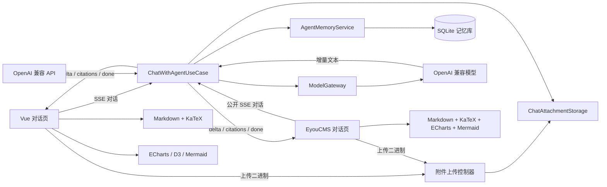
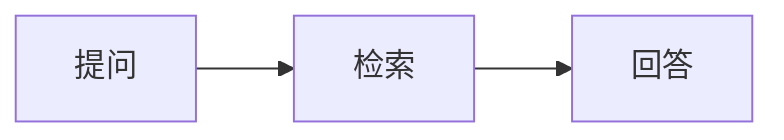

# 流式富内容与多模态对话

## 功能范围

- 智能体后台与公开接口默认使用 SSE 流式输出。
- 对话入口支持可选 `conversationId`，用于服务端短期记忆和长期记忆归档。
- Vue 管理端回答支持 Markdown、LaTeX、ECharts、D3 和 Mermaid；
  EyouCMS 用户页支持 Markdown、LaTeX、表格、ECharts（含仪表盘）和 Mermaid。
- Vue 管理端和 EyouCMS 用户页都可在单条消息中上传图片或音频，并与文本一并提交模型。
- 所有智能体入口共用 `ChatWithAgentUseCase`，后台测试、公开页面和 API 应用具有一致的多模态能力。
- 附件存储、模型协议和界面渲染通过端口分离，便于替换对象存储或模型厂商。

## 模块结构



## 输出格式

普通 Markdown 与 LaTeX 直接使用标准语法：

```text
行内公式：$E=mc^2$

块级公式：
$$
\int_0^1 x^2 dx = \frac{1}{3}
$$
```

图表和图形使用带语言标识的代码块：

````text
```echarts
{"xAxis":{"type":"category","data":["一月","二月"]},"yAxis":{"type":"value"},"series":[{"type":"bar","data":[12,18]}]}
```

```d3
{"type":"bar","data":[{"name":"一月","value":12},{"name":"二月","value":18}]}
```


````

ECharts 配置必须是 JSON，支持全部原生图表类型，仪表盘使用 `gauge` 系列：

````text
```echarts
{"series":[{"type":"gauge","data":[{"name":"完成率","value":72}]}]}
```
````

D3 仅 Vue 管理端支持，当前提供 `bar` 和 `line` 两种结构化图表。

图表渲染有统一兜底：Mermaid 渲染前先 `parse` 语法校验，任一图表配置非法或
类型不支持（如 Mermaid 不存在的 `gauge`）时降级为友好错误提示加原始代码块，
不中断消息内其余内容；ECharts 图表随容器尺寸变化自动 `resize`。仪表盘请使用
ECharts 的 `gauge` 系列。
Markdown 渲染允许模型输出的内联 HTML（如表格单元格中的 `<br>` 换行），
渲染结果经 DOMPurify 白名单消毒后再进入页面，脚本与危险属性会被移除。
EyouCMS 页的 DOMPurify 由 CDN 按需加载，加载失败时自动降级为禁用
原始 HTML 的安全模式，保证任何浏览器环境下内容都可读且无注入风险。
EyouCMS 页的渲染库由 `templates/eyoucms/skin/js/agent-rich-content.js`
按需懒加载，版本与 Vue 管理端依赖保持一致，图表在流式回答结束后统一绘制。

## 流式协议

`POST /api/agents/:id/chat` 默认返回 `text/event-stream`，也可显式传入
`"stream": false` 获取完整 JSON。SSE 事件依次为：

- `delta`：回答增量，数据结构为 `{"content":"..."}`。
- `metadata`：智能体 ID 与知识库来源列表。
- `done`：回答完成。
- `error`：流处理失败。

OpenAI 兼容接口 `POST /api/v1/chat/completions` 同样默认流式；显式传入
`"stream": false` 可关闭。

请求体可传入 `conversationId` 和 `memoryOwnerKey`。同一 owner 下同一 ID 的成功对话会写入服务端短期记忆；用户显式要求
“记住”的事实或偏好会进入长期记忆，并在后续相关问题中召回。

## 多模态附件

`POST /api/chat-attachments` 接收原始二进制请求体：

- `Content-Type`：`image/png`、`image/jpeg`、`image/webp`、`image/gif`、
  `audio/mpeg` 或 `audio/wav`。
- `X-File-Name`：经过 URI 编码的文件名。
- 返回值：附件 ID、文件名、MIME 类型和大小。

对话消息通过附件 ID 引用文件。服务端重新读取并校验实际存储内容，然后转换为
OpenAI 兼容的 `image_url` 或 `input_audio` 内容片段。界面每条消息最多选择 6 个、
服务端上限由 `CHAT_ATTACHMENT_MAX_BYTES` 配置。

以下入口都把消息交给同一个多模态用例，不按智能体单独开关：

- 后台测试：`POST /api/agents/:id/chat`
- EyouCMS 与公开页面：`POST /api/public/agents/:id/chat`
- API 应用：`POST /api/v1/chat/completions`

## 存储与扩展

- `ChatAttachmentStorage` 是应用层端口。
- `LocalChatAttachmentStorage` 使用 `CHAT_ATTACHMENT_STORAGE_PATH` 本地持久化。
- 文件路径只使用服务端 UUID，不拼接用户文件名。
- 图片和音频通过魔数校验，不能仅依赖客户端 `Content-Type`。
- 迁移到 OSS、S3 或 MinIO 时新增存储适配器，不修改对话用例。
