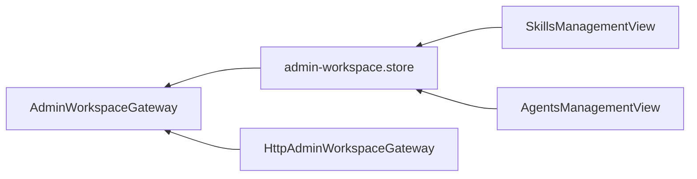

# 技能管理（前端）

## 目标

在管理控制台提供技能的安装、编辑、启停、卸载与智能体绑定入口。

## 结构

```text
apps/web/src/modules/admin/
├── domain/admin-workspace.ts                 # SkillSummary / InstallSkillInput / UpdateSkillInput
├── application/admin-workspace.gateway.ts    # listSkills / installSkill / updateSkill / deleteSkill
├── infrastructure/http-admin-workspace.gateway.ts
├── stores/admin-workspace.store.ts           # skills 状态与操作
└── presentation/views/
    ├── SkillsManagementView.vue              # /skills 技能管理页
    └── AgentsManagementView.vue              # 智能体表单新增技能多选绑定
```



## 功能

- 技能列表卡片：类型（提示词 / MCP 工具）、启用状态、MCP 工具清单、更新时间。
- 安装表单：选择类型；提示词技能填指令内容，MCP 技能填服务地址与可选请求头（每行一条 `key: value`，仅提交不回显）。
- 编辑：修改名称、描述、内容或地址；请求头留空表示保留原值。
- 启停 / 卸载：卸载被智能体绑定的技能时后端返回 409，错误信息展示在页面顶部。
- 智能体表单新增「绑定技能」多选框，随创建 / 更新提交 `skillIds`。

## 当前限制

- 已保存的请求头不回显（后端不返回），仅可整体覆盖。
- MCP 工具清单在安装或启用更新时刷新，页面不做手动刷新按钮。
