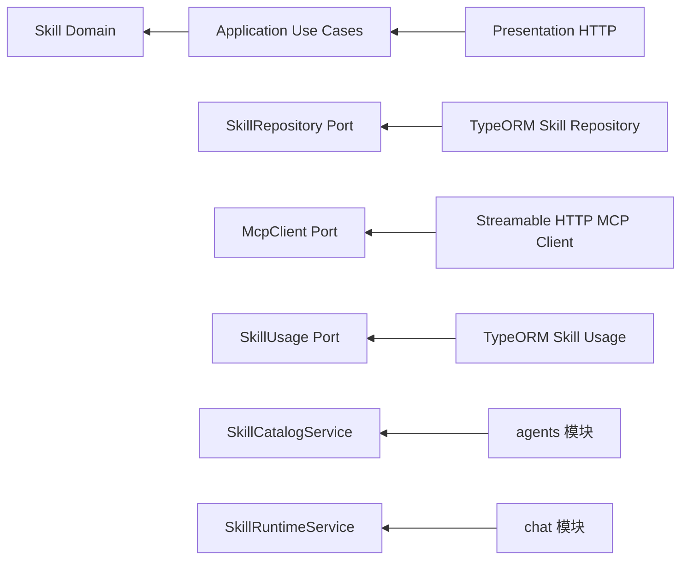
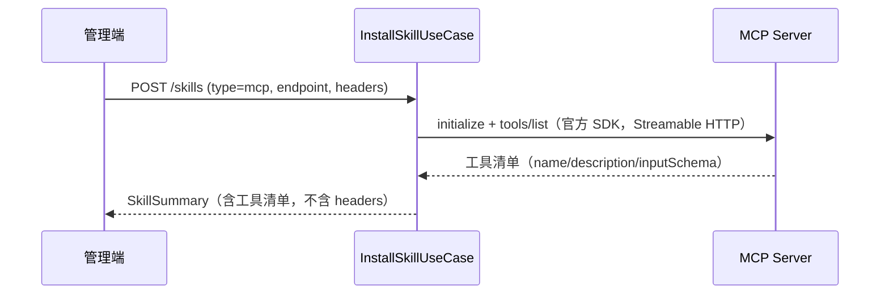

# 技能与 MCP 模块（后端）

## 目标

为智能体提供可安装、可管理的技能体系：

- `prompt` 提示词技能：安装后作为附加指令注入系统提示（参考 Anthropic Agent Skills 的「指令包」思路）。
- `mcp` 工具技能：登记 MCP Server（Streamable HTTP），安装时连接并缓存工具清单，对话时经 OpenAI function calling 工具环调用（参考 MCP 协议 initialize → tools/list → tools/call）。

## 非目标

- 不支持在本地执行任意代码或脚本类技能。
- 不实现技能市场、版本仓库与回滚。
- 不允许前端直接连接 MCP Server。
- 不在任何 API 响应中返回 MCP 请求头（可能含凭证）。

## 模块结构

```text
apps/api/src/modules/skills/
├── domain/
│   └── skill.ts                      # Skill / SkillTool / SkillSummary
├── application/
│   ├── skill.repository.ts           # 持久化端口
│   ├── mcp-client.ts                 # MCP 客户端端口
│   ├── skill-usage.ts                # 绑定计数端口
│   ├── install-skill.use-case.ts     # 安装（MCP 需连接校验并缓存工具）
│   ├── list-skills.use-case.ts
│   ├── update-skill.use-case.ts      # 编辑 / 启停（启用的 MCP 会刷新工具）
│   ├── delete-skill.use-case.ts      # 卸载（仍被绑定时返回 409）
│   ├── skill-catalog.service.ts      # 供 agents 模块校验技能 ID
│   └── skill-runtime.service.ts      # 供 chat 模块加载技能与调用工具
├── infrastructure/
│   ├── skill.entity.ts               # skills 表
│   ├── typeorm-skill.repository.ts
│   ├── typeorm-skill.usage.ts        # 基于 agent_skills 统计绑定
│   └── streamable-http-mcp.client.ts # 官方 @modelcontextprotocol/sdk 适配器
├── presentation/http/                # 一路由一控制器
│   ├── install-skill.controller.ts   # POST   /skills
│   ├── list-skills.controller.ts     # GET    /skills
│   ├── update-skill.controller.ts    # PUT    /skills/:id
│   └── delete-skill.controller.ts    # DELETE /skills/:id
└── skills.module.ts
```



## 数据模型

- `skills`：`id / name / description / type / content / endpoint / headers / tools / enabled / createdAt / updatedAt`。`headers` 与 `tools` 以 JSON 文本存储；`headers` 仅在基础设施层使用，不出现在任何 API 响应。
- `agent_skills`：`id / agentId / skillId`，`(agentId, skillId)` 唯一，智能体保存时全量重建，删除智能体时级联清理。

## 主要流程

### 安装 MCP 技能



### 对话中的工具调用环

```mermaid
sequenceDiagram
  participant Chat as ChatWithAgentUseCase
  participant Loop as SkillToolLoopService
  participant Model as OpenAI 兼容模型
  participant MCP as MCP Server
  Chat->>Loop: 消息 + 已启用 MCP 技能的工具清单
  loop 最多 SKILL_TOOL_MAX_ROUNDS 轮
    Loop->>Model: chat/completions（携带 tools）
    Model-->>Loop: tool_calls 或最终回答
    Loop->>MCP: tools/call（经 SkillRuntimeService）
    MCP-->>Loop: 工具结果（以 tool 消息回填）
  end
  Loop-->>Chat: 最终回答
```

`prompt` 技能不进入工具环：其 `content` 会以「已安装技能指令」小节追加到系统提示。

## 接口

| 方法   | 路径        | 说明                                  |
| ------ | ----------- | ------------------------------------- |
| POST   | /skills     | 安装技能（MCP 会连接校验）            |
| GET    | /skills     | 技能列表                              |
| PUT    | /skills/:id | 编辑 / 启停（headers 留空则保留原值） |
| DELETE | /skills/:id | 卸载（仍被智能体绑定时 409）          |

智能体创建 / 更新接口新增 `skillIds: string[]`，安装校验由 `SkillCatalogService` 完成。

## 配置

| 环境变量                | 默认值      | 说明                              |
| ----------------------- | ----------- | --------------------------------- |
| `MCP_CLIENT_NAME`       | `agent-api` | MCP initialize 时上报的客户端名称 |
| `SKILL_TOOL_MAX_ROUNDS` | `5`         | 单次对话最大工具调用轮数          |

## 安全策略

- MCP `headers` 只写不读：安装 / 更新后仅存于数据库并在服务端调用 MCP 时使用，不回显给前端。
- 工具环有最大轮数限制，超限终止并返回 `service_unavailable`。
- 工具参数必须是 JSON 对象，解析失败时降级为空对象，不透传原始字符串。
- 已停用技能不注入提示词、不暴露工具。

## 当前限制

- 工具环采用非流式补全，最终回答一次性返回（携带 MCP 技能的对话不逐字流式输出）。
- 多技能存在同名工具时仅保留先加载的定义。
- 暂不支持 stdio 传输的 MCP Server，仅支持 Streamable HTTP。
