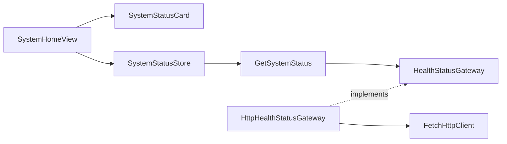

# Web 系统状态模块

## 目标

展示工作区说明并读取 API 健康状态，用于验证 Vue、Pinia、Vue Router、应用用例和 HTTP 适配器之间的集成。该模块不包含业务管理功能。

## 结构



```text
system/
├── domain/system-status.ts
├── application/
│   ├── health-status.gateway.ts
│   └── get-system-status.ts
├── infrastructure/http-health-status.gateway.ts
├── stores/system-status.store.ts
└── presentation/
    ├── components/SystemStatusCard.vue
    └── views/SystemHomeView.vue
```

## 功能

- 页面加载时请求 `GET /health`。
- Pinia 管理空闲、加载、成功和失败状态。
- 组件展示服务名称、在线状态和检查时间。
- 用户可主动重新检查连接。

## 配置

- `VITE_API_BASE_URL`：API 全局前缀地址。

## 测试范围

- 应用用例测试验证网关结果原样返回。
- 类型检查验证 Vue 模板、Pinia 状态和路由定义。
- 构建检查验证模块可被 Vite 正确打包。

## 扩展方式

新增系统指标时先扩展领域契约和 API 校验，再扩展 Store 与展示组件。其他业务模块不得直接复用该 Store，应通过自己的应用边界获取数据。
